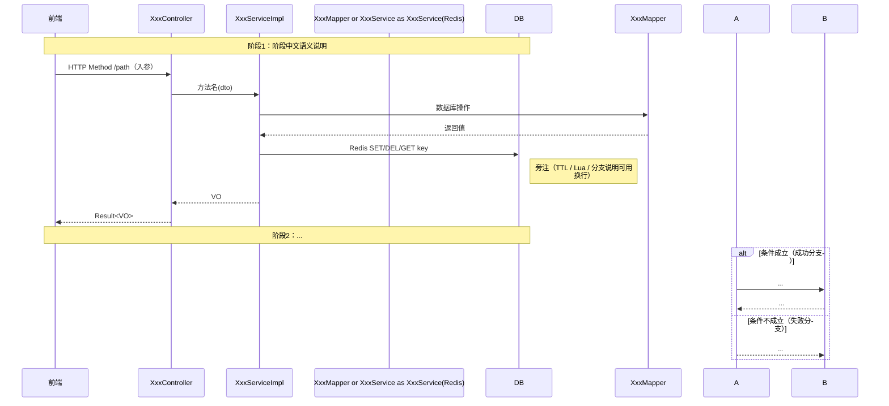
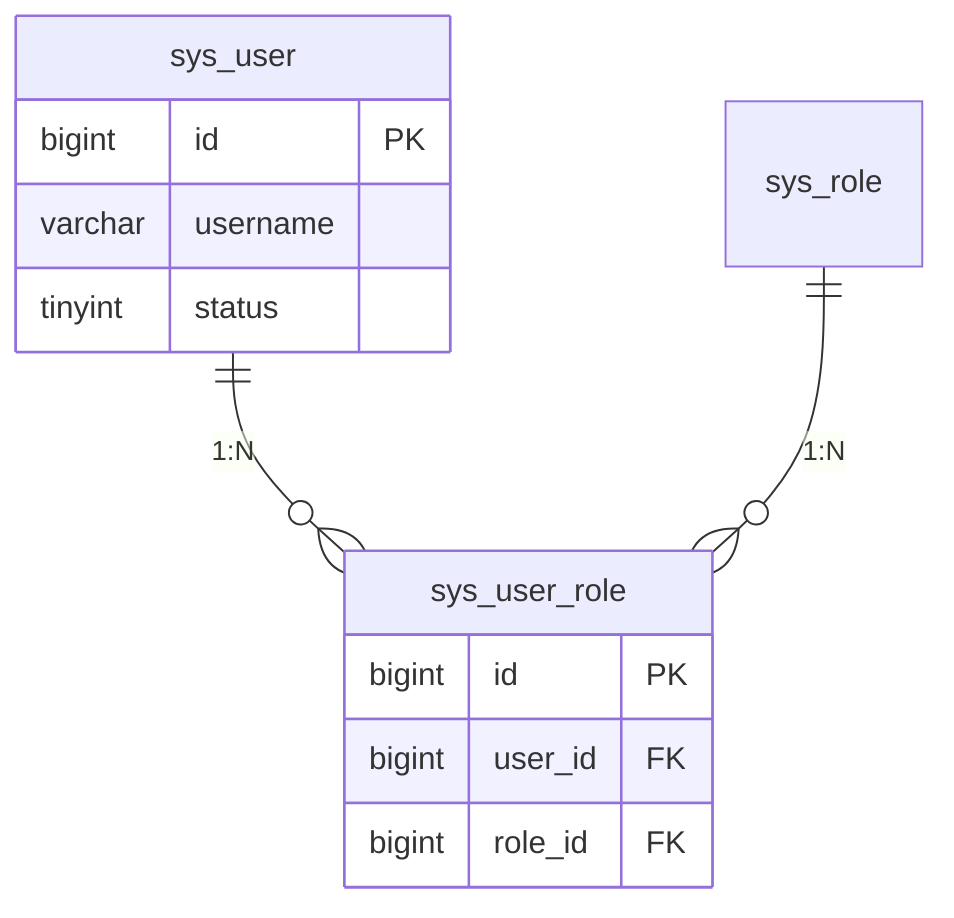
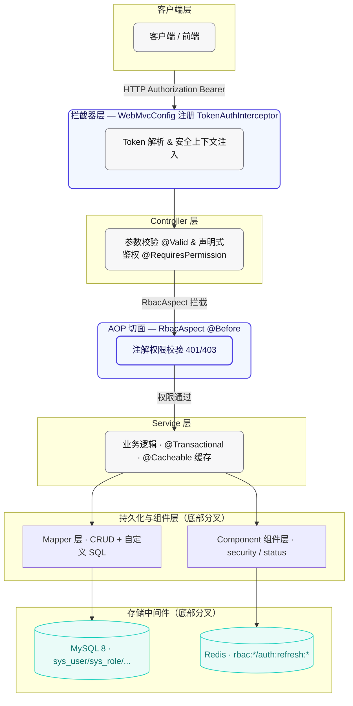
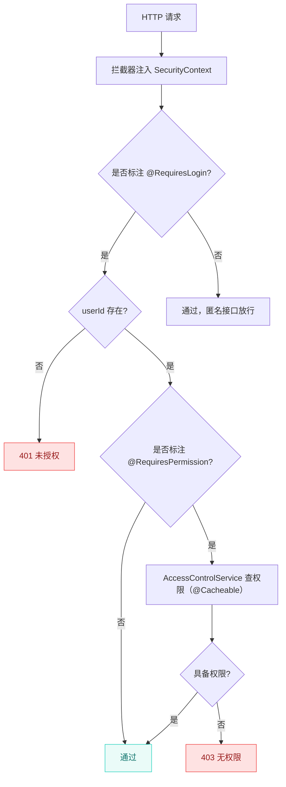
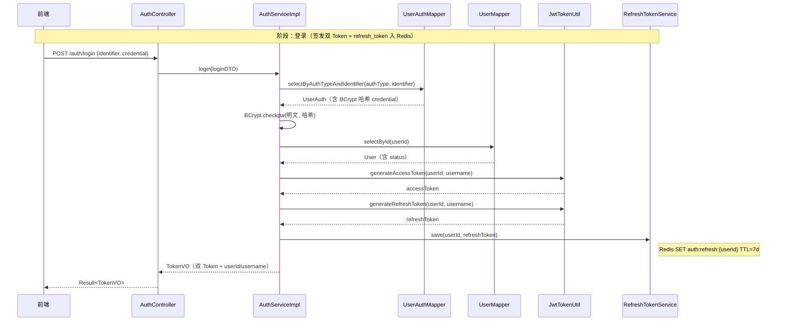

# BAESL 项目设计文档生成器

适用于本工作区 `d:\Java\work_learn_space\z` 下所有 Spring Boot 模块（含 RBAC、双 Token 认证、Redis 缓存、观察者模式状态机、用户管理、任务管理等）的设计文档编写与维护。

## 一、触发条件

当出现以下任一请求时**立即调用**本 Skill：

1. 用户说"写 XX 设计文档"、"XX 模块出一个设计文档"、"整理 XX 成文档"、"把 XX 方案记成文档"。
2. 实现完一套功能后用户要求"总结成文档"、"生成对应的文档"。
3. 用户要求"补全某文档缺失章节"、"把某章节的图改成 mermaid / ASCII / SVG"。
4. 代码侧完成了 RBAC / 认证 / 缓存 / 状态机 / 调度 / 消息通知 等新领域能力，需要沉淀文档。

## 二、文档统一结构（必须遵循的骨架）

```
# {文档主题} · 设计文档

> 模块路径：`org.dam.{module}[.{subpackage}]`
> 作者：zhengbing · 版本：1.0 · 日期：YYYY-MM-DD

## 1. 设计目标
（3~7 条，列出要解决的问题 + 非目标（可选））

## 2. {核心概念 / 模型 / 对比表}
（按主题选择：技术栈表 / ER 关系 / 方案对比 / 角色映射）

## 3. {详细设计章节 A}
（例如：表结构、JWT 设计、序列化策略、核心服务、接口契约...）

## 4. {详细设计章节 B}

## ... 按需追加章节 ...

## N. 扩展约定 / 最佳实践 / 踩坑与最佳实践
（5~10 条，列出 Do/Don't、性能红线、已知取舍）

## N+1. 相关文件
（一张两列表：类别 | 文件路径。路径相对项目根，如 src/main/java/org/dam/service/AccessControlService.java）
```

**头部四行元数据不可省略**：标题（`# XXX · 设计文档`）、`>` 引用块内的模块路径 + 作者 zhengbing + 版本 + 日期。日期格式 `YYYY-MM-DD`。

**章节编号**：按 `## N.` 顺序递增，层级标题不跨级。

**文件名**：kebab-case，中文主题用英文转译，放在 `docs/` 目录下，例如：
- 项目架构 → `docs/project-architecture-design.md`
- RBAC 权限体系 → `docs/rbac-permission-system-design.md`
- 双 Token 认证 → `docs/dual-token-auth-design.md`
- Redis 缓存 → `docs/redis-cache-design.md`
- 用户状态变更观察者 → `docs/user-status-change-observer-design.md`

## 三、统一写作规范

1. **真实代码示例**：所有 ```java / yaml / sql / xml``` 代码块必须来自项目源码，不得编造型字段、方法名、返回码；若源文件已存在，直接抄录片段。
2. **表格优先**：对比（两方案）、字段（表结构）、清单（接口/方法/文件）一律用 Markdown 表格。
3. **技术名词保留英文**：中文正文 + 英文专有名词（如 Token、TTL、CacheEvict、DTO/VO、RBAC、JWT、CAS、Lua）。
4. **文件引用**：文档中引用项目代码/资源路径一律**相对路径**，用 `src/main/java/org/dam/xxx/Xxx.java` 格式。
5. **BAESL 项目规则贯穿**：遇到以下场景时直接链接项目约定（写在文档中提醒读者）：
   - 命名：`com.baesl.{module}.{layer}`、大驼峰类、小驼峰方法、常量全大写下划线
   - 字符串/集合工具类用 Hutool 的 `StrUtil` / `CollUtil`（不用 Apache `StringUtils`）
   - Service 写方法必须加 `@Transactional(rollbackFor = Exception.class)`
   - 依赖注入优先 `@Resource`
   - 日志用 Slf4j + 占位符，异常必须打印堆栈 `log.error("...", e)`
   - 性能红线：禁止循环查 DB，禁止魔法值
   - Git 备注风格：`z  xxx`（z + 两空格 + 简述）

## 四、图形式选型规则（重要，按用户最近偏好）

### 默认首选图（本项目当前偏好）

| 图的语义 | 推荐语法 | 示例用途 |
|----------|----------|----------|
| 实体关系（ER） | **mermaid `erDiagram`** | RBAC 五张表结构 / 任何业务表关联 |
| 调用/泳道时序 | **mermaid `sequenceDiagram`** | 登录/刷新/登出流程 / 缓存命中 4 阶段链路 / 观察者事件分发 |
| 模块 / 数据流概览 | **mermaid `graph LR`** | 双链路概览 / 组件依赖 |
| **分层架构（自上而下堆叠）** | **mermaid `graph TB`**（首选） / `flowchart TD` | Controller→拦截器→Service→Mapper→MySQL/Redis 分层 |
| 拦截/处理链路（带判断节点） | **mermaid `flowchart TD`**（首选） / ASCII 兜底 | RBAC AOP 拦截链路 / 状态流转 / 鉴权判断分支 |
| 横向对比 / 双向依赖 | **mermaid `graph LR`** | 双链路概览 / 组件横向依赖 |

### mermaid `sequenceDiagram` 固定风格（对齐本项目预览渲染效果）



核心元素：
- `participant A as 别名` 来用中文显示列头。
- `Note over A,B: 阶段说明` 作为横跨多列的**阶段灰条**。
- `->>` 实线请求，`-->>` 虚线返回。
- `Note right of X` 侧栏小注（可用 `<br/>` 做多行，适合放 Lua 脚本、TTL 说明）。
- `alt / else` 做条件分支（如 refresh_token 轮转成功 / 失败）。

### mermaid `erDiagram` 固定风格



- 关联语法：`||--o{` 代表 1 对多（另一端 0 或 N）；PK/UK 在字段后标注。
- ER 图在文档中必须保留 mermaid，**不要**转 SVG/ASCII。

### mermaid `graph LR` 固定风格

```mermaid
graph LR
    subgraph A链路:xxx
        A1[Svc1] -->|@Cacheable| K1[(rbac:roles::userId)]
        A2[Svc2] -->|@CacheEvict allEntries| K1
    end
    subgraph B链路:yyy
        B1[Login] -->|save| K2[(auth:refresh:userId)]
        B2[Refresh] -->|rotate Lua CAS| K2
    end
```

### mermaid `graph TB` 分层架构固定风格（**首选**，对齐 preview 深色 participantBox）

用于自上而下堆叠的「分层架构图」。用 `subgraph` 把每一层独立分组（分组标题 + 节点内标题 + 节点侧描述注解），关键路径（拦截器鉴权 / RbacAspect）用 `linkStyle` 或 `classDef focus` 高亮品牌色。底部分叉（Mapper→MySQL、Component→Redis）用 `A --> B & C` 一次画出两条分支。



**核心元素**：
- `classDef` 一次性定义三档视觉（neutral 灰、focus 蓝紫品牌色、storage 青绿存储圆柱 [( )] 语法）。
- `subgraph Name[标题]` 每个独立层一个分组，组内节点再写"本层做什么 + 关键注解"。
- 自上而下用 `-->` 连接，**焦点路径**（拦截器→AOP→Service）`stroke:#4B3FE3,stroke-width:2px` 单独加粗紫色。
- 底部分叉用 `S1 --> P1 & P2` 一行双箭头，对齐 ASCII 视觉但更稳定。

### mermaid `flowchart TD` 拦截链路/流程图固定风格（**首选**）

用于「带判断节点」的拦截链路 / 状态流转 / 鉴权判断分支。比 ASCII 稳定，且支持 `{判断菱形}`、`:::ok / :::fail` 语义配色。



### ASCII 分层图 / ASCII 流程图（**兜底**，仅当明确要求纯文本时使用）

```
┌──────────────────────────────────┐
│          Controller 层           │  @RequiresPermission / @Valid
└───────────────┬──────────────────┘
                ▼  RbacAspect @Before
┌──────────────────────────────────┐
│          Service 层              │  @Transactional / @Cacheable
└───────┬───────────────┬──────────┘
        ▼               ▼
┌──────────────┐  ┌──────────────────┐
│ Mapper 层    │  │ Component 组件层  │
└──────┬───────┘  └──────────────────┘
       ▼
┌──────────────┐  ┌──────────────────┐
│   MySQL 8    │  │      Redis       │
└──────────────┘  └──────────────────┘
```

### 何时回退 SVG 独立文件

**只有**当用户**明确要求**"跟 observer 文档一样用 SVG"、"ASCII/mermaid 效果不好看换 SVG"时，才走 SVG 方案：
1. SVG 文件放 `docs/images/` 目录，命名 `{文档主题前缀}-{图类型}-diagram.svg`（如 `rbac-intercept-flow.svg`）。
2. 图中**严格沿用**已有 SVG 风格（参考 `docs/images/observer-sequence-diagram.svg`）：
   - 背景色 `.surface-muted = #EFEFF2`，主色 `.brand = #4B3FE3`，辅色 `.accent = #27D2BF`
   - 字体：`SF Pro Text, PingFang SC, system-ui, sans-serif`
   - `moduleRect` / `participantBox` / `labelBg` / `phaseChip` / `activation` / `connectorPath` / `messagePath` 等 class 沿用原命名与颜色。
3. md 里用相对路径引用：``。

**默认（用户不特别说明）不走 SVG，优先 mermaid / ASCII。**

## 五、代码定位流程（写文档第一步必做）

写任何文档之前**必须**先定位真实代码，再按"代码→文档"方向推进，避免编造型字段和路径：

1. **定位实体/表**：`Glob **/entity/Xxx.java` → 拿表字段 / `@TableName`。
2. **定位业务服务**：`Grep "interface XxxService"` → `Grep "class XxxServiceImpl"` → 找方法签名、注解（@Transactional / @Cacheable / @CacheEvict）。
3. **定位 Controller/接口**：`Glob **/controller/XxxController.java` → 找 HTTP 方法 + 权限注解 + 入参 DTO/VO。
4. **定位 Mapper/XML SQL**：`Glob **/mapper/XxxMapper.xml` 或 `Grep "selectRolesByUserId"` → 真实字段与 JOIN 关系。
5. **定位配置/常量**：`Grep "auth:refresh:" / "rbac:" / DEFAULT_CACHE_TTL` → 用真实 key / TTL。
6. **定位已有文档**：`LS docs/` → 参考同风格段落组织。

定位失败时报 `File does not exist` 的处理：优先 `Glob` + `Grep` 建立真实调用链，再开始写文档，严禁"猜测模块路径"。

## 六、文档文件放置与命名清单（遇到下列主题直接套用已有文件名）

| 主题 | 推荐文件路径 | 图建议 |
|------|-------------|--------|
| 项目基础架构 / 脚手架 / 技术栈总览 | `docs/project-architecture-design.md` | ASCII 分层图 + 文本目录树 |
| RBAC 角色权限 / 鉴权 / 访问控制 | `docs/rbac-permission-system-design.md` | mermaid **erDiagram** + mermaid / ASCII 拦截链路 |
| 双 Token 认证 / JWT / 登录刷新登出 | `docs/dual-token-auth-design.md` | 3 张 mermaid **sequenceDiagram**（登录 / 刷新 alt 分支 / 登出） |
| Redis 缓存 / Spring Cache / refresh_token 轮转 | `docs/redis-cache-design.md` | mermaid **graph LR**（双链路） + mermaid **sequenceDiagram**（4 阶段） |
| 用户状态变更 / 观察者模式 / 状态机 | `docs/user-status-change-observer-design.md` | 已存，3 张 SVG；同类新主题按需 mermaid 或 SVG |
| 任务调度 / 定时任务 / Quartz / XXL-Job | `docs/scheduled-job-design.md` | mermaid sequenceDiagram + graph LR（任务流） |
| 消息通知 / MQ / 邮件 / 钉钉 / 飞书 | `docs/message-notification-design.md` | mermaid sequenceDiagram（发送+失败重试链路） |
| 模块级单体功能（如标签打印/订单流转） | `docs/{模块英文}-design.md`（如 `label-print-design.md`） | 按主题从以上 5 种图中组合 |

## 七、交付检查清单（写完文档必过）

- [ ] 头部 4 行元数据齐全（`# 标题 · 设计文档` + `>` 引用块的模块路径 / 作者 / 版本 / 日期）
- [ ] 章节编号 1..N+1 递增，中间无跳号
- [ ] 代码块均来自项目真实文件，字段名、方法名、返回码无编造
- [ ] 表结构有 PK/UK 标记；接口表有 HTTP 方法与路径；方法矩阵有注解 value/key/allEntries 三列
- [ ] 图按"四. 图形式选型规则"选择（ER=erDiagram，时序=sequenceDiagram，分层=ASCII），**用户未明确要求 SVG 时不要生成 SVG**
- [ ] 末尾有"相关文件"表格，列出核心源码/脚本/配置文件的相对路径
- [ ] 文档中无真实密码、内网 IP、Token 等敏感信息
- [ ] 若改/补了已有文档：用 `Grep` 确认替换干净，无旧 SVG `.svg` 残留引用（除非用户明确保留）

## 八、典型输出示例（登录时序，供对齐视觉风格）


