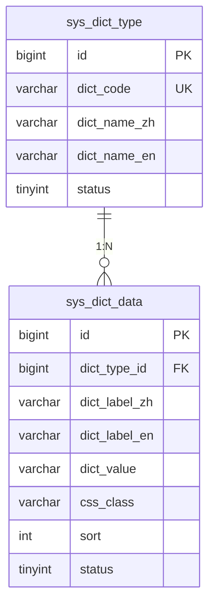
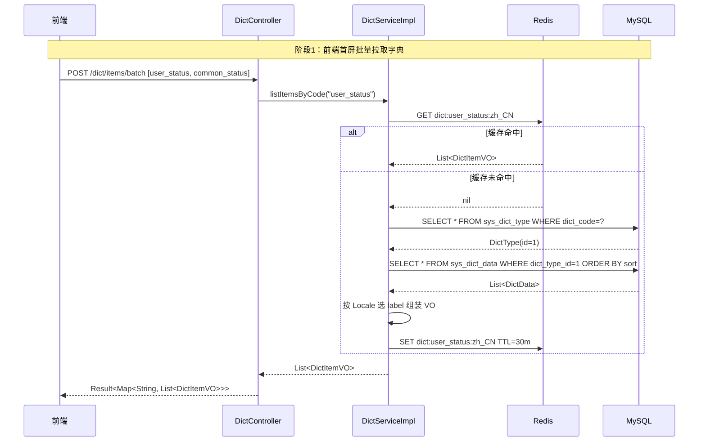
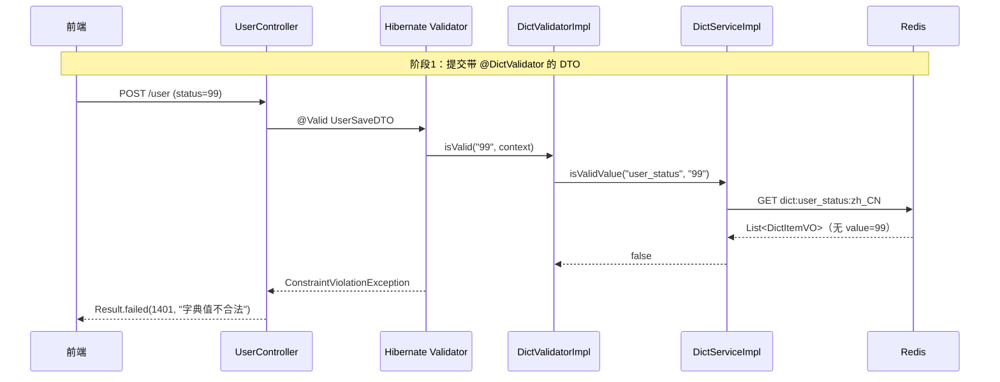

# 数据字典 · 设计文档

> 模块路径：`org.dam.entity` + `org.dam.service.dict` + `org.dam.component.dict`
> 作者：zhengbing · 版本：1.0 · 日期：2026-08-31

## 1. 设计目标

### 1.1 背景

当前项目存在大量"魔法值"问题，集中在三个层面：

1. **Java 枚举硬编码**：如 `UserStatus`（0-禁用 / 1-启用 / 2-锁定 / 3-待审核）、`Logical`（AND / OR）等，文案写死在枚举常量里。前端要展示"禁用""启用"时，需要前后端各自维护一份映射，易不一致。
2. **数据库字段注释里的状态码**：`sys_permission.type` 注释为 `1-菜单，2-按钮，3-接口`；`sys_role.status` / `sys_permission.status` 注释为 `0-禁用，1-启用`；`sys_role.built_in` 注释为 `0-否，1-是`。前端拿不到这些注释，要么硬编码、要么反复询问后端。
3. **新增枚举值需改代码发版**：例如 `UserStatus` 要加"4-休眠"，必须改 Java 枚举、改 SQL 注释、改前端映射、改校验逻辑，链路长且易漏。

引入数据字典（Data Dictionary）后，所有"值 + 含义"的对应关系统一存入 `sys_dict_type` / `sys_dict_data` 两张表，运营后台可维护，前端按 dictCode 拉取下拉框数据，后端按 dictCode + dictValue 校验入参，多语言场景下还能与 i18n 联动展示。

### 1.2 设计目标

1. **消除魔法值**：所有"值-含义"对应关系全部走字典，业务代码不再出现 `0/1/2` 字面量与中文注释。
2. **前端下拉框数据源统一**：前端按 `dictCode` 调一个接口拿选项列表，不再为每个字段单独写映射。
3. **后端入参校验自动化**：通过自定义注解 `@DictValidator(dictCode="user_status")` 自动校验请求参数值是否在字典合法范围内。
4. **数据导出文本转换**：导出 Excel / 报表时，按字典把 `0` 自动转成"禁用"，无需业务代码 if-else。
5. **与 i18n 联动**：字典标签（label）支持多语言，与 [多语言设计方案](./i18n-design.md) 共用 `_zh` / `_en` 字段方案。
6. **非目标**：不替代 Java 枚举的"程序内逻辑判断"用途（如 `if (status == UserStatus.DISABLED.getCode())` 仍走枚举，字典只负责"展示文案"和"入参校验"）。
7. **非目标**：不维护业务实体的"分类"（如商品分类、文章标签），这些是业务数据，应有独立表，不进字典。

## 2. 核心概念与对比表

### 2.1 字典 vs Java 枚举 vs 配置文件

| 维度    | Java 枚举             | properties / yml 配置 | 数据字典（本方案）                   |
| ----- | ------------------- | ------------------- | --------------------------- |
| 数据来源  | 代码内                 | 文件                  | DB 表                        |
| 修改成本  | 改代码 + 发版            | 改文件 + 发版            | 后台改 + 即时生效（清缓存后）            |
| 是否多语言 | 否（写死中文）             | 否                   | 是（`_zh` / `_en` 字段）         |
| 前端获取  | 后端提供常量接口            | 不方便                 | `GET /dict/{dictCode}` 直接返回 |
| 入参校验  | 需手写 `isValidCode()` | 不支持                 | `@DictValidator` 注解自动校验     |
| 适用场景  | 程序内逻辑判断（if/switch）  | 框架配置                | 展示文案、下拉框、入参校验、导出转换          |

**结论**：Java 枚举与数据字典不是二选一，而是分工——枚举管"逻辑"，字典管"展示"。

### 2.2 字典与多语言的关系

字典是"动态多语言（业务数据层）"的一种，与菜单/角色名共用 `_zh` / `_en` 字段方案。详见 [i18n-design.md §3.4](./i18n-design.md#34-sys_dict-字典表新建)。

### 2.3 字典类型清单（初始）

| dictCode          | dictName | 选项示例                       | 关联字段                                      |
| ----------------- | -------- | -------------------------- | ----------------------------------------- |
| `user_status`     | 用户状态     | 0-禁用 / 1-启用 / 2-锁定 / 3-待审核 | `sys_user.status`                         |
| `common_status`   | 通用启用状态   | 0-禁用 / 1-启用                | `sys_role.status`、`sys_permission.status` |
| `permission_type` | 权限类型     | 1-菜单 / 2-按钮 / 3-接口         | `sys_permission.type`                     |
| `yes_no`          | 是否       | 0-否 / 1-是                  | `sys_role.built_in`                       |
| `auth_type`       | 认证类型     | password / sms / oauth     | `sys_user_auth.auth_type`                 |
| `gender`          | 性别       | M-男 / F-女 / U-未知           | `sys_user.gender`（如新增）                    |

## 3. 表结构设计

### 3.1 字典类型表 `sys_dict_type`

```sql
-- =====================================================
-- 字典类型表 sys_dict_type
-- 一个 dictCode 对应一种分类（如 user_status）
-- =====================================================
DROP TABLE IF EXISTS `sys_dict_type`;
CREATE TABLE `sys_dict_type` (
    `id`           BIGINT       NOT NULL AUTO_INCREMENT COMMENT '主键 ID',
    `dict_code`    VARCHAR(50)  NOT NULL                COMMENT '字典编码（程序使用，唯一，如 user_status）',
    `dict_name_zh` VARCHAR(50)  NOT NULL                COMMENT '字典名称-中文（如：用户状态）',
    `dict_name_en` VARCHAR(50)  NOT NULL DEFAULT ''     COMMENT '字典名称-英文（如：User Status）',
    `status`       TINYINT      NOT NULL DEFAULT 1      COMMENT '状态（0-禁用，1-启用）',
    `remark`      VARCHAR(200)          DEFAULT NULL    COMMENT '备注',
    `create_time`  DATETIME     NOT NULL DEFAULT CURRENT_TIMESTAMP COMMENT '创建时间',
    `update_time`  DATETIME     NOT NULL DEFAULT CURRENT_TIMESTAMP ON UPDATE CURRENT_TIMESTAMP COMMENT '更新时间',
    `create_by`    VARCHAR(64)           DEFAULT NULL   COMMENT '创建人',
    `update_by`    VARCHAR(64)           DEFAULT NULL   COMMENT '更新人',
    `deleted`      TINYINT      NOT NULL DEFAULT 0      COMMENT '逻辑删除标识',
    PRIMARY KEY (`id`),
    UNIQUE KEY `uk_dict_code` (`dict_code`)
) ENGINE = InnoDB DEFAULT CHARSET = utf8mb4 COMMENT = '字典类型表';
```

### 3.2 字典项表 `sys_dict_data`

```sql
-- =====================================================
-- 字典项表 sys_dict_data
-- 一个 dict_value 对应一个选项（如 0-禁用）
-- =====================================================
DROP TABLE IF EXISTS `sys_dict_data`;
CREATE TABLE `sys_dict_data` (
    `id`            BIGINT       NOT NULL AUTO_INCREMENT COMMENT '主键 ID',
    `dict_type_id`  BIGINT       NOT NULL                COMMENT '字典类型 ID',
    `dict_label_zh` VARCHAR(100) NOT NULL                COMMENT '字典标签-中文（展示用，如：禁用）',
    `dict_label_en` VARCHAR(100) NOT NULL DEFAULT ''     COMMENT '字典标签-英文（如：Disabled）',
    `dict_value`    VARCHAR(100) NOT NULL                 COMMENT '字典值（程序使用，如 0）',
    `css_class`     VARCHAR(100)          DEFAULT NULL   COMMENT '前端样式类（如 el-tag-danger，便于按值着色）',
    `sort`          INT          NOT NULL DEFAULT 0      COMMENT '排序（数字越小越靠前）',
    `status`        TINYINT      NOT NULL DEFAULT 1      COMMENT '状态（0-禁用，1-启用）',
    `remark`       VARCHAR(200)          DEFAULT NULL   COMMENT '备注',
    `create_time`   DATETIME     NOT NULL DEFAULT CURRENT_TIMESTAMP COMMENT '创建时间',
    `update_time`   DATETIME     NOT NULL DEFAULT CURRENT_TIMESTAMP ON UPDATE CURRENT_TIMESTAMP COMMENT '更新时间',
    `create_by`    VARCHAR(64)           DEFAULT NULL   COMMENT '创建人',
    `update_by`    VARCHAR(64)           DEFAULT NULL   COMMENT '更新人',
    `deleted`      TINYINT      NOT NULL DEFAULT 0    COMMENT '逻辑删除标识',
    PRIMARY KEY (`id`),
    KEY `idx_dict_type_id` (`dict_type_id`),
    KEY `idx_dict_value` (`dict_value`)
) ENGINE = InnoDB DEFAULT CHARSET = utf8mb4 COMMENT = '字典项表';
```

### 3.3 ER 关系



### 3.4 初始化数据

```sql
-- =====================================================
-- 字典类型初始化
-- =====================================================
INSERT INTO `sys_dict_type` (`dict_code`, `dict_name_zh`, `dict_name_en`, `remark`) VALUES
('user_status',     '用户状态',  'User Status',       'sys_user.status 字段对应值'),
('common_status',    '通用状态',  'Common Status',     'sys_role/sys_permission.status 共用'),
('permission_type',  '权限类型',  'Permission Type',   'sys_permission.type 字段对应值'),
('yes_no',           '是否',     'Yes/No',             '0-否，1-是'),
('auth_type',        '认证类型',  'Auth Type',         'sys_user_auth.auth_type 字段对应值');

-- =====================================================
-- 字典项初始化
-- =====================================================
-- user_status 用户状态
INSERT INTO `sys_dict_data` (`dict_type_id`, `dict_label_zh`, `dict_label_en`, `dict_value`, `css_class`, `sort`, `remark`) VALUES
((SELECT id FROM sys_dict_type WHERE dict_code='user_status'), '禁用',   'Disabled',  '0', 'danger',  1, '用户被禁用，不可登录'),
((SELECT id FROM sys_dict_type WHERE dict_code='user_status'), '启用',   'Enabled',  '1', 'success',  2, '正常状态'),
((SELECT id FROM sys_dict_type WHERE dict_code='user_status'), '锁定',   'Locked',   '2', 'warning',  3, '密码错误次数超限'),
((SELECT id FROM sys_dict_type WHERE dict_code='user_status'), '待审核', 'Pending',  '3', 'info',     4, '注册后等待审核');

-- common_status 通用状态
INSERT INTO `sys_dict_data` (`dict_type_id`, `dict_label_zh`, `dict_label_en`, `dict_value`, `css_class`, `sort`) VALUES
((SELECT id FROM sys_dict_type WHERE dict_code='common_status'), '禁用', 'Disabled', '0', 'danger', 1),
((SELECT id FROM sys_dict_type WHERE dict_code='common_status'), '启用', 'Enabled',  '1', 'success', 2);

-- permission_type 权限类型
INSERT INTO `sys_dict_data` (`dict_type_id`, `dict_label_zh`, `dict_label_en`, `dict_value`, `css_class`, `sort`) VALUES
((SELECT id FROM sys_dict_type WHERE dict_code='permission_type'), '菜单', 'Menu',     '1', 'primary', 1),
((SELECT id FROM sys_dict_type WHERE dict_code='permission_type'), '按钮', 'Button',   '2', 'success', 2),
((SELECT id FROM sys_dict_type WHERE dict_code='permission_type'), '接口', 'API',      '3', 'warning', 3);

-- yes_no 是否
INSERT INTO `sys_dict_data` (`dict_type_id`, `dict_label_zh`, `dict_label_en`, `dict_value`, `css_class`, `sort`) VALUES
((SELECT id FROM sys_dict_type WHERE dict_code='yes_no'), '否', 'No',  '0', 'info',    1),
((SELECT id FROM sys_dict_type WHERE dict_code='yes_no'), '是', 'Yes', '1', 'success', 2);

-- auth_type 认证类型
INSERT INTO `sys_dict_data` (`dict_type_id`, `dict_label_zh`, `dict_label_en`, `dict_value`, `css_class`, `sort`) VALUES
((SELECT id FROM sys_dict_type WHERE dict_code='auth_type'), '密码',       'Password',   'password', 'primary', 1),
((SELECT id FROM sys_dict_type WHERE dict_code='auth_type'), '短信验证码', 'SMS Code',   'sms',      'success', 2),
((SELECT id FROM sys_dict_type WHERE dict_code='auth_type'), 'OAuth 第三方','OAuth',      'oauth',    'warning', 3);
```

## 4. 实体与 Service 设计

### 4.1 实体类

```java
// 新增：src/main/java/org/dam/entity/DictType.java

/**
 * 字典类型实体
 * 对应数据库表 sys_dict_type
 *
 * @author zhengbing
 * @since 2026-08-31
 **/
@Data
@EqualsAndHashCode(callSuper = true)
@TableName("sys_dict_type")
@Schema(description = "字典类型")
public class DictType extends BaseEntity {

    private static final long serialVersionUID = 1L;

    @Schema(description = "主键 ID")
    @TableId(type = IdType.AUTO)
    private Long id;

    @Schema(description = "字典编码")
    private String dictCode;

    @Schema(description = "字典名称-中文")
    private String dictNameZh;

    @Schema(description = "字典名称-英文")
    private String dictNameEn;

    @Schema(description = "状态")
    private Integer status;

    @Schema(description = "备注")
    private String remark;
}
```

```java
// 新增：src/main/java/org/dam/entity/DictData.java

/**
 * 字典项实体
 * 对应数据库表 sys_dict_data
 *
 * @author zhengbing
 * @since 2026-08-31
 **/
@Data
@EqualsAndHashCode(callSuper = true)
@TableName("sys_dict_data")
@Schema(description = "字典项")
public class DictData extends BaseEntity {

    private static final long serialVersionUID = 1L;

    @Schema(description = "主键 ID")
    @TableId(type = IdType.AUTO)
    private Long id;

    @Schema(description = "字典类型 ID")
    private Long dictTypeId;

    @Schema(description = "字典标签-中文")
    private String dictLabelZh;

    @Schema(description = "字典标签-英文")
    private String dictLabelEn;

    @Schema(description = "字典值")
    private String dictValue;

    @Schema(description = "前端样式类")
    private String cssClass;

    @Schema(description = "排序")
    private Integer sort;

    @Schema(description = "状态")
    private Integer status;

    @Schema(description = "备注")
    private String remark;
}
```

### 4.2 VO 设计（前端友好输出）

前端只关心"值 + 当前语言标签 + 样式类"，不关心 `_zh` / `_en` 双字段。Service 层按 `LocaleContextHolder` 选 label。

```java
// 新增：src/main/java/org/dam/vo/DictItemVO.java

/**
 * 字典项 VO（按当前 Locale 输出 label）
 *
 * @author zhengbing
 * @since 2026-08-31
 **/
@Data
@Schema(description = "字典项")
public class DictItemVO {

    @Schema(description = "字典值")
    private String value;

    @Schema(description = "字典标签（按当前 Locale）")
    private String label;

    @Schema(description = "前端样式类")
    private String cssClass;

    @Schema(description = "排序")
    private Integer sort;
}
```

### 4.3 Mapper 与 Service

```java
// 新增：src/main/java/org/dam/mapper/DictTypeMapper.java
public interface DictTypeMapper extends BaseMapper<DictType> {
}

// 新增：src/main/java/org/dam/mapper/DictDataMapper.java
public interface DictDataMapper extends BaseMapper<DictData> {
}
```

```java
// 新增：src/main/java/org/dam/service/DictService.java

public interface DictService {

    /**
     * 按 dictCode 查询所有启用字典项（前端下拉框用，走缓存）
     */
    List<DictItemVO> listItemsByCode(String dictCode);

    /**
     * 按 dictCode + dictValue 反查当前 Locale 下的标签（导出/展示用）
     */
    String getLabel(String dictCode, String dictValue);

    /**
     * 校验 dictValue 是否在字典合法范围内
     */
    boolean isValidValue(String dictCode, String dictValue);

    /**
     * 新增/更新字典类型（运营后台用，触发缓存 evict）
     */
    Long saveOrUpdateType(DictType dictType);

    /**
     * 新增/更新字典项（触发缓存 evict）
     */
    Long saveOrUpdateData(DictData dictData);
}
```

### 4.4 Service 实现要点

```java
// 新增：src/main/java/org/dam/service/impl/DictServiceImpl.java

/**
 * 字典 Service 实现
 * 读走缓存，写触发 evict
 *
 * @author zhengbing
 * @since 2026-08-31
 **/
@Slf4j
@Service
public class DictServiceImpl implements DictService {

    @Resource
    private DictTypeMapper dictTypeMapper;

    @Resource
    private DictDataMapper dictDataMapper;

    /**
     * 按 dictCode 拉取字典项（走缓存）
     * 缓存 key: dict:user_status:zh_CN
     */
    @Override
    @Cacheable(value = "dict", key = "#dictCode + ':' + T(org.springframework.context.i18n.LocaleContextHolder).getLocale().toString()")
    public List<DictItemVO> listItemsByCode(String dictCode) {
        DictType type = dictTypeMapper.selectOne(
                Wrappers.<DictType>lambdaQuery().eq(DictType::getDictCode, dictCode));
        if (type == null) {
            return Collections.emptyList();
        }
        List<DictData> list = dictDataMapper.selectList(
                Wrappers.<DictData>lambdaQuery()
                        .eq(DictData::getDictTypeId, type.getId())
                        .eq(DictData::getStatus, 1)
                        .orderByAsc(DictData::getSort));
        boolean isEn = isEnLocale();
        return list.stream().map(d -> {
            DictItemVO vo = new DictItemVO();
            vo.setValue(d.getDictValue());
            vo.setLabel(isEn && StrUtil.isNotBlank(d.getDictLabelEn())
                    ? d.getDictLabelEn() : d.getDictLabelZh());
            vo.setCssClass(d.getCssClass());
            vo.setSort(d.getSort());
            return vo;
        }).collect(Collectors.toList());
    }

    /**
     * 反查标签（导出/详情页展示）
     */
    @Override
    public String getLabel(String dictCode, String dictValue) {
        return listItemsByCode(dictCode).stream()
                .filter(vo -> vo.getValue().equals(dictValue))
                .map(DictItemVO::getLabel)
                .findFirst()
                .orElse(dictValue);
    }

    /**
     * 校验入参值合法性
     */
    @Override
    public boolean isValidValue(String dictCode, String dictValue) {
        return listItemsByCode(dictCode).stream()
                .anyMatch(vo -> vo.getValue().equals(dictValue));
    }

    @Override
    @CacheEvict(value = "dict", allEntries = true)
    @Transactional(rollbackFor = Exception.class)
    public Long saveOrUpdateType(DictType dictType) {
        if (dictType.getId() == null) {
            dictTypeMapper.insert(dictType);
        } else {
            dictTypeMapper.updateById(dictType);
        }
        return dictType.getId();
    }

    @Override
    @CacheEvict(value = "dict", allEntries = true)
    @Transactional(rollbackFor = Exception.class)
    public Long saveOrUpdateData(DictData dictData) {
        if (dictData.getId() == null) {
            dictDataMapper.insert(dictData);
        } else {
            dictDataMapper.updateById(dictData);
        }
        return dictData.getId();
    }

    private boolean isEnLocale() {
        Locale locale = LocaleContextHolder.getLocale();
        return "en_US".equals(locale.toString()) || "en".equals(locale.getLanguage());
    }
}
```

### 4.5 Controller

```java
// 新增：src/main/java/org/dam/controller/DictController.java

/**
 * 字典 Controller
 * 提供给前端拉取下拉框数据源
 *
 * @author zhengbing
 * @since 2026-08-31
 **/
@Slf4j
@RestController
@RequestMapping("/dict")
@RequiresPermission("dict:view")
public class DictController {

    @Resource
    private DictService dictService;

    /**
     * 按 dictCode 拉取字典项列表
     * 前端下拉框数据源统一入口
     */
    @GetMapping("/{dictCode}/items")
    public Result<List<DictItemVO>> listItems(@PathVariable String dictCode) {
        return Result.success(dictService.listItemsByCode(dictCode));
    }

    /**
     * 批量拉取多个字典（前端首屏一次性加载）
     */
    @PostMapping("/items/batch")
    public Result<Map<String, List<DictItemVO>>> listItemsBatch(@RequestBody List<String> dictCodes) {
        Map<String, List<DictItemVO>> result = new HashMap<>(dictCodes.size());
        dictCodes.forEach(code -> result.put(code, dictService.listItemsByCode(code)));
        return Result.success(result);
    }
}
```

## 5. 各场景使用方式

### 5.1 场景一：前端下拉框数据源

**场景**：用户列表页筛选条件里有"用户状态"下拉框，需要展示 `禁用 / 启用 / 锁定 / 待审核`。

**前端调用**：

```http
GET /dict/user_status/items
Accept-Language: zh_CN
```

**响应**：

```json
{
  "code": 200,
  "message": "操作成功",
  "data": [
    { "value": "0", "label": "禁用",   "cssClass": "danger",  "sort": 1 },
    { "value": "1", "label": "启用",   "cssClass": "success", "sort": 2 },
    { "value": "2", "label": "锁定",   "cssClass": "warning", "sort": 3 },
    { "value": "3", "label": "待审核", "cssClass": "info",    "sort": 4 }
  ]
}
```

**前端用法**（伪代码）：

```javascript
// 一次性加载首屏所有字典，缓存到本地
async loadDicts() {
  const codes = ['user_status', 'common_status', 'permission_type'];
  const res = await POST('/dict/items/batch', codes);
  this.dictMap = res.data;  // { user_status: [...], common_status: [...] }
}

// 下拉框渲染
<el-select v-model="filter.status">
  <el-option v-for="item in dictMap.user_status"
             :key="item.value"
             :label="item.label"
             :value="item.value" />
</el-select>
```

### 5.2 场景二：后端入参自动校验

**场景**：用户修改接口入参 `status` 必须是 `user_status` 字典里的合法值，不接受 `99` 这种非法值。

**自定义校验注解**：

```java
// 新增：src/main/java/org/dam/component/dict/annotation/DictValidator.java

/**
 * 字典校验注解
 * 校验字段值是否在指定 dictCode 的合法范围内
 *
 * @author zhengbing
 * @since 2026-08-31
 **/
@Target({ElementType.FIELD, ElementType.PARAMETER})
@Retention(RetentionPolicy.RUNTIME)
@Constraint(validatedBy = DictValidatorImpl.class)
public @interface DictValidator {

    String dictCode();

    String message() default "{dict.value.invalid}";

    Class<?>[] groups() default {};

    Class<? extends Payload>[] payload() default {};
}
```

```java
// 新增：src/main/java/org/dam/component/dict/DictValidatorImpl.java

/**
 * 字典校验实现
 *
 * @author zhengbing
 * @since 2026-08-31
 **/
public class DictValidatorImpl implements ConstraintValidator<DictValidator, String> {

    @Resource
    private DictService dictService;

    private String dictCode;

    @Override
    public void initialize(DictValidator anno) {
        this.dictCode = anno.dictCode();
    }

    @Override
    public boolean isValid(String value, ConstraintValidatorContext context) {
        if (StrUtil.isBlank(value)) {
            return true;
        }
        return dictService.isValidValue(dictCode, value);
    }
}
```

**DTO 用法**：

```java
// 来源：src/main/java/org/dam/dto/UserSaveDTO.java（改造后片段）

@Schema(description = "用户新增/修改 DTO")
@Data
public class UserSaveDTO {

    @Schema(description = "用户状态")
    @DictValidator(dictCode = "user_status", message = "{dict.value.invalid}")
    private String status;
}
```

**消息资源**（`sys_i18n_message` 表，module=dict）：

```sql
INSERT INTO `sys_i18n_message` (`message_key`, `locale`, `message`, `module`, `remark`) VALUES
('dict.value.invalid', 'zh_CN', '字典值不合法',          'dict', '校验失败'),
('dict.value.invalid', 'en_US', 'Invalid dictionary value','dict','Validation failed');
```

非法值会自动返回：

```json
{ "code": 1400, "message": "字典值不合法" }
```

### 5.3 场景三：列表数据回显文本

**场景**：用户列表接口返回 `status=0`，前端需要展示成"禁用"。

**方案 A（前端转换，推荐）**：前端用场景一加载的 `dictMap.user_status` 做本地映射，后端只返回原始值。

**方案 B（后端转换）**：列表 VO 直接返回 label 文本。

```java
// 来源：src/main/java/org/dam/vo/UserVO.java（改造后片段）

@Data
@Schema(description = "用户 VO")
public class UserVO {

    @Schema(description = "状态值")
    private Integer status;

    @Schema(description = "状态标签（按 Locale 转换）")
    private String statusLabel;
}
```

```java
// 来源：src/main/java/org/dam/service/impl/UserServiceImpl.java（改造后片段）

private UserVO buildVo(User user) {
    UserVO vo = new UserVO();
    BeanUtil.copyProperties(user, vo);
    // 反查字典标签
    vo.setStatusLabel(dictService.getLabel("user_status", String.valueOf(user.getStatus())));
    return vo;
}
```

**取舍**：方案 A 网络包小，前端响应快；方案 B 后端逻辑集中，前端简单。默认推荐 A，对状态值变化实时性要求高的接口用 B。

### 5.4 场景四：数据导出 Excel

**场景**：导出用户列表 Excel，状态列需要显示"禁用"而不是 `0`。

**EasyExcel 自定义转换器**：

```java
// 新增：src/main/java/org/dam/component/dict/DictExcelConverter.java

/**
 * Excel 字典转换器
 * 导出时把 dictValue 转为 label，导入时反向转回 dictValue
 *
 * 用法：@ExcelProperty(value = "状态", converter = DictExcelConverter.class)
 *       需在构造时指定 dictCode（通过 @ExcelProperty 的自定义注解或工厂创建）
 *
 * @author zhengbing
 * @since 2026-08-31
 **/
public class DictExcelConverter implements Converter<String> {

    private final String dictCode;
    private final DictService dictService;

    public DictExcelConverter(String dictCode, DictService dictService) {
        this.dictCode = dictCode;
        this.dictService = dictService;
    }

    /**
     * 导出：value → label
     */
    @Override
    public String convertToExcelData(String value) {
        return dictService.getLabel(dictCode, value);
    }

    /**
     * 导入：label → value
     */
    @Override
    public String convertToJavaData(String label) {
        return dictService.listItemsByCode(dictCode).stream()
                .filter(vo -> vo.getLabel().equals(label))
                .map(DictItemVO::getValue)
                .findFirst()
                .orElse(label);
    }
}
```

**导出实体用法**：

```java
// 用法示例（实际项目按 EasyExcel 用法调整）
@ExcelProperty(value = "状态", converter = DictExcelConverter.class)
private String statusLabel;
```

### 5.5 场景五：替代 Java 枚举魔法值

**场景**：`UserStatus` 枚举的 `description` 字段写死了中文"禁用/启用"，无法多语言，前端拿不到。改造后枚举只保留 `code`，文案进字典。

**改造前**：

```java
public enum UserStatus {
    DISABLED(0, "禁用"),
    ENABLED(1, "启用"),
    // ...
}
```

**改造后**：

```java
public enum UserStatus {

    DISABLED(0),
    ENABLED(1),
    LOCKED(2),
    PENDING(3);

    private final Integer code;

    UserStatus(Integer code) {
        this.code = code;
    }

    public Integer getCode() {
        return code;
    }
}
```

文案统一查字典：`dictService.getLabel("user_status", String.valueOf(UserStatus.DISABLED.getCode()))`。

**保留枚举的原因**：业务逻辑判断 `if (user.getStatus().equals(UserStatus.DISABLED.getCode()))` 仍走枚举，可读性远高于 `if (user.getStatus() == 0)`。枚举管逻辑，字典管展示。

### 5.6 场景六：多语言展示联动

**场景**：英文环境下，下拉框要展示 `Disabled / Enabled / Locked / Pending`。

由于 `DictServiceImpl.listItemsByCode()` 内部读取 `LocaleContextHolder.getLocale()` 选 `_zh` / `_en` 字段，前端只需在请求头带 `Accept-Language: en_US` 即可自动切换：

```http
GET /dict/user_status/items
Accept-Language: en_US
```

```json
{
  "code": 200,
  "data": [
    { "value": "0", "label": "Disabled", "cssClass": "danger" },
    { "value": "1", "label": "Enabled",  "cssClass": "success" }
  ]
}
```

缓存维度：`dict:user_status:zh_CN` 与 `dict:user_status:en_US` 分开缓存，互不影响。详见 [i18n-design.md §5](./i18n-design.md#5-locale-解析链路设计)。

## 6. 缓存设计

### 6.1 缓存策略

| 维度   | 配置                                                                          |
| ---- | --------------------------------------------------------------------------- |
| 缓存空间 | `dict`                                                                      |
| 缓存键  | `dict:{dictCode}:{locale}`（如 `dict:user_status:zh_CN`）                      |
| TTL  | 30 分钟                                                                       |
| 读策略  | `@Cacheable`，未命中查 DB 后回填                                                    |
| 写策略  | `saveOrUpdateType` / `saveOrUpdateData` 触发 `@CacheEvict(allEntries = true)` |
| 启动预热 | 可选：`ApplicationRunner` 加载高频 dictCode（`user_status` / `common_status`）       |

### 6.2 缓存失效场景

| 操作                 | 失效范围        | 原因                              |
| ------------------ | ----------- | ------------------------------- |
| 新增/修改字典类型          | 全部 `dict:*` | 类型可能影响 dictCode 映射              |
| 新增/修改字典项           | 全部 `dict:*` | label / cssClass / sort 变化需重新加载 |
| 字典项状态切换（启用↔禁用）     | 全部 `dict:*` | 选项列表变化                          |
| 多语言新增（locale 字段更新） | 全部 `dict:*` | 各 locale 缓存独立，统一清空简化逻辑          |

## 7. 核心流程时序图

### 7.1 前端拉取下拉框数据时序



### 7.2 入参校验时序



## 8. 扩展约定与最佳实践

### 8.1 dictCode 命名规范

| 类型  | 规则                 | 示例                            |
| --- | ------------------ | ----------------------------- |
| 状态类 | `{entity}_{field}` | `user_status`、`role_status`   |
| 类型类 | `{entity}_type`    | `permission_type`、`auth_type` |
| 通用类 | 简短英文               | `yes_no`、`gender`             |

规则：全小写 + 下划线分隔，禁止拼音、禁止缩写到不可读。

### 8.2 Do / Don't

| 类型      | 规则                                               |
| ------- | ------------------------------------------------ |
| ✅ Do    | 业务逻辑判断仍走 Java 枚举 `UserStatus.DISABLED.getCode()` |
| ✅ Do    | 展示文案、下拉框、入参校验全部走字典                               |
| ✅ Do    | dictValue 用字符串存储（即使值是数字），兼容"password"等非数字值       |
| ✅ Do    | 字典项加 `cssClass` 字段，前端按值着色，避免前端再写映射               |
| ✅ Do    | 多语言环境下按 `dict:{code}:{locale}` 分维度缓存             |
| ❌ Don't | 禁止在业务代码里写 `if (status == 0)` 这种魔法值判断             |
| ❌ Don't | 禁止把"业务实体分类"（如商品分类）塞进字典，应有独立表                     |
| ❌ Don't | 禁止前端硬编码 `0 → 禁用` 映射，统一从 `/dict/{code}/items` 拉   |
| ❌ Don't | 禁止在循环内调用 `dictService.getLabel()`（应在批量查询后本地映射）   |
| ❌ Don't | 禁止 `dictValue` 含特殊字符（空格、引号、HTML 标签），保持纯值         |

### 8.3 性能红线

1. **字典查询必须走缓存**：所有 `listItemsByCode` / `getLabel` / `isValidValue` 命中 Redis，未命中才查 DB。
2. **列表数据回显避免 N+1**：列表接口禁止循环调用 `getLabel`，应一次性把所有 dictCode 的 items 拉到内存 Map，循环内做本地查找。
3. **首屏批量加载**：前端首屏一次性 `POST /dict/items/batch` 拉取所有需要的字典，避免 N 个并发请求。
4. **字典项数量限制**：单个 dictCode 下的字典项不建议超过 50 条，超过应考虑是否该用业务实体表。

### 8.4 已知取舍

| 取舍点                            | 选择     | 理由                                  |
| ------------------------------ | ------ | ----------------------------------- |
| dictValue 类型                   | 字符串    | 兼容 `password` / `oauth` 等非数字值，统一序列化 |
| Java 枚举 vs 字典                  | 并存     | 枚举管逻辑，字典管展示，各司其职                    |
| 前端转换 vs 后端转换                   | 默认前端转换 | 网络包小、响应快；特殊接口后端转换                   |
| `@CacheEvict(allEntries=true)` | 是      | 字典更新频率低，整空间清空影响可忽略                  |
| 是否引入 Redisson 精准删除             | 否      | 暂不需要；高频更新场景再切换                      |

## 9. 相关文件

| 类别                | 文件路径                                                                 |
| ----------------- | -------------------------------------------------------------------- |
| 设计文档（本文）          | `docs/dict-system-design.md`                                         |
| 关联设计 - 多语言        | `docs/i18n-design.md`                                                |
| 关联设计 - RBAC 权限    | `docs/rbac-permission-system-design.md`                              |
| 关联设计 - Redis 缓存   | `docs/redis-cache-design.md`                                         |
| 字典表 + 初始化脚本（新增）   | `src/main/resources/sql/dict_schema.sql`                             |
| 实体类 - 字典类型（新增）    | `src/main/java/org/dam/entity/DictType.java`                         |
| 实体类 - 字典项（新增）     | `src/main/java/org/dam/entity/DictData.java`                         |
| VO - 字典项（新增）      | `src/main/java/org/dam/vo/DictItemVO.java`                           |
| Mapper - 字典类型（新增） | `src/main/java/org/dam/mapper/DictTypeMapper.java`                   |
| Mapper - 字典项（新增）  | `src/main/java/org/dam/mapper/DictDataMapper.java`                   |
| Service（新增）       | `src/main/java/org/dam/service/DictService.java`                     |
| Service 实现（新增）    | `src/main/java/org/dam/service/impl/DictServiceImpl.java`            |
| Controller（新增）    | `src/main/java/org/dam/controller/DictController.java`               |
| 校验注解（新增）          | `src/main/java/org/dam/component/dict/annotation/DictValidator.java` |
| 校验实现（新增）          | `src/main/java/org/dam/component/dict/DictValidatorImpl.java`        |
| Excel 转换器（新增）     | `src/main/java/org/dam/component/dict/DictExcelConverter.java`       |
| 现有枚举（参考改造）        | `src/main/java/org/dam/component/status/UserStatus.java`             |

