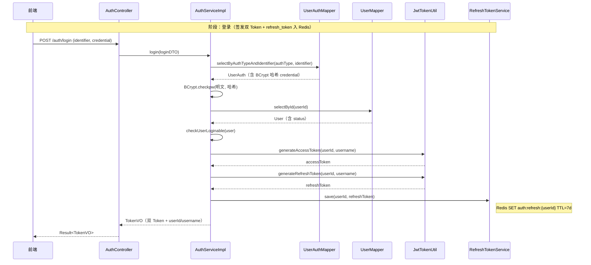
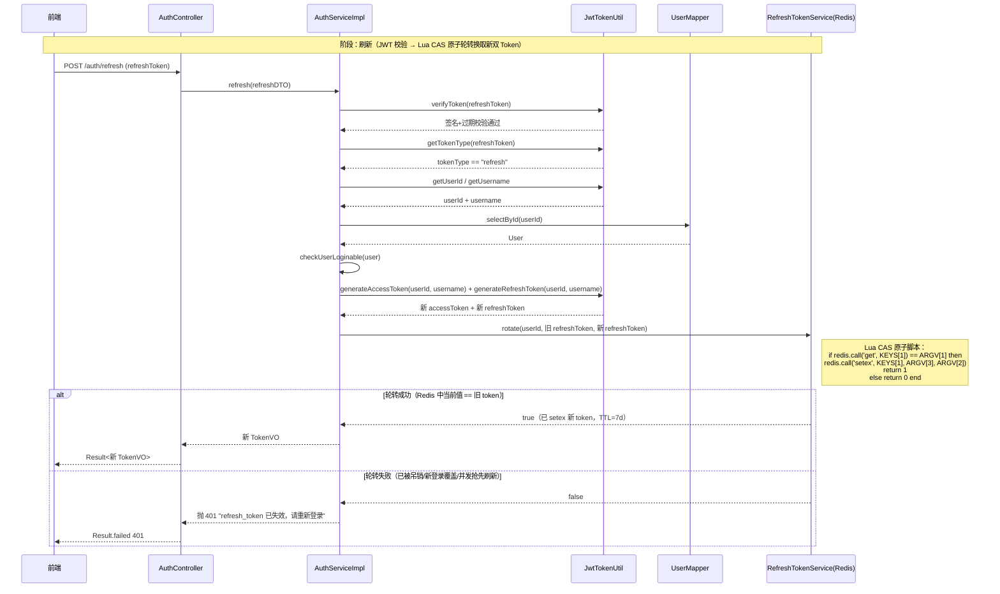
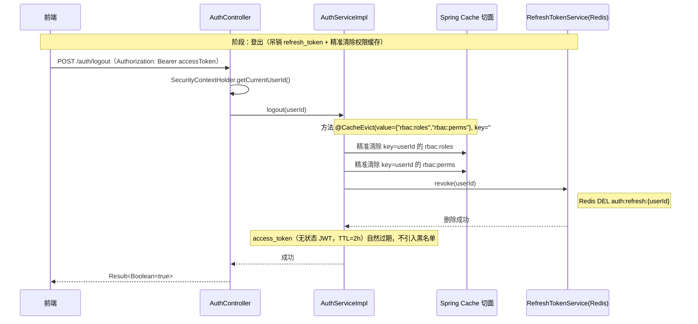

# 双 Token 认证 · 设计文档

> 模块路径：`org.dam.service` + `org.dam.component.security`
> 作者：zhengbing · 版本：1.0 · 日期：2026-08-18

## 1. 设计目标

为 Spring Boot 后端提供一套**无状态 JWT + 双 Token** 认证机制，在「服务无状态可水平扩展」与「令牌可吊销、可无感续期」之间取得平衡：

- **无状态**：业务接口鉴权完全依赖 access_token 自身的签名与过期时间，服务端不查库、不查缓存，可任意横向扩容。
- **双 Token 分离**：access_token 短时效负责业务鉴权；refresh_token 长时效仅用于换取新 access_token，且服务端侧落库（Redis）可吊销。
- **多认证方式预留**：认证表 `sys_user_auth` 通过 `auth_type` 字段区分密码、手机验证码、第三方 OAuth 等多种登录方式，新增方式无需改表结构。
- **防 replay**：refresh_token 通过 Lua 脚本做 CAS 原子轮转，旧 token 一次性失效，攻击者无法用旧 token 重复刷新。
- **状态可吊销**：登出、踢人下线、改密码等场景通过删除 Redis 中的 refresh_token 实现「准实时」吊销；access_token 因短期自然过期，不引入黑名单。
- **安全上下文线程级隔离**：基于 ThreadLocal 注入当前操作者身份，请求结束统一清理，避免线程池复用串数据。

## 2. 为什么双 Token（与单 Token 对比）

| 维度 | 单 Token 方案 | 双 Token 方案（本项目） |
|------|---------------|--------------------------|
| Token 寿命 | 长寿命（如 7 天），兼顾续期与安全矛盾 | access 短（默认 120 分钟），refresh 长（默认 7 天） |
| 续期方式 | 用旧 Token 直接换新 Token，旧 Token 在生效期内可被 replay | refresh 一次性轮转，旧 refresh 立即失效 |
| 安全性 | 长寿命 Token 一旦泄漏窗口期长 | access 泄露窗口短；refresh 泄露可吊销 |
| 吊销能力 | 长寿命 Token 若要吊销需引入黑名单，破坏无状态 | refresh 落 Redis 可吊销；access 短期自然过期，无需黑名单 |
| 用户体验 | 续期需主动重新登录或暴露长 Token | access 过期前端用 refresh 无感换取新双 Token |
| 服务端状态 | 若要吊销则需有状态 | 仅 refresh 维护轻量状态，业务接口仍无状态 |

**核心结论**：双 Token 把「可吊销性」集中到 refresh_token 这一条链路上，业务接口鉴权链路保持纯无状态，兼顾安全与扩展性。

## 3. 认证关联表 sys_user_auth（多认证方式预留 auth_type）

认证凭证与用户基本信息解耦，一张用户主体表对应零到多条认证记录，支持同一用户绑定多种登录方式。

```sql
CREATE TABLE `sys_user_auth` (
    `id`          BIGINT       NOT NULL AUTO_INCREMENT COMMENT '主键 ID',
    `user_id`     BIGINT       NOT NULL                COMMENT '关联用户 ID（sys_user.id）',
    `auth_type`   TINYINT      NOT NULL DEFAULT 1      COMMENT '认证类型（1-密码，2-手机验证码，3-第三方 OAuth）',
    `identifier`  VARCHAR(100) NOT NULL                COMMENT '登录标识（用户名/手机号/邮箱）',
    `credential`  VARCHAR(200) NOT NULL                COMMENT '凭证（密码认证下为 BCrypt 哈希）',
    `status`      TINYINT      NOT NULL DEFAULT 1      COMMENT '状态（0-禁用，1-启用）',
    -- create_time / update_time / create_by / update_by / deleted 略
    PRIMARY KEY (`id`),
    UNIQUE KEY `uk_auth_type_identifier` (`auth_type`, `identifier`),
    KEY `idx_user_id` (`user_id`)
) ENGINE = InnoDB DEFAULT CHARSET = utf8mb4 COMMENT = '用户认证关联表';
```

**设计要点**：

- `auth_type + identifier` 联合唯一，确保同一认证方式下登录标识唯一；不同认证方式可共用同一 identifier。
- `credential` 存储的是 **BCrypt 哈希值**，强度 10，由 Hutool `BCrypt.hashpw` 生成，绝不存明文。
- 登录时通过 `selectByAuthTypeAndIdentifier(authType, identifier)` 定位认证记录，再用 `BCrypt.checkpw` 校验密码。
- 失败统一返回"用户名或密码错误"，防止账号枚举攻击。

**扩展方式**：新增手机验证码登录只需在 `AuthLoginDTO.authType` 传 2 并新增对应校验逻辑，无需改表结构与唯一约束。

## 4. JWT 设计（access vs refresh）

JWT 由 `JwtTokenUtil` 基于 Hutool JWT 生成与校验，配置项绑定 `application.yml` 的 `jwt.*` 前缀（`JwtProperties`）。

### 4.1 配置属性

```java
@Data
@Component
@ConfigurationProperties(prefix = "jwt")
public class JwtProperties {
    private String secret;                              // 签名密钥（HS256 建议 >= 32 字节）
    private String issuer;                              // 签发者
    private long accessTokenExpireMinutes = 120L;       // access 过期分钟数
    private long refreshTokenExpireDays = 7L;           // refresh 过期天数
}
```

### 4.2 Payload 载荷

每枚 Token 在 Payload 中携带 `userId / username / tokenType` 三项业务字段，其中 `tokenType` 区分两类 Token，防止业务接口被 refresh_token 误用、刷新接口被 access_token 误用。

```java
private String generateToken(Long userId, String username, String tokenType, long expireMillis) {
    Date now = new Date();
    Date expireAt = new Date(now.getTime() + expireMillis);
    return JWT.create()
            .setIssuer(jwtProperties.getIssuer())
            .setIssuedAt(now)
            .setExpiresAt(expireAt)
            .setPayload("userId", userId)
            .setPayload("username", username)
            .setPayload("tokenType", tokenType)
            .setKey(getKey())
            .sign();
}
```

### 4.3 双 Token 对比

| 维度 | access_token | refresh_token |
|------|--------------|---------------|
| 类型标识 | `TOKEN_TYPE_ACCESS = "access"` | `TOKEN_TYPE_REFRESH = "refresh"` |
| TTL | 120 分钟（可配置） | 7 天（可配置） |
| 用途 | 业务接口鉴权 | 仅调用 `/auth/refresh` 换取新双 Token |
| 存储位置 | 客户端内存 / localStorage（前端持有） | 客户端 + 服务端 Redis 双份 |
| 校验链路 | JWT 签名 + 过期 + 类型校验（拦截器） | JWT 签名 + 过期 + 类型校验 + Redis CAS 轮转 |
| 能否吊销 | 不可（短期自然过期，不引入黑名单） | 可（删除 Redis 即吊销） |
| 一次性 | 否（生效期内可多次使用） | 是（轮转后旧 token 立即失效） |

## 5. 核心链路（登录 / 刷新 / 登出）

### 5.1 登录流程



**关键步骤**（`AuthServiceImpl.login`）：

1. `authType` 为空时回退到密码认证（`AUTH_TYPE_PASSWORD = 1`）。
2. 按 `authType + identifier` 查认证记录，记录不存在直接抛 401。
3. `BCrypt.checkpw` 校验密码，失败统一抛"用户名或密码错误"。
4. 查用户主体并 `checkUserLoginable`，仅 `ENABLED` 状态可登录；`DISABLED/LOCKED/PENDING` 给出明确提示。
5. 生成双 Token，refresh_token 同步入 Redis（TTL 与 Token 自身过期一致）。
6. 返回 `TokenVO`，含 `accessToken / refreshToken / tokenType=Bearer / expiresIn / userId / username`。

### 5.2 刷新流程



**关键步骤**（`AuthServiceImpl.refresh`）：

1. JWT 签名 + 过期校验，失败抛 401。
2. `tokenType` 必须为 `refresh`，防止 access_token 被误用刷新。
3. 解析 `userId / username`，回查用户主体并 `checkUserLoginable`，确保账号仍可登录。
4. 生成新双 Token，调用 `refreshTokenService.rotate` 做 **CAS 原子轮转**。
5. `rotate` 返回 false 表示 Redis 中旧 token 已失效（登出、被新登录覆盖、并发抢先刷新），抛 401 要求重新登录。
6. 返回新 `TokenVO`。

**轮转 Lua 脚本**（`RefreshTokenServiceImpl.ROTATE_LUA`）：

```java
private static final String ROTATE_LUA =
        "if redis.call('get', KEYS[1]) == ARGV[1] then " +
        "    redis.call('setex', KEYS[1], ARGV[3], ARGV[2]) " +
        "    return 1 " +
        "else " +
        "    return 0 " +
        "end";
```

KEYS[1] = `auth:refresh:{userId}`，ARGV[1] = 旧 refresh_token，ARGV[2] = 新 refresh_token，ARGV[3] = TTL 秒数。**只有 Redis 中当前值与旧 token 一致才替换**，保证旧 token 一次性失效。

### 5.3 登出流程



**关键步骤**（`AuthServiceImpl.logout`）：

1. `logout` 接口需登录（`@RequiresLogin`），从 `SecurityContextHolder` 取 `userId`。
2. `@CacheEvict(value = {"rbac:roles", "rbac:perms"}, key = "#userId")` 精准清除该用户权限/角色缓存。
3. `refreshTokenService.revoke(userId)` 删除 Redis 中的 refresh_token。
4. access_token 为无状态 JWT，不引入黑名单，依赖短期自然过期失效。

## 6. 拦截器与安全上下文

### 6.1 TokenAuthInterceptor 拦截策略

拦截器在 `WebMvcConfig` 中注册，匹配 `/**`，放行 `/auth/login`、`/auth/refresh`、Swagger 文档、`/error` 等无需认证的路径。

```java
@Override
public boolean preHandle(HttpServletRequest request, HttpServletResponse response, Object handler) {
    String authHeader = request.getHeader(AUTHORIZATION_HEADER);

    // 未携带 Authorization 头 → 匿名访问，由 @RequiresLogin 注解决定是否拦截
    if (StrUtil.isBlank(authHeader) || !authHeader.startsWith(BEARER_PREFIX)) {
        SecurityContext context = SecurityContext.builder()
                .loggedIn(Boolean.FALSE)
                .build();
        SecurityContextHolder.set(context);
        return true;
    }

    String token = authHeader.substring(BEARER_PREFIX.length()).trim();

    // 校验 Token 签名 + 过期时间
    if (!jwtTokenUtil.verifyToken(token)) {
        writeUnauthorized(response, "Token 无效或已过期，请重新登录");
        return false;
    }

    // 校验 Token 类型必须是 access（业务接口禁止使用 refresh_token）
    String tokenType = jwtTokenUtil.getTokenType(token);
    if (!JwtTokenUtil.TOKEN_TYPE_ACCESS.equals(tokenType)) {
        writeUnauthorized(response, "请使用 access_token 访问业务接口");
        return false;
    }

    // 提取用户身份注入上下文
    Long userId = jwtTokenUtil.getUserId(token);
    String username = jwtTokenUtil.getUsername(token);
    SecurityContext context = SecurityContext.builder()
            .userId(userId)
            .username(username)
            .loggedIn(Boolean.TRUE)
            .build();
    SecurityContextHolder.set(context);
    return true;
}

@Override
public void afterCompletion(HttpServletRequest request, HttpServletResponse response,
                            Object handler, Exception ex) {
    // 请求结束清理 ThreadLocal，避免线程池复用串数据
    SecurityContextHolder.clear();
}
```

**处理策略**：

- **无 Token**：注入 `loggedIn=false` 上下文放行，是否拒绝由方法上的 `@RequiresLogin` 注解决定，支持匿名接口与登录接口共存。
- **Token 无效/过期**：HTTP 401，body 为标准 `Result` 结构，便于前端统一处理。
- **Token 类型非 access**：返回 401"请使用 access_token 访问业务接口"，防止业务接口用 refresh_token。
- **Token 有效**：注入 `SecurityContext`（userId/username/loggedIn），放行。
- **请求结束**：`afterCompletion` 必清理 ThreadLocal，避免线程池复用串数据。

### 6.2 SecurityContextHolder ThreadLocal 上下文

```java
public class SecurityContextHolder {

    private static final ThreadLocal<SecurityContext> CONTEXT_HOLDER = new ThreadLocal<>();

    public static void set(SecurityContext context) { CONTEXT_HOLDER.set(context); }
    public static SecurityContext get() { return CONTEXT_HOLDER.get(); }

    public static Long getCurrentUserId() {
        SecurityContext ctx = CONTEXT_HOLDER.get();
        return (ctx != null && Boolean.TRUE.equals(ctx.getLoggedIn())) ? ctx.getUserId() : null;
    }

    public static String getCurrentUsername() {
        SecurityContext ctx = CONTEXT_HOLDER.get();
        return (ctx != null && ctx.getUsername() != null) ? ctx.getUsername() : "anonymous";
    }

    public static Boolean isLoggedIn() {
        SecurityContext ctx = CONTEXT_HOLDER.get();
        return ctx != null && Boolean.TRUE.equals(ctx.getLoggedIn());
    }

    public static void clear() { CONTEXT_HOLDER.remove(); }
}
```

业务层与 Controller 可直接通过 `SecurityContextHolder.getCurrentUserId() / getCurrentUsername() / isLoggedIn()` 获取当前操作者，无需从请求头再次解析 Token。

### 6.3 WebMvcConfig 放行规则

```java
@Override
public void addInterceptors(InterceptorRegistry registry) {
    registry.addInterceptor(tokenAuthInterceptor)
            .addPathPatterns("/**")
            .excludePathPatterns(
                    "/auth/login",
                    "/auth/refresh",
                    "/doc.html",
                    "/swagger-ui.html",
                    "/swagger-ui/**",
                    "/v3/api-docs/**",
                    "/webjars/**",
                    "/favicon.ico",
                    "/error"
            );
}
```

`/auth/logout` **不在放行列表**，必须携带 access_token 才能调用，便于从上下文拿到 `userId`。

## 7. 接口清单

| 方法 | 路径 | 入参 | 出参 | 是否需登录 | 说明 |
|------|------|------|------|-----------|------|
| POST | `/auth/login` | `AuthLoginDTO`（identifier / credential / authType） | `Result<TokenVO>` | 否 | 校验账号密码后签发双 Token，refresh 同步 Redis |
| POST | `/auth/refresh` | `RefreshTokenDTO`（refreshToken） | `Result<TokenVO>` | 否 | 用 refresh_token 原子轮转换取新双 Token |
| POST | `/auth/logout` | 无 | `Result<Boolean>` | 是（`@RequiresLogin`） | 吊销 refresh_token 并清除权限缓存 |

### 7.1 请求/响应结构

`AuthLoginDTO`：

```java
public class AuthLoginDTO implements Serializable {
    @NotBlank(message = "登录标识不能为空")
    private String identifier;      // 登录标识（用户名/手机号/邮箱）

    @NotBlank(message = "凭证不能为空")
    private String credential;      // 凭证（密码明文，服务端用 BCrypt 校验）

    private Integer authType;       // 认证类型（1-密码，默认 1；预留扩展）
}
```

`RefreshTokenDTO`：

```java
public class RefreshTokenDTO implements Serializable {
    @NotBlank(message = "refreshToken 不能为空")
    private String refreshToken;
}
```

`TokenVO`（登录/刷新成功返回）：

```java
public class TokenVO implements Serializable {
    private String accessToken;     // 业务接口鉴权用，短时效
    private String refreshToken;    // 仅用于刷新接口，长时效
    private String tokenType;       // 固定 Bearer
    private Long expiresIn;         // access_token 过期秒数（前端据此判断何时主动刷新）
    private Long userId;
    private String username;
}
```

### 7.2 AuthController 端点定义

```java
@RestController
@RequestMapping("/auth")
@Tag(name = "认证管理", description = "用户登录、Token 刷新、登出接口")
public class AuthController {

    @Resource
    private AuthService authService;

    @PostMapping("/login")
    @Operation(summary = "用户登录", description = "账号密码校验通过后返回双 Token，access 用于业务接口，refresh 用于无感续期")
    public Result<TokenVO> login(@Valid @RequestBody AuthLoginDTO loginDTO) {
        TokenVO vo = authService.login(loginDTO);
        return Result.success(vo);
    }

    @PostMapping("/refresh")
    @Operation(summary = "刷新 Token", description = "access_token 过期后，前端用 refresh_token 调本接口无感换取新 Token")
    public Result<TokenVO> refresh(@Valid @RequestBody RefreshTokenDTO refreshDTO) {
        TokenVO vo = authService.refresh(refreshDTO);
        return Result.success(vo);
    }

    @PostMapping("/logout")
    @RequiresLogin
    @Operation(summary = "用户登出", description = "吊销 refresh_token 并清除权限缓存，access_token 自然过期失效")
    public Result<Boolean> logout() {
        Long userId = SecurityContextHolder.getCurrentUserId();
        authService.logout(userId);
        return Result.success(Boolean.TRUE);
    }
}
```

## 8. 安全考虑

### 8.1 防 replay（refresh_token 一次性轮转）

refresh_token 刷新时通过 Lua 脚本做 **CAS 原子轮转**：只有 Redis 中当前 token 与请求 token 一致才替换为新 token，否则返回失败。旧 token 在轮转成功后立即失效，攻击者即使截获旧 refresh_token 也无法重复刷新。

并发场景下两个请求同时到达，Lua 脚本在 Redis 单线程内串行执行，必然一胜一负，避免双发新 token。

### 8.2 状态可吊销（refresh 落 Redis）

refresh_token 在签发时同步存入 Redis，Key 为 `auth:refresh:{userId}`，TTL 与 Token 自身过期一致。登出、踢人下线、修改密码等场景调用 `refreshTokenService.revoke(userId)` 删除 Key 即可吊销。**单用户单 token 模型**：新登录覆盖旧 token，等同踢人下线。

### 8.3 access 短期失效（不引入黑名单）

access_token 为纯无状态 JWT，服务端不存储、不查缓存，鉴权性能最优。TTL 默认 120 分钟，到期自然失效。登出后 access_token 在剩余 TTL 内仍可用，但无法刷新；相比维护全局黑名单的复杂度与性能损耗，这是更优的工程取舍。

### 8.4 其他安全措施

| 风险 | 应对措施 |
|------|---------|
| 密码明文存储 | `credential` 字段存 BCrypt 哈希（强度 10），`BCrypt.checkpw` 校验 |
| 账号枚举 | 记录不存在、密码错误、用户不存在统一返回"用户名或密码错误" |
| Token 类型混用 | Payload 携带 `tokenType`，拦截器与刷新接口双重校验类型 |
| ThreadLocal 串数据 | `afterCompletion` 统一 `clear()`；`@PreDestroy` 销毁时兜底清理 |
| 401 响应不规范 | 统一返回 `Result` 结构 + HTTP 401，前端可一致处理 |
| 权限缓存残留 | `logout` 方法 `@CacheEvict` 精准清除 `rbac:roles / rbac:perms` |
| 密钥泄漏 | `jwt.secret` 通过 `application.yml` 注入，HS256 密钥建议 >= 32 字节 |

## 9. 相关文件

| 类别 | 文件 |
|------|------|
| 数据库表 | `src/main/resources/sql/auth_schema.sql`（`sys_user_auth`） |
| 配置属性 | `src/main/java/org/dam/config/JwtProperties.java` |
| Web 配置 | `src/main/java/org/dam/config/WebMvcConfig.java`（拦截器注册、放行规则） |
| Token 工具 | `src/main/java/org/dam/component/security/JwtTokenUtil.java` |
| 认证拦截器 | `src/main/java/org/dam/component/security/TokenAuthInterceptor.java` |
| 安全上下文 | `src/main/java/org/dam/component/security/SecurityContextHolder.java` |
| 安全上下文对象 | `src/main/java/org/dam/component/security/SecurityContext.java` |
| 入参 DTO | `src/main/java/org/dam/dto/AuthLoginDTO.java` |
| 入参 DTO | `src/main/java/org/dam/dto/RefreshTokenDTO.java` |
| 出参 VO | `src/main/java/org/dam/vo/TokenVO.java` |
| 认证服务接口 | `src/main/java/org/dam/service/AuthService.java` |
| 认证服务实现 | `src/main/java/org/dam/service/impl/AuthServiceImpl.java` |
| Refresh Token 服务接口 | `src/main/java/org/dam/service/RefreshTokenService.java` |
| Refresh Token 服务实现 | `src/main/java/org/dam/service/impl/RefreshTokenServiceImpl.java`（Lua 原子轮转） |
| HTTP 入口 | `src/main/java/org/dam/controller/AuthController.java`（`/auth/login`、`/auth/refresh`、`/auth/logout`） |
