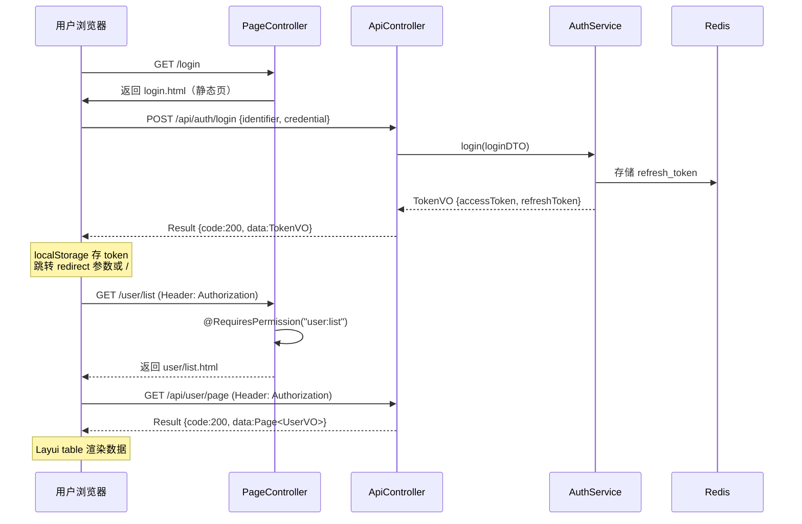
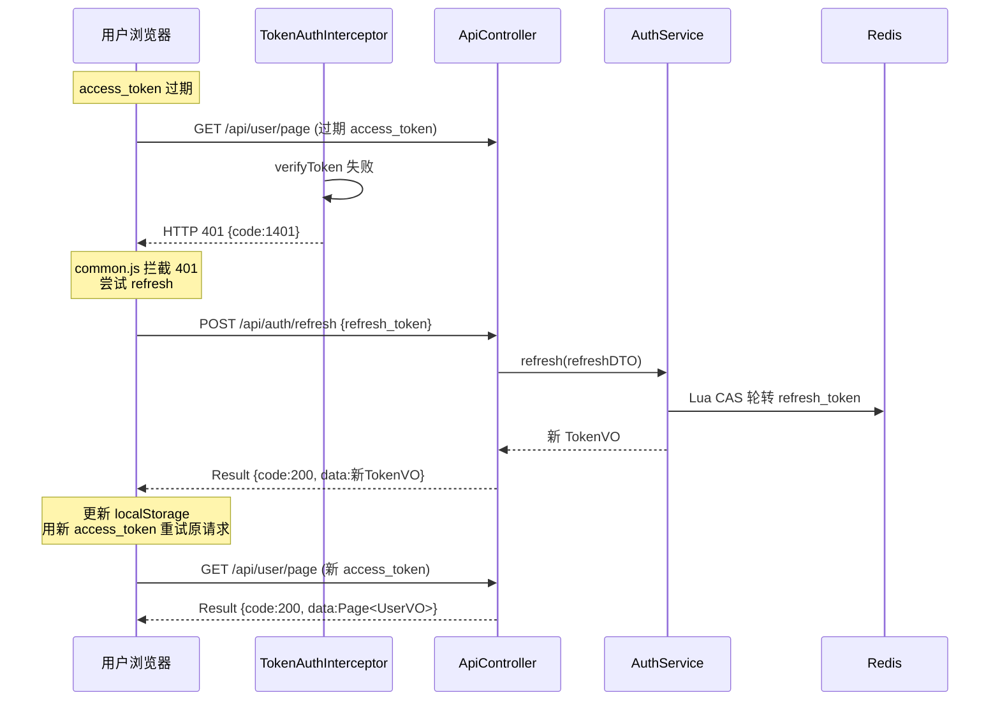
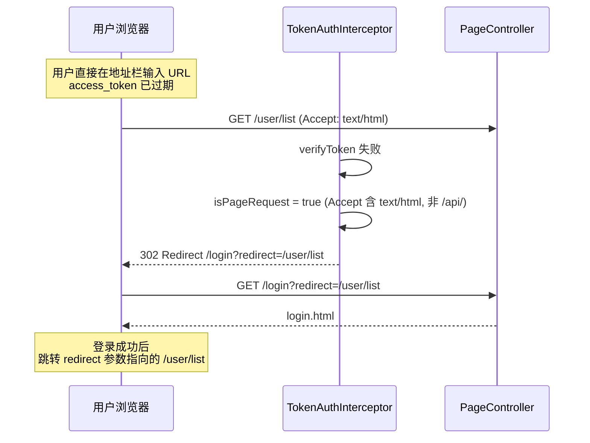

# 前后端不分离方案 · 设计文档

> 模块路径：`org.dam.controller.page` + `resources/templates` + `resources/static`
> 作者：zhengbing · 版本：1.0 · 日期：2026-08-26

## 1. 设计目标

在现有 Spring Boot 脚手架基础上，将前端页面纳入同一工程，实现**前后端不分离的单体应用**，目标如下：

- **一站式部署**：一个 `dam-server.jar` 搞定前后端，无需 Node.js / Nginx / 独立前端构建链。
- **复用现有 RBAC**：页面路由直接加 `@RequiresPermission` 注解，与 API 共用同一套权限体系，无需前端路由守卫。
- **渐进式可拆**：API 接口路径统一 `/api/**` 前缀，页面路由走 `PageController` 返回视图名；未来切前后端分离时，删掉 `templates/` + `static/` + `controller/page/`，`/api/**` 完全不动。
- **页面与 API 鉴权一体化**：拦截器区分页面请求和 API 请求，页面 401 跳登录页，API 401 返 JSON。
- **开发体验友好**：Thymeleaf 自然模板 + Layui 国产组件库，学习成本极低，IDE 直接预览 HTML。

## 2. 为什么选前后端不分离

| 维度 | 前后端不分离（本项目方案） | 前后端分离 |
|------|--------------------------|-----------|
| 部署复杂度 | 一个 jar，零运维 | 需 Nginx 转发前端 + 独立部署后端 |
| 开发链路 | Java 全栈，无需 Node/npm | 需前端构建链（Vite/Webpack + npm） |
| 权限控制 | 注解 + 拦截器一步到位 | 前端路由守卫 + 后端注解双重维护 |
| 适合场景 | 管理后台、内部系统、MVP 验证 | 复杂交互、多端（Web+H5+小程序）、实时协作 |
| 切分离成本 | 删 templates/static + PageController，API 零改动 | — |

**适用判断**：本项目是 RBAC 管理后台脚手架，交互以列表/表单/弹窗为主，Thymeleaf + Layui 完全够用。

## 3. 技术选型

| 层 | 选型 | 版本 | 理由 |
|----|------|------|------|
| 模板引擎 | Thymeleaf | 随 Spring Boot 2.7.x | 官方默认，自然模板不破坏 HTML，Spring EL 表达式完整 |
| UI 组件库 | Layui | 2.8.x | 国产轻量，管理后台组件齐全，文档中文，学习成本极低 |
| 静态资源管理 | 直接放 `/static/libs/` | — | 不走 WebJars，避免版本冲突 |
| HTTP 客户端 | 原生 `fetch` + 自封装 `API` | — | 无需引 axios/jQuery，fetch 够用 |

### 3.1 依赖变更（pom.xml）

新增一个依赖：

```xml
<!-- Thymeleaf 模板引擎 -->
<dependency>
    <groupId>org.springframework.boot</groupId>
    <artifactId>spring-boot-starter-thymeleaf</artifactId>
</dependency>
```

`spring-boot-starter-thymeleaf` 由 Spring Boot 父 POM 管理版本，无需手动指定。

## 4. 调整后的目录结构

在现有目录基础上新增 `controller/page/`、`templates/`、`static/` 三块，其余完全不动：

```
src/main
├── java/org/dam
│   ├── controller/
│   │   ├── api/                         # ★ 原有 Controller 移入，路径加 /api 前缀
│   │   │   ├── AuthController.java      # /api/auth/login, /api/auth/refresh, /api/auth/logout
│   │   │   ├── UserController.java      # /api/user/**
│   │   │   ├── RoleController.java      # /api/role/**
│   │   │   └── PermissionController.java # /api/permission/**
│   │   └── page/                        # ★ 新增：页面跳转 Controller（@Controller 非 @RestController）
│   │       ├── LoginPageController.java # GET /login → login.html
│   │       ├── DashboardController.java # GET / → dashboard.html
│   │       ├── UserPageController.java  # GET /user/list, /user/form → templates/user/*
│   │       ├── RolePageController.java
│   │       └── PermissionPageController.java
│   ├── common / component / config / dto / entity / mapper / service / vo  (不变)
│   └── Application.java
└── resources/
    ├── application*.yml                 (不变)
    ├── mapper/*.xml                     (不变)
    ├── sql/*.sql                        (不变)
    ├── static/                          # ★ 新增：静态资源
    │   ├── css/app.css
    │   ├── js/
    │   │   ├── common.js                # 核心：token 管理 + fetch 封装 + 401 自动跳转 + refresh
    │   │   ├── user/list.js
    │   │   └── user/form.js
    │   ├── images/
    │   └── libs/
    │       └── layui-v2.8.18/           # Layui 解压后的 css/js/font
    └── templates/                      # ★ 新增：Thymeleaf 模板
        ├── fragments/                  # 公共片段（th:fragment）
        │   ├── layout.html              # 统一布局骨架（layout:decorate）
        │   ├── sidebar.html             # 左侧菜单（根据权限动态渲染）
        │   ├── header.html              # 顶栏（用户信息 + 登出）
        │   └── footer.html
        ├── login.html                   # 登录页（独立布局）
        ├── dashboard.html               # 首页仪表盘
        ├── user/
        │   ├── list.html                # 用户列表
        │   └── form.html                # 用户新增/编辑
        ├── role/
        │   ├── list.html
        │   └── form.html
        ├── permission/
        │   └── list.html
        └── error/
            ├── 401.html
            ├── 403.html
            ├── 404.html
            └── 500.html
```

### 4.1 目录职责对照

| 目录 | 职责 | 返回类型 | 鉴权方式 |
|------|------|---------|---------|
| `controller/api/` | JSON 数据接口 | `Result<T>` | `@RequiresPermission` + Token 拦截器 |
| `controller/page/` | 页面跳转 | `String`（视图名） | `@RequiresPermission` + Token 拦截器 |
| `templates/` | HTML 模板 | — | Thymeleaf 渲染 |
| `static/` | JS/CSS/Layui 组件库 | — | 静态资源直放 |

## 5. 核心设计

### 5.1 Controller 分层：PageController vs ApiController

**核心原则：页面跳转和 JSON 接口彻底分家。** 未来切分离时，删掉 `controller/page/` + `templates/` + `static/`，`/api/**` 零改动。

```java
// ====== ApiController：纯 JSON，返回 Result<T>，路径统一 /api/** ======
@RestController
@RequestMapping("/api/user")
public class UserController {

    @PostMapping("/page")
    @RequiresPermission("user:list")
    public Result<Page<UserVO>> page(@Valid @RequestBody UserPageDTO dto) { ... }
}

// ====== PageController：只做跳转，返回 String 视图名 ======
@Controller
@RequestMapping("/user")
public class UserPageController {

    @GetMapping("/list")
    @RequiresPermission("user:list")
    public String listPage() {
        return "user/list";
    }

    @GetMapping("/form")
    @RequiresPermission({"user:add", "user:update"})
    public String formPage(@RequestParam(required = false) Long id, Model model) {
        model.addAttribute("id", id);
        return "user/form";
    }
}
```

### 5.2 TokenAuthInterceptor：页面请求 vs API 请求的 401 分流

现有拦截器对所有未认证请求一律返回 JSON `{code:401}`。浏览器直接输 `http://xxx/user/list` 看到的是 JSON 而不是登录页，体验差。

**改进逻辑**：根据 `Accept` 头和请求路径判断请求类型。

```java
@Override
public boolean preHandle(HttpServletRequest request, HttpServletResponse response, Object handler) {
    // ... 省略 token 解析逻辑 ...

    if (!jwtTokenUtil.verifyToken(token)) {
        if (isPageRequest(request)) {
            // 页面请求 → 302 跳登录页，附带 redirect 参数
            String redirect = URLEncoder.encode(request.getRequestURI(), StandardCharsets.UTF_8);
            response.sendRedirect("/login?redirect=" + redirect);
        } else {
            // API 请求 → JSON Result(401)
            writeUnauthorized(response, "Token 无效或已过期");
        }
        return false;
    }
    // ...
}

private boolean isPageRequest(HttpServletRequest request) {
    String accept = request.getHeader("Accept");
    String uri = request.getRequestURI();
    return accept != null && accept.contains("text/html")
        && !uri.startsWith("/api/")
        && !uri.startsWith("/v3/")
        && !uri.startsWith("/doc.html");
}
```

### 5.3 WebMvcConfig 放行清单更新

```java
@Override
public void addInterceptors(InterceptorRegistry registry) {
    registry.addInterceptor(tokenAuthInterceptor)
            .addPathPatterns("/**")
            .excludePathPatterns(
                    "/login",               // 登录页
                    "/error/**",            // 错误页
                    "/css/**", "/js/**", "/images/**", "/libs/**", "/favicon.ico",
                    "/api/auth/login", "/api/auth/refresh",
                    "/doc.html", "/swagger-ui/**", "/v3/api-docs/**", "/webjars/**"
            );
}
```

### 5.4 application.yml 新增 Thymeleaf 配置

```yaml
spring:
  thymeleaf:
    cache: false                    # dev: false; prod: true（application-prod.yml 覆盖）
    prefix: classpath:/templates/
    suffix: .html
    mode: HTML
    encoding: UTF-8
  web:
    resources:
      static-locations: classpath:/static/
  mvc:
    static-path-pattern: /static/**
```

### 5.5 common.js：前端 Token 管理 + fetch 封装

页面跳转靠 Spring MVC 控制，但数据加载走 JS 调 `/api/**`。common.js 是前后端联调的桥梁：

```javascript
// resources/static/js/common.js
(function (window) {
    const TOKEN_KEY = 'access_token';
    const REFRESH_KEY = 'refresh_token';

    const Token = {
        get access() { return localStorage.getItem(TOKEN_KEY); },
        set access(val) { localStorage.setItem(TOKEN_KEY, val); },
        get refresh() { return localStorage.getItem(REFRESH_KEY); },
        set refresh(val) { localStorage.setItem(REFRESH_KEY, val); },
        clear() { localStorage.removeItem(TOKEN_KEY); localStorage.removeItem(REFRESH_KEY); }
    };

    // 刷新 Token（401 时自动触发，防抖：并发 401 只刷新一次）
    let refreshingPromise = null;
    async function tryRefresh() {
        if (!Token.refresh) return false;
        if (!refreshingPromise) {
            refreshingPromise = fetch('/api/auth/refresh', {
                method: 'POST',
                headers: {'Content-Type': 'application/json'},
                body: JSON.stringify({refreshToken: Token.refresh})
            }).then(r => r.json()).finally(() => refreshingPromise = null);
        }
        const res = await refreshingPromise;
        if (res.code === 200 && res.data) {
            Token.access = res.data.accessToken;
            Token.refresh = res.data.refreshToken;
            return true;
        }
        return false;
    }

    // fetch 统一封装
    async function request(url, options = {}) {
        const headers = Object.assign(
            {'Content-Type': 'application/json', 'Authorization': 'Bearer ' + (Token.access || '')},
            options.headers || {}
        );
        let resp = await fetch(url, {...options, headers});

        // 401 → 尝试刷新一次再重试
        if (resp.status === 401 && Token.refresh) {
            const ok = await tryRefresh();
            if (ok) {
                headers.Authorization = 'Bearer ' + Token.access;
                resp = await fetch(url, {...options, headers});
            }
        }

        // 还是 401 或刷新失败 → 清 token 跳登录
        if (resp.status === 401) {
            Token.clear();
            const redirect = encodeURIComponent(window.location.pathname + window.location.search);
            window.location.replace('/login?redirect=' + redirect);
            throw new Error('UNAUTHORIZED');
        }

        const result = await resp.json();
        if (result.code !== 200) {
            if (window.layer) layer.msg(result.message || '操作失败', {icon: 2});
            throw new Error(result.message);
        }
        return result.data;
    }

    window.API = {
        Token,
        get:    (u)        => request(u, {method: 'GET'}),
        post:   (u, d={})  => request(u, {method: 'POST',   body: JSON.stringify(d)}),
        put:    (u, d={})  => request(u, {method: 'PUT',    body: JSON.stringify(d)}),
        delete: (u)        => request(u, {method: 'DELETE'})
    };

    // 登出按钮全局绑定
    document.addEventListener('click', async (e) => {
        if (e.target.matches('[data-action="logout"]')) {
            await API.post('/api/auth/logout', {}).catch(()=>{});
            API.Token.clear();
            window.location.href = '/login';
        }
    });
})(window);
```

### 5.6 Thymeleaf 片段化布局

```html
<!-- templates/fragments/layout.html（统一布局骨架） -->
<!DOCTYPE html>
<html lang="zh-CN" xmlns:th="http://www.thymeleaf.org"
                xmlns:layout="http://www.ultraq.net.nz/thymeleaf/layout">
<head>
    <meta charset="UTF-8"/>
    <title>BAESL 管理后台</title>
    <link rel="stylesheet" th:href="@{/static/libs/layui-v2.8.18/css/layui.css}"/>
    <link rel="stylesheet" th:href="@{/static/css/app.css}"/>
</head>
<body class="layui-layout-body">
<div class="layui-layout layui-layout-admin">
    <!-- 顶栏 -->
    <div th:replace="~{fragments/header :: header}"></div>
    <!-- 侧栏菜单（菜单内容由后端根据当前用户权限注入 Model） -->
    <div th:replace="~{fragments/sidebar :: sidebar(menuList=${menuList})}"></div>
    <!-- 内容区：子页面填充 -->
    <div class="layui-body">
        <div layout:fragment="content" class="layui-container" style="padding: 20px;"></div>
    </div>
    <div th:replace="~{fragments/footer :: footer}"></div>
</div>
<script th:src="@{/static/libs/layui-v2.8.18/layui.js}"></script>
<script th:src="@{/static/js/common.js}"></script>
<!-- 子页面自己的 JS -->
<div layout:fragment="scripts"></div>
</body>
</html>
```

```html
<!-- templates/user/list.html（业务子页面示例） -->
<!DOCTYPE html>
<html xmlns:th="http://www.thymeleaf.org"
      xmlns:layout="http://www.ultraq.net.nz/thymeleaf/layout"
      layout:decorate="~{fragments/layout}">
<head><title>用户管理</title></head>
<body>
<section layout:fragment="content">
    <div class="layui-card">
        <div class="layui-card-body">
            <table id="userTable" lay-filter="userTable"></table>
        </div>
    </div>
</section>

<div layout:fragment="scripts">
    <script th:src="@{/static/js/user/list.js}"></script>
</div>
</body>
</html>
```

### 5.7 侧栏菜单动态渲染

新建 `MenuService`（或在 `AccessControlService` 中扩展），根据当前登录用户的权限列表，从 `sys_permission` 表查出 `type=1（菜单）` 的树形结构，放入 Model：

```java
@Controller
public class DashboardController {

    @Resource
    private MenuService menuService;

    @GetMapping("/")
    @RequiresLogin
    public String dashboard(Model model) {
        Long userId = SecurityContextHolder.getCurrentUserId();
        model.addAttribute("menuList", menuService.listMenuTreeByUserId(userId));
        return "dashboard";
    }
}
```

`fragments/sidebar.html` 用 `th:each` 递归渲染菜单，菜单链接就是 PageController 的路由（如 `/user/list`）。

### 5.8 登录流程



### 5.9 401 自动刷新 + 跳转流程



### 5.10 页面请求 401 跳转流程



## 6. 实施步骤

### 阶段 1：基础设施搭建

1. `pom.xml` 加 `spring-boot-starter-thymeleaf` 依赖。
2. `application.yml`（dev profile）加 Thymeleaf 配置。
3. 创建 `templates/` 和 `static/` 目录结构。
4. 下载 Layui 2.8.x 解压到 `static/libs/layui-v2.8.18/`。
5. 编写 `static/js/common.js`（token 管理 + fetch 封装）。
6. 编写 `static/css/app.css`（基础样式）。

### 阶段 2：Controller 拆分

1. 现有 4 个 Controller 移入 `controller/api/`，`@RequestMapping` 统一加 `/api` 前缀。
2. 新建 `controller/page/` 下 5 个 PageController（Login/Dashboard/User/Role/Permission）。
3. 更新 `WebMvcConfig` 放行清单（加 `/login`、`/static/**` 等路径）。
4. 改造 `TokenAuthInterceptor`，增加 `isPageRequest` 判断和 302 跳转。

### 阶段 3：页面开发

1. `templates/fragments/layout.html` 统一布局。
2. `templates/fragments/sidebar.html` + `header.html` + `footer.html`。
3. `templates/login.html` 登录页 + `static/js/login.js`。
4. `templates/dashboard.html` 首页。
5. `templates/user/list.html` + `static/js/user/list.js` 用户列表（Layui table + 分页）。
6. `templates/user/form.html` + `static/js/user/form.js` 用户新增/编辑。
7. `templates/role/list.html` + `templates/role/form.html` 角色管理。
8. `templates/permission/list.html` 权限管理。
9. `templates/error/` 下 4 个错误页。

### 阶段 4：菜单权限渲染

1. 新建 `MenuService`，从 `sys_permission` 查 `type=1` 菜单树。
2. `DashboardController` 注入 `menuList` 到 Model。
3. `fragments/sidebar.html` 用 `th:each` 递归渲染菜单。

## 7. 前后端不分离与前后端分离的切换路径

当未来需要切前后端分离时，按以下步骤操作，**API 层零改动**：

| 步骤 | 操作 | 影响 |
|------|------|------|
| 1 | 新建独立前端工程（Vue/React） | 无 |
| 2 | 前端调 `/api/**` 接口 | API 零改动，路径已是 `/api/**` |
| 3 | 删除 `controller/page/` | 无影响 |
| 4 | 删除 `templates/` + `static/` | 无影响 |
| 5 | `TokenAuthInterceptor` 移除 `isPageRequest` 分支 | API 返回 JSON 不变 |
| 6 | 前端 Nginx 代理 `/api/**` 到后端 | 标准部署 |

## 8. 相关文件索引

| 文件 | 说明 |
|------|------|
| [project-architecture-design.md](./project-architecture-design.md) | 项目基础架构设计 |
| [dual-token-auth-design.md](./dual-token-auth-design.md) | JWT 双 Token 认证设计 |
| [rbac-permission-system-design.md](./rbac-permission-system-design.md) | RBAC 角色权限体系 |
| [redis-cache-design.md](./redis-cache-design.md) | Redis 缓存设计 |
| [user-status-change-observer-design.md](./user-status-change-observer-design.md) | 用户状态变更观察者 |
| **本文档** | 前后端不分离方案设计 |
