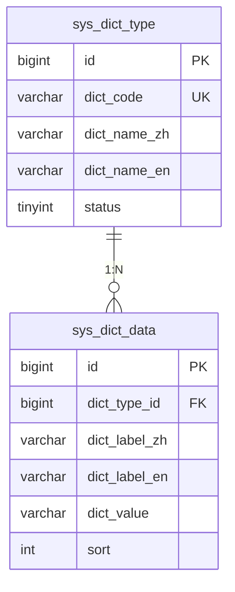
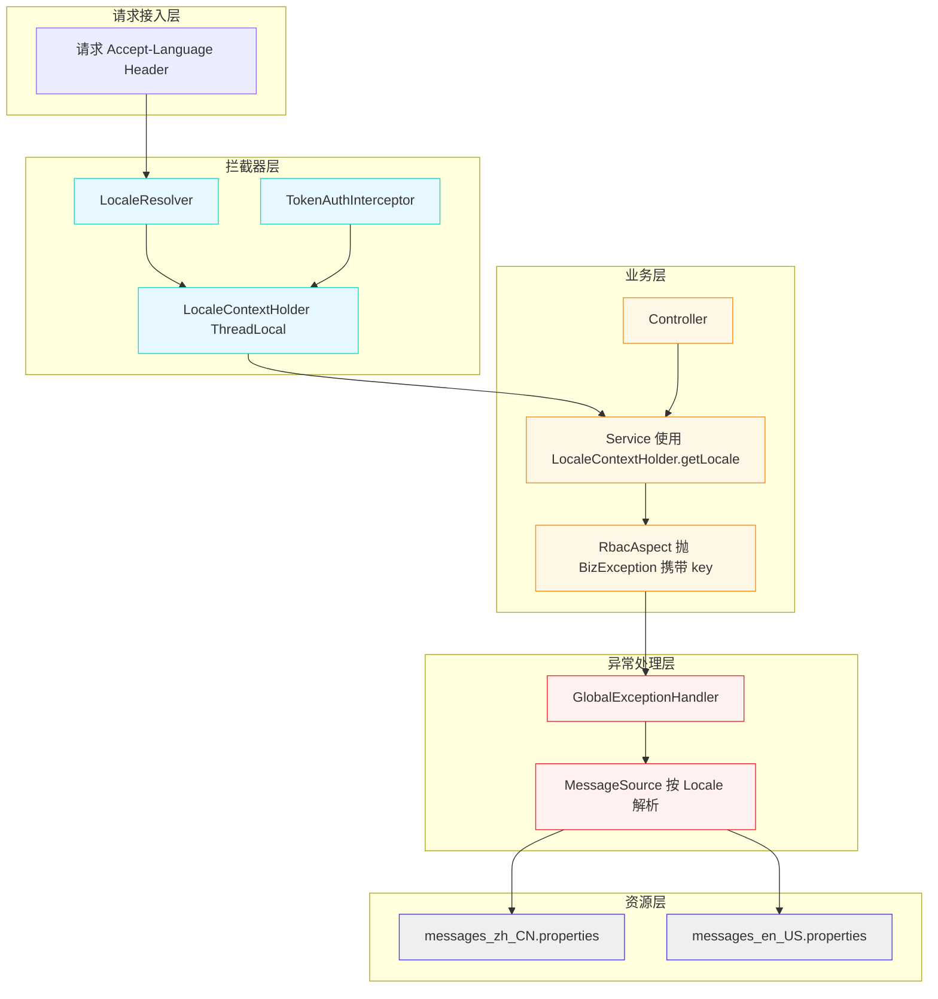
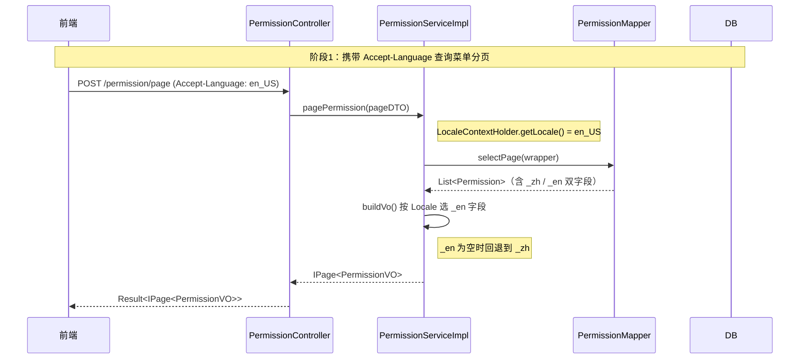
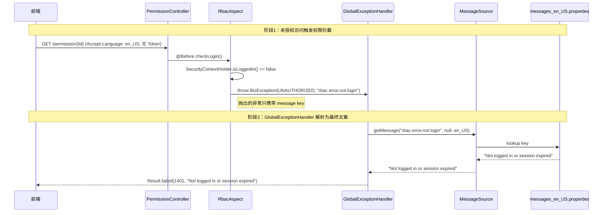
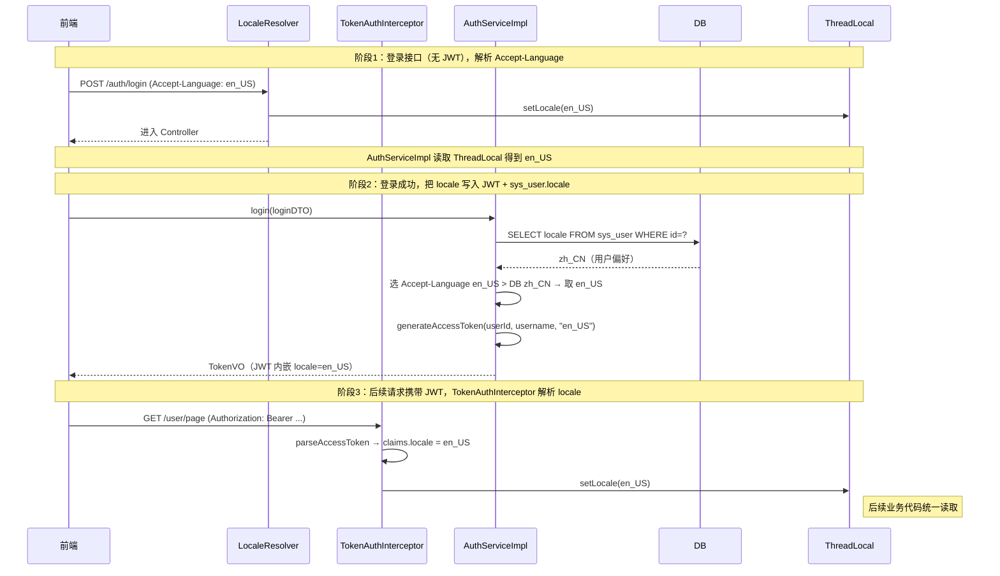

# 多语言（i18n）设计 · 设计文档

> 模块路径：`org.dam.component.i18n` + `org.dam.common.exception` + `org.dam.entity`
> 作者：zhengbing · 版本：1.0 · 日期：2026-08-31

## 1. 设计目标

1. **菜单/权限/角色/字典数据多语言**：前端按用户语言偏好展示对应语言名称，主表扩展 `_zh` / `_en` 字段，避免额外翻译表的 JOIN 开销。
2. **业务异常消息多语言**：`BizException` 携带 message key + 动态参数，由 `MessageSource` 在异常处理层解析为当前 Locale 文本，消除硬编码中文字符串。
3. **系统异常 / 参数校验 / 权限拦截消息多语言**：`GlobalExceptionHandler`、`RbacAspect`、JSR-303 注解全部走 message key，覆盖所有面向前端的提示。
4. **Locale 解析链路统一**：按 `Accept-Language Header → JWT claim → sys_user.locale → 默认 zh_CN` 四级回退，无状态架构与持久化偏好结合。
5. **默认语言回退策略**：找不到对应语言资源时回退 `zh_CN`，保证前端始终能拿到非空 message。
6. **非目标**：前端 UI 自身的 i18n（如按钮文案"提交/Submit"）由前端 vue-i18n 等独立处理；本设计只负责后端返回的数据和消息。
7. **非目标**：操作日志、审计日志的多语言（日志通常固定中文以便排查）。

## 2. 核心概念与对比表

### 2.1 动态多语言 vs 静态多语言

| 维度   | 动态多语言（数据层）                                        | 静态多语言（消息层）                                                    |
| ---- | ------------------------------------------------- | ------------------------------------------------------------- |
| 数据来源 | 数据库表字段                                            | `messages_*.properties` 资源文件                                  |
| 变更方式 | 运营/管理员后台修改                                        | 开发打包发版                                                        |
| 适用内容 | 菜单名、角色名、字典标签                                      | 异常消息、校验提示、权限拦截提示                                              |
| 实现机制 | 主表加 `_zh` / `_en` 字段 + 查询时按 Locale 选字段            | Spring `MessageSource` + `MessageSourceResolver`              |
| 缓存策略 | `@Cacheable` 按 `locale` 维度缓存（如 `i18n:menu:zh_CN`） | `MessageSource` 内置 `ReloadableResourceBundleMessageSource` 缓存 |
| 当前现状 | 无多语言字段，仅 `permission_name` / `role_name`          | 全部硬编码中文（见 §4 现状清单）                                            |

### 2.2 支持语言清单

| Locale  | 语言           | 资源文件后缀                      | 是否默认        |
| ------- | ------------ | --------------------------- | ----------- |
| `zh_CN` | 简体中文         | `messages_zh_CN.properties` | 是（Fallback） |
| `en_US` | English (US) | `messages_en_US.properties` | 否           |

扩展第三门语言只需：① 主表加 `_xx` 字段；② 新增 `messages_xx.properties`；无需改造核心链路。

### 2.3 静态多语言改造范围一览

| 改造点   | 文件                                | 改造前                                  | 改造后                                                                               |
| ----- | --------------------------------- | ------------------------------------ | --------------------------------------------------------------------------------- |
| 业务异常  | `BizException.java`               | 直接传中文字符串                             | 携带 `messageKey` + `args`，由 GlobalExceptionHandler 解析                              |
| 错误码枚举 | `ResultCode.java`                 | 枚举内嵌中文 `message`                     | 枚举内嵌 `messageKey`（如 `result.code.unauthorized`）                                   |
| 全局异常  | `GlobalExceptionHandler.java`     | 硬编码 `"缺少必需参数：" + paramName`          | 走 `MessageSource.getMessage("param.missing", new Object[]{paramName}, locale)`    |
| 参数校验  | DTO 上的 `@NotBlank(message="...")` | 硬编码中文 message                        | `@NotBlank(message="{user.username.notblank}")` 走 `ValidationMessages.properties` |
| 权限切面  | `RbacAspect.java`                 | `"未登录或登录已过期"`、`"无权限访问，缺少权限：" + perm` | message key + 动态参数                                                                |

## 3. 数据库表结构改造（动态多语言）

### 3.1 `sys_permission` 菜单/权限表

新增 `permission_name_zh`、`permission_name_en` 两个字段，原 `permission_name` 字段保留作为兼容兜底（数据迁移期间回退用），新代码不再读写原字段。

```sql
-- =====================================================
-- sys_permission 多语言字段扩展
-- =====================================================
ALTER TABLE `sys_permission`
    ADD COLUMN `permission_name_zh` VARCHAR(50) NOT NULL DEFAULT '' COMMENT '权限名称-中文' AFTER `permission_name`,
    ADD COLUMN `permission_name_en` VARCHAR(50) NOT NULL DEFAULT '' COMMENT '权限名称-英文' AFTER `permission_name_zh`;

-- 数据迁移：原字段值回填到 zh 字段
UPDATE `sys_permission` SET `permission_name_zh` = `permission_name` WHERE `permission_name_zh` = '';
```

字段对比：

| 字段                   | 类型          | 是否多语言   | 用途         |
| -------------------- | ----------- | ------- | ---------- |
| `permission_name`    | VARCHAR(50) | 否（兼容兜底） | 旧版本回退，新版不读 |
| `permission_name_zh` | VARCHAR(50) | 是       | 中文展示名      |
| `permission_name_en` | VARCHAR(50) | 是       | 英文展示名      |

### 3.2 `sys_role` 角色表

```sql
ALTER TABLE `sys_role`
    ADD COLUMN `role_name_zh` VARCHAR(50) NOT NULL DEFAULT '' COMMENT '角色名称-中文' AFTER `role_name`,
    ADD COLUMN `role_name_en` VARCHAR(50) NOT NULL DEFAULT '' COMMENT '角色名称-英文' AFTER `role_name_zh`;

UPDATE `sys_role` SET `role_name_zh` = `role_name` WHERE `role_name_zh` = '';
```

### 3.3 `sys_user` 用户表（Locale 偏好持久化）

```sql
ALTER TABLE `sys_user`
    ADD COLUMN `locale` VARCHAR(10) NOT NULL DEFAULT 'zh_CN' COMMENT '用户语言偏好（zh_CN / en_US）' AFTER `status`;
```

登录时若 JWT 中无 `locale` claim，则从此字段读取并写入 Token；用户切换语言后更新此字段，下次刷新 Token 时生效。

### 3.4 `sys_dict` 字典表（新建）

项目当前无字典体系，随多语言方案一并引入。采用「字典类型 + 字典项」两张表：

```sql
-- =====================================================
-- 字典类型表 sys_dict_type
-- =====================================================
DROP TABLE IF EXISTS `sys_dict_type`;
CREATE TABLE `sys_dict_type` (
    `id`          BIGINT       NOT NULL AUTO_INCREMENT COMMENT '主键 ID',
    `dict_code`   VARCHAR(50)  NOT NULL                COMMENT '字典编码（程序使用，唯一，如 user_status）',
    `dict_name_zh` VARCHAR(50) NOT NULL                COMMENT '字典名称-中文（如：用户状态）',
    `dict_name_en` VARCHAR(50) NOT NULL DEFAULT ''     COMMENT '字典名称-英文（如：User Status）',
    `status`      TINYINT      NOT NULL DEFAULT 1      COMMENT '状态（0-禁用，1-启用）',
    `create_time` DATETIME     NOT NULL DEFAULT CURRENT_TIMESTAMP COMMENT '创建时间',
    `update_time` DATETIME     NOT NULL DEFAULT CURRENT_TIMESTAMP ON UPDATE CURRENT_TIMESTAMP COMMENT '更新时间',
    `create_by`   VARCHAR(64)          DEFAULT NULL    COMMENT '创建人',
    `update_by`   VARCHAR(64)          DEFAULT NULL    COMMENT '更新人',
    `deleted`     TINYINT      NOT NULL DEFAULT 0      COMMENT '逻辑删除标识',
    PRIMARY KEY (`id`),
    UNIQUE KEY `uk_dict_code` (`dict_code`)
) ENGINE = InnoDB DEFAULT CHARSET = utf8mb4 COMMENT = '字典类型表';

-- =====================================================
-- 字典项表 sys_dict_data
-- =====================================================
DROP TABLE IF EXISTS `sys_dict_data`;
CREATE TABLE `sys_dict_data` (
    `id`           BIGINT       NOT NULL AUTO_INCREMENT COMMENT '主键 ID',
    `dict_type_id` BIGINT       NOT NULL                COMMENT '字典类型 ID',
    `dict_label_zh` VARCHAR(100) NOT NULL              COMMENT '字典标签-中文（展示用，如：启用）',
    `dict_label_en` VARCHAR(100) NOT NULL DEFAULT ''    COMMENT '字典标签-英文（如：Enabled）',
    `dict_value`   VARCHAR(100) NOT NULL               COMMENT '字典值（程序使用，如 1）',
    `sort`         INT          NOT NULL DEFAULT 0     COMMENT '排序',
    `status`       TINYINT      NOT NULL DEFAULT 1     COMMENT '状态',
    `create_time`  DATETIME     NOT NULL DEFAULT CURRENT_TIMESTAMP COMMENT '创建时间',
    `update_time`  DATETIME     NOT NULL DEFAULT CURRENT_TIMESTAMP ON UPDATE CURRENT_TIMESTAMP COMMENT '更新时间',
    `create_by`    VARCHAR(64)          DEFAULT NULL   COMMENT '创建人',
    `update_by`    VARCHAR(64)          DEFAULT NULL   COMMENT '更新人',
    `deleted`      TINYINT      NOT NULL DEFAULT 0    COMMENT '逻辑删除标识',
    PRIMARY KEY (`id`),
    KEY `idx_dict_type_id` (`dict_type_id`)
) ENGINE = InnoDB DEFAULT CHARSET = utf8mb4 COMMENT = '字典项表';
```

字典 ER 关系：



### 3.5 实体类改造（以 `Permission` 为例）

`Permission.java` 新增字段，原 `permissionName` 字段保留兼容但标注 `@Deprecated`：

```java
// 来源：src/main/java/org/dam/entity/Permission.java（改造后片段）

/**
 * 权限名称（兼容兜底，新代码请用 permissionNameZh / permissionNameEn）
 */
@Schema(description = "权限名称（兼容字段）")
@Deprecated
private String permissionName;

/**
 * 权限名称 - 中文
 */
@Schema(description = "权限名称-中文")
private String permissionNameZh;

/**
 * 权限名称 - 英文
 */
@Schema(description = "权限名称-英文")
private String permissionNameEn;
```

### 3.6 VO 按 Locale 输出（`PermissionVO` 改造）

VO 不直接暴露 `_zh` / `_en` 双字段，而是按当前 Locale 只返回单个 `permissionName`，避免前端处理逻辑复杂化。改造方式：在 Service 层组装 VO 时根据 `LocaleContextHolder.getLocale()` 选字段。

```java
// 来源：src/main/java/org/dam/service/impl/PermissionServiceImpl.java（改造后片段）

/**
 * 按当前 Locale 组装 VO 的展示名称
 */
private PermissionVO buildVo(Permission entity) {
    PermissionVO vo = new PermissionVO();
    BeanUtil.copyProperties(entity, vo);
    Locale locale = LocaleContextHolder.getLocale();
    boolean isEn = "en_US".equals(locale.toString()) || "en".equals(locale.getLanguage());
    String displayName = isEn
            ? (StrUtil.isNotBlank(entity.getPermissionNameEn()) ? entity.getPermissionNameEn() : entity.getPermissionNameZh())
            : entity.getPermissionNameZh();
    vo.setPermissionName(displayName);
    return vo;
}
```

回退规则：英文为空时回退到中文，中文永远非空（DDL `NOT NULL`）。

## 4. 静态消息资源设计

### 4.1 资源文件目录结构

```
src/main/resources/
├── i18n/
│   ├── messages.properties             # 默认（= 中文，Fallback）
│   ├── messages_zh_CN.properties       # 中文
│   └── messages_en_US.properties       # 英文
├── ValidationMessages.properties       # JSR-303 默认（中文）
└── ValidationMessages_en_US.properties # JSR-303 英文
```

### 4.2 `messages_zh_CN.properties`（中文）

```properties
# ==================== ResultCode 错误码消息 ====================
result.code.success=操作成功
result.code.param.validate.failed=参数校验失败
result.code.unauthorized=未授权
result.code.forbidden=无权限访问
result.code.not.found=资源不存在
result.code.biz.error=业务异常
result.code.system.error=系统异常
result.code.common.failed=操作失败

# ==================== 权限拦截消息（RbacAspect） ====================
rbac.error.not.login=未登录或登录已过期
rbac.error.role.missing=无权限访问，缺少角色：{0}
rbac.error.role.any.missing=无权限访问，缺少所需角色
rbac.error.permission.missing=无权限访问，缺少权限：{0}
rbac.error.permission.any.missing=无权限访问，缺少所需权限

# ==================== 参数校验消息 ====================
param.missing=缺少必需参数：{0}
param.illegal=非法参数：{0}

# ==================== 业务异常（示例） ====================
user.login.failed=用户名或密码错误
user.disabled=用户已被禁用，请联系管理员
user.locked=用户已被锁定，请稍后再试
user.not.found=用户不存在
user.username.notblank=用户名不能为空
user.password.notblank=密码不能为空
```

### 4.3 `messages_en_US.properties`（英文）

```properties
# ==================== ResultCode error messages ====================
result.code.success=Operation succeeded
result.code.param.validate.failed=Parameter validation failed
result.code.unauthorized=Unauthorized
result.code.forbidden=Access denied
result.code.not.found=Resource not found
result.code.biz.error=Business error
result.code.system.error=System error
result.code.common.failed=Operation failed

# ==================== RBAC aspect messages ====================
rbac.error.not.login=Not logged in or session expired
rbac.error.role.missing=Access denied, missing role: {0}
rbac.error.role.any.missing=Access denied, missing required role
rbac.error.permission.missing=Access denied, missing permission: {0}
rbac.error.permission.any.missing=Access denied, missing required permission

# ==================== Parameter validation ====================
param.missing=Missing required parameter: {0}
param.illegal=Illegal argument: {0}

# ==================== Business exceptions ====================
user.login.failed=Invalid username or password
user.disabled=User is disabled, please contact administrator
user.locked=User is locked, please try again later
user.not.found=User not found
user.username.notblank=Username cannot be blank
user.password.notblank=Password cannot be blank
```

### 4.4 `ResultCode` 枚举改造

枚举内 `message` 字段语义变更为 message key，原 `getMessage()` 方法保留但语义改为"返回 key"，新增 `resolveMessage(Locale)` 由 `MessageSource` 解析。

```java
// 来源：src/main/java/org/dam/common/enums/ResultCode.java（改造后片段）

public enum ResultCode {

    SUCCESS(200, "result.code.success"),

    PARAM_VALIDATE_FAILED(1400, "result.code.param.validate.failed"),

    UNAUTHORIZED(1401, "result.code.unauthorized"),

    FORBIDDEN(1403, "result.code.forbidden"),

    NOT_FOUND(1404, "result.code.not.found"),

    BIZ_ERROR(1000, "result.code.biz.error"),

    SYSTEM_ERROR(5000, "result.code.system.error"),

    COMMON_FAILED(9999, "result.code.common.failed");

    private final Integer code;

    private final String messageKey;

    ResultCode(Integer code, String messageKey) {
        this.code = code;
        this.messageKey = messageKey;
    }

    public Integer getCode() {
        return code;
    }

    /**
     * 返回 message key（不再返回中文文案）
     */
    public String getMessageKey() {
        return messageKey;
    }
}
```

### 4.5 `BizException` 改造

新增 `messageKey` + `args` 两个字段，原 `message` 字段保留兼容旧调用。推荐调用方使用新构造方法。

```java
// 来源：src/main/java/org/dam/common/exception/BizException.java（改造后片段）

@Getter
public class BizException extends RuntimeException {

    private final Integer code;

    /**
     * 消息资源 key（优先级高于 message 字段）
     */
    private final String messageKey;

    /**
     * 消息动态参数（用于占位符 {0} {1} ...）
     */
    private final Object[] args;

    /**
     * 使用结果码构造（消息来自 ResultCode 的 key）
     */
    public BizException(ResultCode resultCode, Object... args) {
        super(resultCode.getMessageKey());
        this.code = resultCode.getCode();
        this.messageKey = resultCode.getMessageKey();
        this.args = args;
    }

    /**
     * 使用自定义 key + 结果码构造
     */
    public BizException(ResultCode resultCode, String messageKey, Object... args) {
        super(messageKey);
        this.code = resultCode.getCode();
        this.messageKey = messageKey;
        this.args = args;
    }

    /**
     * 兼容旧调用：直接传中文文案（不推荐，新代码请走 key）
     */
    public BizException(Integer code, String message) {
        super(message);
        this.code = code;
        this.messageKey = null;
        this.args = null;
    }
}
```

### 4.6 `GlobalExceptionHandler` 改造

注入 `MessageSource`，根据当前请求 Locale 解析 message key 为最终文案。

```java
// 来源：src/main/java/org/dam/common/exception/GlobalExceptionHandler.java（改造后片段）

@Slf4j
@RestControllerAdvice
public class GlobalExceptionHandler {

    @Resource
    private MessageSource messageSource;

    @ExceptionHandler(BizException.class)
    public Result<Void> handleBizException(BizException e, HttpServletRequest request) {
        log.warn("业务异常，uri={}，code={}，messageKey={}", request.getRequestURI(), e.getCode(), e.getMessageKey());
        String message = resolveMessage(e.getMessageKey(), e.getArgs(), e.getMessage());
        return Result.failed(e.getCode(), message);
    }

    @ExceptionHandler(MethodArgumentNotValidException.class)
    public Result<Void> handleMethodArgumentNotValidException(MethodArgumentNotValidException e, HttpServletRequest request) {
        Locale locale = LocaleContextHolder.getLocale();
        String message = e.getBindingResult().getFieldErrors().stream()
                .map(fe -> messageSource.getMessage(fe, locale))
                .collect(Collectors.joining("; "));
        log.warn("参数校验失败，uri={}，message={}", request.getRequestURI(), message);
        return Result.failed(ResultCode.PARAM_VALIDATE_FAILED.getCode(), message);
    }

    @ExceptionHandler(MissingServletRequestParameterException.class)
    public Result<Void> handleMissingServletRequestParameterException(MissingServletRequestParameterException e, HttpServletRequest request) {
        String message = resolveMessage("param.missing", new Object[]{e.getParameterName()}, null);
        log.warn("缺少请求参数，uri={}，message={}", request.getRequestURI(), message);
        return Result.failed(ResultCode.PARAM_VALIDATE_FAILED.getCode(), message);
    }

    @ExceptionHandler(Exception.class)
    @ResponseStatus(HttpStatus.INTERNAL_SERVER_ERROR)
    public Result<Void> handleException(Exception e, HttpServletRequest request) {
        log.error("系统异常，uri={}", request.getRequestURI(), e);
        String message = resolveMessage(ResultCode.SYSTEM_ERROR.getMessageKey(), null, ResultCode.SYSTEM_ERROR.getMessageKey());
        return Result.failed(ResultCode.SYSTEM_ERROR.getCode(), message);
    }

    /**
     * 解析消息：key → MessageSource → 兜底 fallback
     */
    private String resolveMessage(String key, Object[] args, String fallback) {
        if (StrUtil.isBlank(key)) {
            return fallback;
        }
        try {
            return messageSource.getMessage(key, args, fallback, LocaleContextHolder.getLocale());
        } catch (Exception ex) {
            log.warn("消息解析失败，key={}，fallback={}", key, fallback);
            return fallback;
        }
    }
}
```

### 4.7 `RbacAspect` 改造

切面内所有硬编码中文改为抛出携带 message key 的 `BizException`。

```java
// 来源：src/main/java/org/dam/component/security/aspect/RbacAspect.java（改造后片段）

@Before("requiresLoginPointcut()")
public void checkLogin(JoinPoint joinPoint) {
    if (!SecurityContextHolder.isLoggedIn()) {
        log.warn("未登录访问受保护资源，method={}", joinPoint.getSignature().toShortString());
        throw new BizException(ResultCode.UNAUTHORIZED, "rbac.error.not.login");
    }
}

@Before("requiresRolePointcut()")
public void checkRole(JoinPoint joinPoint) {
    checkLogin(joinPoint);
    RequiresRole anno = resolveAnnotation(joinPoint, RequiresRole.class);
    if (anno == null) {
        return;
    }
    Long userId = SecurityContextHolder.getCurrentUserId();
    String[] roles = anno.value();
    Logical logical = anno.logical();

    if (logical == Logical.AND) {
        for (String role : roles) {
            if (!accessControlService.hasRole(userId, role)) {
                log.warn("权限校验失败，缺少角色 {}，userId={}", role, userId);
                throw new BizException(ResultCode.FORBIDDEN, "rbac.error.role.missing", role);
            }
        }
    } else {
        if (!accessControlService.hasAnyRole(userId, roles)) {
            log.warn("权限校验失败，缺少任意一个角色 {}，userId={}", String.join("/", roles), userId);
            throw new BizException(ResultCode.FORBIDDEN, "rbac.error.role.any.missing");
        }
    }
}

@Before("requiresPermissionPointcut()")
public void checkPermission(JoinPoint joinPoint) {
    checkLogin(joinPoint);
    RequiresPermission anno = resolveAnnotation(joinPoint, RequiresPermission.class);
    if (anno == null) {
        return;
    }
    Long userId = SecurityContextHolder.getCurrentUserId();
    String[] perms = anno.value();
    Logical logical = anno.logical();

    if (logical == Logical.AND) {
        for (String perm : perms) {
            if (!accessControlService.hasPermission(userId, perm)) {
                log.warn("权限校验失败，缺少权限 {}，userId={}", perm, userId);
                throw new BizException(ResultCode.FORBIDDEN, "rbac.error.permission.missing", perm);
            }
        }
    } else {
        if (!accessControlService.hasAnyPermission(userId, perms)) {
            log.warn("权限校验失败，缺少任意一个权限 {}，userId={}", String.join("/", perms), userId);
            throw new BizException(ResultCode.FORBIDDEN, "rbac.error.permission.any.missing");
        }
    }
}
```

### 4.8 JSR-303 校验注解改造

DTO 上的注解 `message` 属性使用 `{key}` 占位符，由 Hibernate Validator 自动从 `ValidationMessages.properties` 解析。

```java
// 来源：src/main/java/org/dam/dto/UserSaveDTO.java（改造后片段）

@Schema(description = "用户新增/修改 DTO")
@Data
public class UserSaveDTO {

    @Schema(description = "用户名")
    @NotBlank(message = "{user.username.notblank}")
    @Length(min = 3, max = 20, message = "{user.username.length}")
    private String username;

    @Schema(description = "密码")
    @NotBlank(message = "{user.password.notblank}")
    @Length(min = 6, max = 64, message = "{user.password.length}")
    private String password;
}
```

对应的 `ValidationMessages.properties`：

```properties
user.username.notblank=用户名不能为空
user.username.length=用户名长度必须在 {min} 到 {max} 之间
user.password.notblank=密码不能为空
user.password.length=密码长度必须在 {min} 到 {max} 之间
```

`ValidationMessages_en_US.properties`：

```properties
user.username.notblank=Username cannot be blank
user.username.length=Username length must be between {min} and {max}
user.password.notblank=Password cannot be blank
user.password.length=Password length must be between {min} and {max}
```

## 5. Locale 解析链路设计

### 5.1 四级回退解析策略

优先级从高到低：

| 优先级 | 来源                       | 适用场景                     | 实现机制                                               |
| --- | ------------------------ | ------------------------ | -------------------------------------------------- |
| 1   | `Accept-Language` Header | 临时切换语言、未登录接口（如登录接口本身的报错） | `LocaleResolver` 解析 Header                         |
| 2   | JWT `locale` claim       | 已登录接口，Token 签发时固化偏好      | `TokenAuthInterceptor` 解析后写入 `LocaleContextHolder` |
| 3   | `sys_user.locale` 字段     | 首次登录、Token 中无 locale 时回查 | `AuthService` 登录时读取并写入 Token                       |
| 4   | 默认 `zh_CN`               | 以上均缺失                    | 配置项 `dam.i18n.default-locale`                      |

### 5.2 架构分层



### 5.3 自定义 `LocaleResolver` 实现

```java
// 新增：src/main/java/org/dam/component/i18n/HeaderLocaleResolver.java

/**
 * 自定义 Locale 解析器
 * 四级回退：Accept-Language Header → JWT claim → sys_user.locale → 默认 zh_CN
 *
 * @author zhengbing
 * @since 2026-08-31
 **/
@Slf4j
public class HeaderLocaleResolver implements LocaleResolver {

    private static final String DEFAULT_LOCALE = "zh_CN";

    @Override
    public Locale resolveLocale(HttpServletRequest request) {
        // 优先级 1：Accept-Language Header
        String header = request.getHeader("Accept-Language");
        if (StrUtil.isNotBlank(header)) {
            Locale resolved = parseLocale(header);
            if (resolved != null) {
                return resolved;
            }
        }

        // 优先级 2 & 3：JWT claim / sys_user.locale
        // 已由 TokenAuthInterceptor 在本 Resolver 调用前写入 LocaleContextHolder，
        // 这里直接读取（Spring MVC 调用顺序：拦截器 → Resolver → Controller）
        Locale ctxLocale = LocaleContextHolder.getLocale();
        if (ctxLocale != null) {
            return ctxLocale;
        }

        // 优先级 4：默认
        return parseLocale(DEFAULT_LOCALE);
    }

    @Override
    public void setLocale(HttpServletRequest request, HttpServletResponse response, Locale locale) {
        LocaleContextHolder.setLocale(locale);
    }

    private Locale parseLocale(String localeStr) {
        try {
            String[] parts = localeStr.split("[-_]");
            if (parts.length == 1) {
                return new Locale(parts[0]);
            } else if (parts.length >= 2) {
                return new Locale(parts[0], parts[1]);
            }
        } catch (Exception e) {
            log.warn("Locale 解析失败，raw={}", localeStr);
        }
        return null;
    }
}
```

### 5.4 `TokenAuthInterceptor` 改造（JWT 中写入 Locale）

```java
// 来源：src/main/java/org/dam/component/security/TokenAuthInterceptor.java（改造后片段）

@Override
public boolean preHandle(HttpServletRequest request, HttpServletResponse response, Object handler) throws Exception {
    String token = extractToken(request);
    if (StrUtil.isBlank(token)) {
        return true;
    }

    Claims claims = jwtTokenUtil.parseAccessToken(token);
    Long userId = claims.get("userId", Long.class);
    String username = claims.get("username", String.class);

    // 从 JWT claim 读取 locale，写入 LocaleContextHolder
    String localeStr = claims.get("locale", String.class);
    if (StrUtil.isNotBlank(localeStr)) {
        LocaleContextHolder.setLocale(parseLocale(localeStr));
    }

    SecurityContextHolder.set(new SecurityContext(userId, username));
    return true;
}
```

### 5.5 登录时把 `sys_user.locale` 写入 JWT

```java
// 来源：src/main/java/org/dam/service/impl/AuthServiceImpl.java（改造后片段）

@Override
public TokenVO login(AuthLoginDTO loginDTO) {
    UserAuth auth = userAuthMapper.selectByAuthTypeAndIdentifier(loginDTO.getAuthType(), loginDTO.getIdentifier());
    if (auth == null || !BCrypt.checkpw(loginDTO.getCredential(), auth.getCredential())) {
        throw new BizException(ResultCode.UNAUTHORIZED, "user.login.failed");
    }
    User user = userMapper.selectById(auth.getUserId());
    if (UserStatus.DISABLED.getCode().equals(user.getStatus())) {
        throw new BizException(ResultCode.FORBIDDEN, "user.disabled");
    }

    // 把用户语言偏好写入 JWT（首次登录的 Accept-Language 优先于 sys_user.locale）
    Locale loginLocale = LocaleContextHolder.getLocale();
    String localeStr = StrUtil.isNotBlank(loginLocale.toString())
            ? loginLocale.toString()
            : user.getLocale();

    String accessToken = jwtTokenUtil.generateAccessToken(user.getId(), user.getUsername(), localeStr);
    String refreshToken = jwtTokenUtil.generateRefreshToken(user.getId(), user.getUsername(), localeStr);

    refreshTokenService.save(user.getId(), refreshToken);
    return buildTokenVO(user, accessToken, refreshToken);
}
```

### 5.6 `JwtTokenUtil` 改造（生成 Token 时携带 locale claim）

```java
// 来源：src/main/java/org/dam/component/security/JwtTokenUtil.java（改造后片段）

/**
 * 生成 access token（含 locale claim）
 */
public String generateAccessToken(Long userId, String username, String locale) {
    Map<String, Object> claims = new HashMap<>(4);
    claims.put("userId", userId);
    claims.put("username", username);
    claims.put("type", "access");
    claims.put("locale", locale);
    return Jwts.builder()
            .setClaims(claims)
            .setIssuer(jwtProperties.getIssuer())
            .setSubject(String.valueOf(userId))
            .setIssuedAt(new Date())
            .setExpiration(Date.from(Instant.now().plusSeconds(jwtProperties.getAccessTokenExpireMinutes() * 60L)))
            .signWith(getSigningKey(), SignatureAlgorithm.HS256)
            .compact();
}
```

### 5.7 `MessageSource` 与 `LocaleResolver` 配置

新增配置类 `src/main/java/org/dam/config/I18nConfig.java`：

```java
/**
 * 国际化配置
 * 注册 MessageSource + 自定义 LocaleResolver + LocaleContextHolder 过滤器
 *
 * @author zhengbing
 * @since 2026-08-31
 **/
@Configuration
public class I18nConfig {

    @Bean
    public MessageSource messageSource() {
        ReloadableResourceBundleMessageSource source = new ReloadableResourceBundleMessageSource();
        source.setBasenames("classpath:i18n/messages");
        source.setDefaultEncoding("UTF-8");
        source.setUseCodeAsDefaultMessage(true);
        source.setFallbackToSystemLocale(false);
        return source;
    }

    @Bean
    public LocaleResolver localeResolver() {
        HeaderLocaleResolver resolver = new HeaderLocaleResolver();
        return resolver;
    }

    /**
     * 让 @Validated 注解的校验消息也走 i18n
     */
    @Bean
    public LocalValidatorFactoryBean validator(MessageSource messageSource) {
        LocalValidatorFactoryBean bean = new LocalValidatorFactoryBean();
        bean.setValidationMessageSource(messageSource);
        return bean;
    }
}
```

`application.yml` 公共配置补充：

```yaml
# ========== 多语言 i18n 公共配置 ==========
dam:
  i18n:
    default-locale: zh_CN
    supported-locales: zh_CN,en_US
```

## 6. 核心流程时序图

### 6.1 菜单多语言查询时序



### 6.2 业务异常多语言解析时序



### 6.3 Locale 解析全链路时序



## 7. 扩展约定与最佳实践

### 7.1 消息 Key 命名规范

| 模块              | Key 前缀                                | 示例                         |
| --------------- | ------------------------------------- | -------------------------- |
| 错误码（ResultCode） | `result.code.*`                       | `result.code.unauthorized` |
| RBAC 拦截         | `rbac.error.*`                        | `rbac.error.role.missing`  |
| 参数校验            | `param.*` / `{entity}.{field}.{rule}` | `user.username.notblank`   |
| 业务异常            | `{module}.{scene}.*`                  | `user.login.failed`        |

规则：全小写 + 点分层级 + 动词/状态收尾，禁止使用拼音。

### 7.2 Do / Don't

| 类型      | 规则                                                                       |
| ------- | ------------------------------------------------------------------------ |
| ✅ Do    | 业务代码只抛 message key + args，不关心最终语言                                        |
| ✅ Do    | 资源文件统一 UTF-8 编码，避免 native2ascii                                          |
| ✅ Do    | 新增语言只加 properties 文件 + 主表加 `_xx` 字段，核心链路不动                               |
| ✅ Do    | `MessageSource.setUseCodeAsDefaultMessage(true)`，key 找不到时返回 key 本身避免 NPE |
| ✅ Do    | 字典翻译结果按 `i18n:dict:{dictCode}:{locale}` 缓存（Spring Data Cache）            |
| ❌ Don't | 禁止在 Service / Aspect 中硬编码中文文案                                            |
| ❌ Don't | 禁止在循环内调用 `messageSource.getMessage()`（应在异常处理层统一解析）                       |
| ❌ Don't | 禁止把 `_zh` / `_en` 双字段直接返回给前端，必须经 VO 组装为单字段                               |
| ❌ Don't | 禁止把 `messages_zh_CN.properties` 当默认文件，必须同时维护 `messages.properties` 兜底    |
| ❌ Don't | 禁止在日志中打印解析后的多语言消息，日志统一用中文 key 便于排查                                       |

### 7.3 性能红线

1. **字典/菜单多语言查询必须走缓存**：按 `locale` 维度建 `@Cacheable`，避免每次请求都查 DB。
2. **`MessageSource`** **解析零 DB 操作**：纯内存查找，可在异常处理层放心调用。
3. **`LocaleContextHolder`** **必须在请求结束时清理**：通过 `RequestContextFilter` 或自定义 Filter 在 `finally` 中 `reset()`，避免线程池复用导致 Locale 串号。
4. **JWT locale claim 长度限制**：locale 字符串本身仅 5\~10 字节，不会显著增加 Token 体积。

### 7.4 已知取舍

| 取舍点                    | 选择    | 理由                               |
| ---------------------- | ----- | -------------------------------- |
| 翻译表 vs 主表加字段           | 主表加字段 | 减少 JOIN，查询简单；扩展语言需 DDL 但本项目语言数可控 |
| Locale 持久化 vs 纯 Header | 三者结合  | 兼顾"游客临时切换"和"用户偏好固化"              |
| 日志多语言                  | 不做    | 日志主要服务运维，固定中文便于 grep             |
| Swagger 多语言            | 不做    | 接口文档面向开发，非业务用户                   |

## 8. 相关文件

| 类别                 | 文件路径                                                                 |
| ------------------ | -------------------------------------------------------------------- |
| 设计文档（本文）           | `docs/i18n-design.md`                                                |
| RBAC 表结构脚本         | `src/main/resources/sql/rbac_schema.sql`                             |
| 字典表脚本（新增）          | `src/main/resources/sql/i18n_schema.sql`                             |
| 实体类 - 菜单           | `src/main/java/org/dam/entity/Permission.java`                       |
| 实体类 - 角色           | `src/main/java/org/dam/entity/Role.java`                             |
| 实体类 - 用户（加 locale） | `src/main/java/org/dam/entity/User.java`                             |
| 实体类 - 字典类型（新增）     | `src/main/java/org/dam/entity/DictType.java`                         |
| 实体类 - 字典项（新增）      | `src/main/java/org/dam/entity/DictData.java`                         |
| 错误码枚举（改造）          | `src/main/java/org/dam/common/enums/ResultCode.java`                 |
| 业务异常（改造）           | `src/main/java/org/dam/common/exception/BizException.java`           |
| 全局异常处理器（改造）        | `src/main/java/org/dam/common/exception/GlobalExceptionHandler.java` |
| 权限切面（改造）           | `src/main/java/org/dam/component/security/aspect/RbacAspect.java`    |
| JWT 工具（改造）         | `src/main/java/org/dam/component/security/JwtTokenUtil.java`         |
| Locale 解析器（新增）     | `src/main/java/org/dam/component/i18n/HeaderLocaleResolver.java`     |
| i18n 配置（新增）        | `src/main/java/org/dam/config/I18nConfig.java`                       |
| 中文消息资源（新增）         | `src/main/resources/i18n/messages_zh_CN.properties`                  |
| 英文消息资源（新增）         | `src/main/resources/i18n/messages_en_US.properties`                  |
| 默认消息资源（新增）         | `src/main/resources/i18n/messages.properties`                        |
| 校验消息资源-中文（新增）      | `src/main/resources/ValidationMessages.properties`                   |
| 校验消息资源-英文（新增）      | `src/main/resources/ValidationMessages_en_US.properties`             |
| 应用配置（追加 i18n 段）    | `src/main/resources/application.yml`                                 |
| 关联设计 - RBAC 权限     | `docs/rbac-permission-system-design.md`                              |
| 关联设计 - 双 Token 认证  | `docs/dual-token-auth-design.md`                                     |
| 关联设计 - Redis 缓存    | `docs/redis-cache-design.md`                                         |

