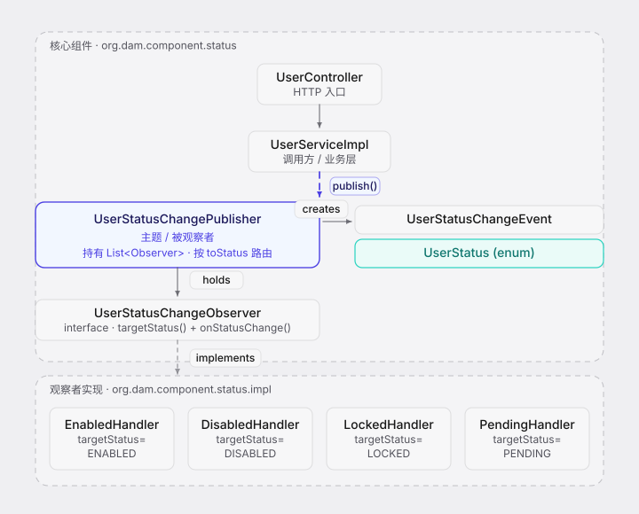
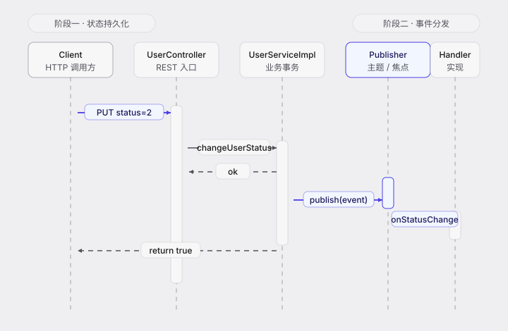
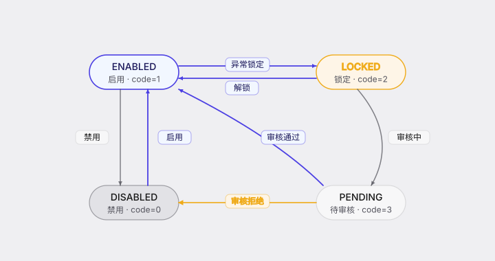

# 用户状态变更 · 观察者模式设计文档

> 模块路径：`org.dam.component.status`
> 作者：zhengbing · 版本：1.0 · 日期：2026-08-18

## 1. 设计目标

将用户状态变更的"**触发**"与"**处理**"解耦：

- **触发方**只负责持久化新状态并广播事件，不感知后续处理逻辑。
- **处理方**按状态路由，每种状态对应一个独立处理器，互不耦合。
- **状态值统一穷举**于 `UserStatus` 枚举，业务代码杜绝魔法值 `0/1/2/3`。
- 新增状态时，只需新增枚举项 + 新增对应 Handler 实现，无需修改现有逻辑（**开闭原则**）。

## 2. 角色映射（GoF 观察者模式）

| GoF 角色 | 本项目实现 | 说明 |
|----------|------------|------|
| Subject（被观察者/主题） | `UserStatusChangePublisher` | 持有所有 `Observer`，提供 `publish(event)` 入口 |
| Observer（观察者接口） | `UserStatusChangeObserver` | 定义 `targetStatus()` + `onStatusChange(event)` |
| ConcreteObserver（具体观察者） | `EnabledHandler` / `DisabledHandler` / `LockedHandler` / `PendingHandler` | 每个声明关注的 `targetStatus`，只处理对应事件 |
| Event（事件载体） | `UserStatusChangeEvent` | 携带 `userId / username / fromStatus / toStatus / changeTime` |
| Context（上下文/状态枚举） | `UserStatus` | 穷举 `DISABLED / ENABLED / LOCKED / PENDING` |

## 3. 类图



## 4. 类职责详表

### 4.1 `UserStatus`（枚举，状态穷举）

| 枚举项 | code | description | 触发的 Handler |
|--------|------|-------------|----------------|
| `DISABLED` | 0 | 禁用 | `UserStatusDisabledHandler` |
| `ENABLED` | 1 | 启用 | `UserStatusEnabledHandler` |
| `LOCKED` | 2 | 锁定 | `UserStatusLockedHandler` |
| `PENDING` | 3 | 待审核 | `UserStatusPendingHandler` |

**关键方法**：

- `ofCode(Integer code)` —— Integer 反查枚举，幂等校验
- `isValidCode(Integer code)` —— 非法状态码拦截

### 4.2 `UserStatusChangeEvent`（不可变事件）

```java
public class UserStatusChangeEvent {
    private final Long userId;
    private final String username;
    private final UserStatus fromStatus;   // 变更前
    private final UserStatus toStatus;     // 变更后
    private final LocalDateTime changeTime; // 自动赋值
}
```

### 4.3 `UserStatusChangeObserver`（观察者接口）

```java
public interface UserStatusChangeObserver {
    UserStatus targetStatus();                    // 声明关注的目标状态
    void onStatusChange(UserStatusChangeEvent e);  // 处理逻辑
}
```

**设计要点**：观察者**主动声明** `targetStatus()`，由 Publisher 做路由匹配，避免每个观察者收到全部事件再自行判断——分离了"路由"与"处理"两个职责。

### 4.4 `UserStatusChangePublisher`（主题/发布器）

| 方法/特性 | 说明 |
|----------|------|
| 构造注入 `List<UserStatusChangeObserver>` | Spring 自动收集所有观察者实现，无需手动注册 |
| `@PostConstruct init()` | 启动时打印已注册观察者清单，便于排查装配问题 |
| `publish(event)` | 按 `event.toStatus == observer.targetStatus()` 路由分发 |
| 异常隔离 | `try-catch` 包裹每个 observer 调用，单个失败不影响其他 |

### 4.5 4 个具体 Handler 职责

| Handler | 触发时机 | 处理逻辑（伪实现） |
|---------|----------|---------------------|
| `UserStatusEnabledHandler` | 用户被启用 | 1. 清空登录失败次数<br>2. 重置风控标记<br>3. 发送启用通知邮件 |
| `UserStatusDisabledHandler` | 用户被禁用 | 1. 强制下线（销毁 Token）<br>2. 记录禁用审计日志<br>3. 通知关联人 |
| `UserStatusLockedHandler` | 用户被锁定 | 1. 风险告警通知安全管理员<br>2. 记录锁定原因与触发场景<br>3. 暂停定时任务 |
| `UserStatusPendingHandler` | 用户进入待审核 | 1. 向审核员发送待审邮件<br>2. 生成审核任务<br>3. 记录提交审核时间 |

## 5. 时序图（以 `ENABLED → LOCKED` 为例）



**触发接口**：`PUT /user/{id}/status?status={code}`

**关键事件流**：

1. `UserController.changeStatus(id, status)` —— 接收 HTTP 请求，校验 `status` 合法性
2. `UserServiceImpl.changeUserStatus(id, targetStatus)` —— 业务事务方法
3. `selectById` 取原用户 → `UserStatus.ofCode(user.getStatus())` 反查 `fromStatus`
4. 若 `targetStatus == fromStatus` → **短路返回 false，不发布事件**
5. `updateById` 持久化新状态（仅更新 `status` 字段，触发 `MyMetaObjectHandler` 自动填充 `updateTime/updateBy`）
6. `userStatusChangePublisher.publish(event)` —— 广播事件
7. Publisher 遍历 Observer，按 `toStatus` 路由，匹配的 Handler 被触发
8. 异常隔离：单个 Handler 抛异常不影响其他 Handler，仅 `log.error` 记录

## 6. 状态流转说明



### 6.1 状态矩阵

| from \ to | DISABLED | ENABLED | LOCKED | PENDING |
|-----------|----------|---------|--------|---------|
| **DISABLED** | — | 重新启用 | 锁定 | 提交审核 |
| **ENABLED** | 禁用 | — | 异常锁定 | 转入审核 |
| **LOCKED** | 锁定后禁用 | 解锁 | — | 转入审核 |
| **PENDING** | 审核拒绝 | 审核通过 | 审核锁定 | — |

**实现层面**：`changeUserStatus` **允许任意状态间转换**，矩阵展示的是业务上典型路径。如需限制，可在 Service 层加 `validateTransition(from, to)` 校验。

### 6.2 状态转换路径分类

| 类别 | 路径 | 颜色标识 | 含义 |
|------|------|---------|------|
| **正向业务路径** | `PENDING → ENABLED`、`DISABLED → ENABLED`、`ENABLED ↔ LOCKED`（解锁） | brand 主色 | 业务正常流转 |
| **风险路径** | `PENDING → DISABLED` | warning 黄色 | 审核拒绝等异常分支 |
| **辅助路径** | `ENABLED → DISABLED`、`LOCKED → DISABLED` | 中性灰 | 常规禁用/下线 |

### 6.3 边界与约束

- **状态未变化不发布事件**：`targetStatus == fromStatus` 时直接返回 false，避免无意义的 Handler 调用
- **非法状态码拦截**：Controller 层 `UserStatus.ofCode(status)` 返回 null 时直接返回 400
- **事务边界**：`@Transactional(rollbackFor = Exception.class)` 包裹 `changeUserStatus`，状态持久化与事件发布同事务
- **⚠ 注意**：Publisher 在事务**内**触发，若 Handler 需读取事务内未提交数据，请改用 `@TransactionalEventListener(phase = AFTER_COMMIT)` 改为事务提交后异步触发

## 7. 扩展指南

### 7.1 新增状态（如 `ARCHIVED(4, "归档")`）

1. `UserStatus` 增加枚举项
2. 新建 `UserStatusArchivedHandler implements UserStatusChangeObserver`，重写 `targetStatus()` 返回 `ARCHIVED`
3. 加 `@Component` 注解，Spring 自动注册到 Publisher
4. **无需修改任何现有代码**

### 7.2 新增处理逻辑（如启用时同步发送短信）

直接在 `UserStatusEnabledHandler.onStatusChange` 中追加逻辑，或新建第二个 `targetStatus=ENABLED` 的 Observer（Spring 会注入所有实现，Publisher 会按路由规则触发所有匹配的 Observer）。

## 8. 验证记录（参考）

启动日志确认 4 个观察者装配：

```
UserStatusChangePublisher 已注册观察者数量=4
  观察者=UserStatusDisabledHandler，关注状态=DISABLED
  观察者=UserStatusEnabledHandler，关注状态=ENABLED
  观察者=UserStatusLockedHandler，关注状态=LOCKED
  观察者=UserStatusPendingHandler，关注状态=PENDING
```

接口测试 `PUT /user/1/status?status={code}` 路由分发结果：

| # | 触发 | fromStatus → toStatus | 路由到的观察者 | 接口返回 |
|---|------|----------------------|----------------|---------|
| 1 | status=2 | ENABLED → LOCKED | LockedHandler | `data=true` |
| 2 | status=0 | LOCKED → DISABLED | DisabledHandler | `data=true` |
| 3 | status=3 | DISABLED → PENDING | PendingHandler | `data=true` |
| 4 | status=1 | PENDING → ENABLED | EnabledHandler | `data=true` |
| 5 | status=1 | ENABLED(未变) | **跳过，不发布事件** | `data=false` |
| 6 | status=99 | 非法码 | Controller 拦截 | `code=400` |

## 9. 相关文件

| 类别 | 文件 |
|------|------|
| 枚举 | `src/main/java/org/dam/component/status/UserStatus.java` |
| 事件 | `src/main/java/org/dam/component/status/UserStatusChangeEvent.java` |
| 观察者接口 | `src/main/java/org/dam/component/status/UserStatusChangeObserver.java` |
| 主题/发布器 | `src/main/java/org/dam/component/status/UserStatusChangePublisher.java` |
| 具体观察者 | `src/main/java/org/dam/component/status/impl/UserStatusEnabledHandler.java` |
| | `src/main/java/org/dam/component/status/impl/UserStatusDisabledHandler.java` |
| | `src/main/java/org/dam/component/status/impl/UserStatusLockedHandler.java` |
| | `src/main/java/org/dam/component/status/impl/UserStatusPendingHandler.java` |
| 业务接入 | `src/main/java/org/dam/service/impl/UserServiceImpl.java` (`changeUserStatus`) |
| HTTP 入口 | `src/main/java/org/dam/controller/UserController.java` (`PUT /user/{id}/status`) |
