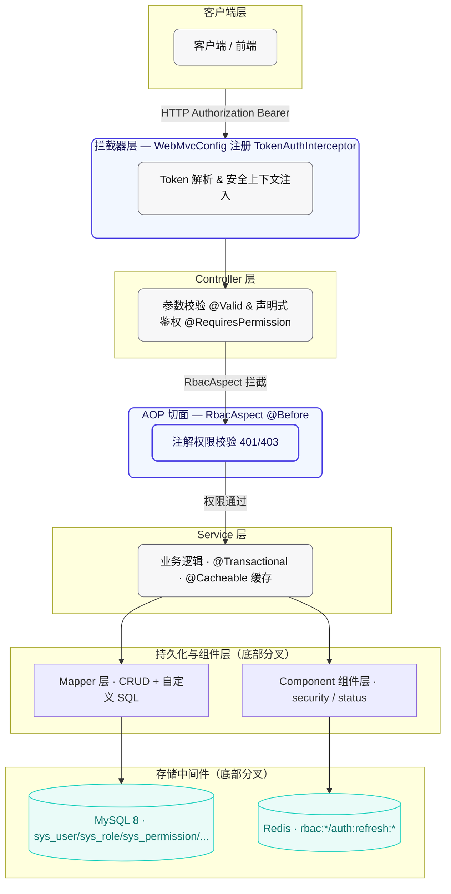

# 项目基础架构 · 设计文档

> 模块路径：`org.dam`
> 作者：zhengbing · 版本：1.0 · 日期：2026-08-18

## 1. 设计目标

构建一套基于 Spring Boot 2.7.x 的后端基础架构，作为业务模块的统一脚手架，目标如下：

- **统一分层**：Controller → Service → Mapper 三层职责清晰，DTO/VO 与 Entity 分离，避免数据库实体直接外泄。
- **统一响应**：所有接口返回标准 `Result<T>`（code / message / data / timestamp），前端按 `code` 统一处理。
- **统一异常**：`@RestControllerAdvice` 全局兜底，业务异常、参数校验异常、系统异常各自有明确码与日志级别。
- **统一鉴权**：JWT 双 Token（access + refresh）+ Redis 存储 refresh_token + ThreadLocal 安全上下文，RBAC 通过 AOP 注解声明式鉴权。
- **统一缓存**：Spring Cache 抽象层接 Redis，权限/角色编码集合按 userId 缓存，变更时主动失效。
- **开闭扩展**：公共字段自动填充、逻辑删除、分页插件等基础设施通过 MyBatis Plus 注解 + 全局配置一次接入全局生效；用户状态变更走观察者模式，新增状态不修改既有逻辑。

## 2. 技术栈

| 分类 | 依赖 | 版本 | 用途 |
|------|------|------|------|
| 基础框架 | spring-boot-starter-web | 2.7.18 | Web MVC、Tomcat 内嵌容器 |
| 切面 | spring-boot-starter-aop | 2.7.18 | RBAC 注解切面、缓存切面 |
| 缓存 | spring-boot-starter-cache | 2.7.18 | `@Cacheable` / `@CacheEvict` 抽象层 |
| 缓存中间件 | spring-boot-starter-data-redis | 2.7.18 | refresh_token 存储 + 权限缓存 |
| 连接池 | commons-pool2 | 随 Boot | Lettuce 连接池 lettuce-pool |
| 参数校验 | spring-boot-starter-validation | 2.7.18 | `@NotBlank` / `@Email` 等 Bean Validation |
| ORM | mybatis-plus-boot-starter | 3.5.5 | CRUD、LambdaQueryWrapper、分页、逻辑删除、字段填充 |
| 数据库驱动 | mysql-connector-j | 8.0.33 | MySQL 8.x JDBC 驱动（runtime） |
| 工具集 | hutool-all | 5.8.25 | StrUtil / CollUtil / BeanUtil / BCrypt / JWT |
| 文档 | knife4j-openapi3-spring-boot-starter | 4.4.0 | OpenAPI3 增强，适配 Boot 2.7.x 的 javax 命名空间 |
| 简化代码 | lombok | 随 Boot | `@Data` / `@Slf4j` / `@Builder` |
| 测试 | spring-boot-starter-test | 2.7.18 | 单元/集成测试（test scope） |
| JDK | java | 8 | 编译目标与运行版本 |

> 构建产物 finalName 为 `dam-server`，由 `spring-boot-maven-plugin` 打可执行 jar，打包时排除 Lombok。

## 3. 分层架构



请求处理主线：`拦截器鉴权 → Controller 参数校验 → RbacAspect 注解鉴权 → Service 事务/缓存 → Mapper 持久化`。

焦点路径（紫色加粗）：Controller→AOP→Service，表示本项目的核心**认证-鉴权-业务**链路；持久化与组件层分为 Mapper（查 MySQL）与 Component（操作 Redis / 状态观察者）两条底部分支。

## 4. 目录结构

```
src/main
├── java/org/dam
│   ├── Application.java                 # 启动类（@SpringBootApplication + @MapperScan）
│   ├── common
│   │   ├── enums
│   │   │   └── ResultCode.java          # 统一结果码枚举
│   │   ├── exception
│   │   │   ├── BizException.java        # 业务异常
│   │   │   └── GlobalExceptionHandler.java # 全局异常处理器
│   │   └── response
│   │       └── Result.java              # 统一返回结果
│   ├── config
│   │   ├── JwtProperties.java          # jwt.* 配置绑定
│   │   ├── Knife4jConfig.java          # OpenAPI 文档
│   │   ├── MybatisPlusConfig.java      # 分页插件
│   │   ├── MyMetaObjectHandler.java    # 公共字段自动填充
│   │   ├── RedisConfig.java            # RedisTemplate + CacheManager
│   │   └── WebMvcConfig.java           # 注册 Token 认证拦截器
│   ├── component
│   │   ├── security
│   │   │   ├── JwtTokenUtil.java        # JWT 双 Token 工具
│   │   │   ├── SecurityContext.java     # 登录上下文
│   │   │   ├── SecurityContextHolder.java # ThreadLocal 持有者
│   │   │   ├── TokenAuthInterceptor.java   # Token 认证拦截器
│   │   │   ├── TestSecurityInterceptor.java# 测试用 X-User-Id 拦截器
│   │   │   ├── annotation
│   │   │   │   ├── Logical.java         # OR/AND 逻辑枚举
│   │   │   │   ├── RequiresLogin.java
│   │   │   │   ├── RequiresPermission.java
│   │   │   │   └── RequiresRole.java
│   │   │   └── aspect
│   │   │       └── RbacAspect.java      # RBAC 注解切面
│   │   └── status                       # 用户状态变更观察者模式
│   │       ├── UserStatus.java          # 状态枚举
│   │       ├── UserStatusChangeEvent.java
│   │       ├── UserStatusChangeObserver.java
│   │       ├── UserStatusChangePublisher.java
│   │       └── impl/*Handler.java      # 4 个具体观察者
│   ├── controller                       # HTTP 入口
│   │   ├── AuthController.java          # 登录/刷新/登出
│   │   ├── UserController.java
│   │   ├── RoleController.java
│   │   └── PermissionController.java
│   ├── service                          # 业务接口 + impl/
│   │   ├── AuthService / RefreshTokenService / AccessControlService
│   │   └── UserService / RoleService / PermissionService
│   ├── mapper                           # MyBatis Plus Mapper
│   │   ├── UserMapper / RoleMapper / PermissionMapper
│   │   ├── UserRoleMapper / RolePermissionMapper / UserAuthMapper
│   ├── entity                           # 数据库实体（继承 BaseEntity）
│   │   ├── BaseEntity.java
│   │   ├── User / Role / Permission / UserRole / RolePermission / UserAuth
│   ├── dto                              # 入参对象（带 javax.validation）
│   └── vo                               # 出参对象（脱敏后的视图）
└── resources
    ├── application.yml                  # 公共配置（Jackson / MyBatis Plus 公共项 / Knife4j 默认关闭 / JWT / 默认激活 dev）
    ├── application-dev.yml              # 开发环境（DEBUG 日志 + SQL 打印 + Knife4j 开 + 本地 DB/Redis 默认值）
    ├── application-test.yml             # 测试环境（INFO 日志 + 联调文档）
    ├── application-prod.yml             # 生产环境（全占位符、强制无明文密钥、Knife4j 关、无 SQL 打印）
    ├── logback-spring.xml
    ├── mapper/*.xml                     # 自定义 SQL（RoleMapper.xml 等）
    └── sql
        ├── schema.sql                   # 用户表（sys_user，status 字段 0/1/2/3 与 UserStatus 枚举对应）
        ├── auth_schema.sql              # 用户认证关联表（sys_user_auth）
        ├── rbac_schema.sql              # RBAC 四表（角色/权限/两张关联表）+ 初始化 ADMIN/USER 角色与权限
        └── init_all.sql                 # 一键初始化入口（SOURCE schema → auth → rbac），详见脚本内注释
```

各包职责（来自 `package-info.java`）：

| 包 | 职责 |
|----|------|
| `controller` | HTTP 请求处理、参数校验 |
| `service` | 业务逻辑、事务控制 |
| `component` | 通用组件、工具类 |
| `entity` / `dto` / `vo` | 数据库实体 / 入参 / 出参 |

## 5. 核心配置

### 5.1 启动类

```java
@SpringBootApplication
@ComponentScan("org.dam")
@MapperScan("org.dam.mapper")
public class Application {
    public static void main(String[] args) {
        SpringApplication.run(Application.class, args);
    }
}
```

### 5.2 多环境 Profile 配置（application*.yml）

配置文件拆分为「公共基础配置 + 三份环境差异化配置」，生产环境严禁写入任何明文密钥：

| 文件 | 激活方式 | 主要特征 |
|------|---------|---------|
| `application.yml` | 始终加载 | Jackson / MyBatis Plus 公共项 / Knife4j 默认关闭 / JWT 公共项 / `spring.profiles.active=${SPRING_PROFILES_ACTIVE:dev}` |
| `application-dev.yml` | 默认激活（未指定时） | DEBUG 日志 + MyBatis SQL stdout 打印 + Knife4j 开启 + 本地 DB/Redis 默认值（含默认密码，仅本地可用） |
| `application-test.yml` | `SPRING_PROFILES_ACTIVE=test` | INFO 日志 + 关闭 SQL 打印 + Knife4j 对内开启 + DB/Redis 全部走占位符 |
| `application-prod.yml` | `SPRING_PROFILES_ACTIVE=prod` | **强制无明文密钥**（JWT/DB/Redis 全占位符） + **关闭 Knife4j 与 SpringDoc** + INFO 日志 + Hikari/Lettuce 连接池调优 |

激活优先级（从高到低）：
1. JVM 参数：`java -jar dam-server.jar -Dspring.profiles.active=prod`
2. 系统环境变量：`export SPRING_PROFILES_ACTIVE=prod`
3. 默认值：`dev`（application.yml 中 `${SPRING_PROFILES_ACTIVE:dev}`）

公共配置 `application.yml` 关键片段（仅列出公共项，server/datasource/redis 等环境相关内容在各 profile 中）：

```yaml
spring:
  profiles:
    active: ${SPRING_PROFILES_ACTIVE:dev}       # 默认激活 dev
  application:
    name: dam-server
  jackson:
    date-format: yyyy-MM-dd HH:mm:ss
    time-zone: Asia/Shanghai
    default-property-inclusion: non_null

mybatis-plus:
  mapper-locations: classpath*:/mapper/**/*.xml
  type-aliases-package: org.dam.entity
  configuration:
    map-underscore-to-camel-case: true
    cache-enabled: false
  global-config:
    db-config:
      id-type: auto
      logic-delete-field: deleted                # 逻辑删除字段（SQL 打印在 dev profile 中开启）
      logic-delete-value: 1
      logic-not-delete-value: 0

knife4j:
  enable: false                                 # 默认关闭，dev/test 单独覆盖为 true

jwt:                                             # 密钥在 prod 中必须通过 ${JWT_SECRET} 环境变量注入
  secret: ${JWT_SECRET:dam-rbac-jwt-secret-key-2026-change-me-in-production-environment}
  issuer: dam-rbac
  access-token-expire-minutes: 120
  refresh-token-expire-days: 7

logging:
  level:
    root: INFO
    org.dam: INFO                               # 各 profile 中按需要调到 DEBUG
    org.springframework.web: INFO
    com.baomidou.mybatisplus: WARN
```

### 5.3 MyBatis Plus 配置

注册分页插件，限制单页最大 500 条，防止超大分页拖垮数据库：

```java
@Configuration
public class MybatisPlusConfig {
    @Bean
    public MybatisPlusInterceptor mybatisPlusInterceptor() {
        MybatisPlusInterceptor interceptor = new MybatisPlusInterceptor();
        PaginationInnerInterceptor paginationInterceptor = new PaginationInnerInterceptor(DbType.MYSQL);
        paginationInterceptor.setMaxLimit(500L);
        paginationInterceptor.setOverflow(false);
        interceptor.addInnerInterceptor(paginationInterceptor);
        return interceptor;
    }
}
```

### 5.4 公共字段自动填充

`MyMetaObjectHandler` 在 INSERT/UPDATE 时自动填充 `createTime / updateTime / createBy / updateBy / deleted`，实体通过 `@TableField(fill = FieldFill.INSERT)` 声明填充策略。

**`createBy` / `updateBy` 获取规则（已完成接入，非 TODO 状态）**：
1. 优先从 `SecurityContextHolder` 获取当前登录用户名（HTTP 请求线程由 `TokenAuthInterceptor` 注入上下文）；
2. 未登录场景（系统初始化任务、单元测试、非 HTTP 异步线程等）兜底返回 `"system"`，避免空值写入。

```java
@Slf4j
@Component
public class MyMetaObjectHandler implements MetaObjectHandler {
    @Override
    public void insertFill(MetaObject metaObject) {
        LocalDateTime now = LocalDateTime.now();
        this.strictInsertFill(metaObject, "createTime", LocalDateTime.class, now);
        this.strictInsertFill(metaObject, "updateTime", LocalDateTime.class, now);
        this.strictInsertFill(metaObject, "createBy",   String.class, getCurrentUser());
        this.strictInsertFill(metaObject, "updateBy",   String.class, getCurrentUser());
        this.strictInsertFill(metaObject, "deleted",    Integer.class, 0);
    }
    @Override
    public void updateFill(MetaObject metaObject) {
        this.strictUpdateFill(metaObject, "updateTime", LocalDateTime.class, LocalDateTime.now());
        this.strictUpdateFill(metaObject, "updateBy",   String.class, getCurrentUser());
    }
    private String getCurrentUser() {
        if (SecurityContextHolder.isLoggedIn()) {
            String username = SecurityContextHolder.getCurrentUsername();
            return username != null ? username : "system";
        }
        return "system";
    }
}
```

`BaseEntity` 集中定义公共字段与逻辑删除标识，所有实体继承：

```java
public class BaseEntity implements Serializable {
    @TableField(value = "create_time", fill = FieldFill.INSERT)
    private LocalDateTime createTime;
    @TableField(value = "update_time", fill = FieldFill.INSERT_UPDATE)
    private LocalDateTime updateTime;
    @TableField(value = "create_by", fill = FieldFill.INSERT)
    private String createBy;
    @TableField(value = "update_by", fill = FieldFill.INSERT_UPDATE)
    private String updateBy;
    @TableLogic
    @TableField(value = "deleted")
    private Integer deleted;
}
```

### 5.5 Redis 配置

`RedisConfig` 同时提供 `RedisTemplate`（手动操作 refresh_token）与 `RedisCacheManager`（Spring Cache 抽象，TTL 30 分钟、禁缓存 null）：

```java
@Configuration
@EnableCaching
public class RedisConfig {
    private static final long DEFAULT_CACHE_TTL_MINUTES = 30L;

    @Bean
    public RedisTemplate<String, Object> redisTemplate(RedisConnectionFactory connectionFactory) {
        RedisTemplate<String, Object> template = new RedisTemplate<>();
        template.setConnectionFactory(connectionFactory);
        StringRedisSerializer stringSerializer = new StringRedisSerializer();
        GenericJackson2JsonRedisSerializer jsonSerializer = new GenericJackson2JsonRedisSerializer();
        template.setKeySerializer(stringSerializer);
        template.setHashKeySerializer(stringSerializer);
        template.setValueSerializer(jsonSerializer);
        template.setHashValueSerializer(jsonSerializer);
        template.afterPropertiesSet();
        return template;
    }

    @Bean
    public RedisCacheManager cacheManager(RedisConnectionFactory connectionFactory) {
        RedisCacheConfiguration config = RedisCacheConfiguration.defaultCacheConfig()
                .entryTtl(Duration.ofMinutes(DEFAULT_CACHE_TTL_MINUTES))
                .serializeKeysWith(RedisSerializationContext.SerializationPair.fromSerializer(new StringRedisSerializer()))
                .serializeValuesWith(RedisSerializationContext.SerializationPair.fromSerializer(new GenericJackson2JsonRedisSerializer()))
                .disableCachingNullValues();
        return RedisCacheManager.builder(connectionFactory).cacheDefaults(config).build();
    }
}
```

### 5.6 WebMvc 配置与拦截器

`WebMvcConfig` 注册 `TokenAuthInterceptor` 拦截 `/**`，登录/刷新/文档接口放行：

```java
@Configuration
public class WebMvcConfig implements WebMvcConfigurer {
    @Resource
    private TokenAuthInterceptor tokenAuthInterceptor;

    @Override
    public void addInterceptors(InterceptorRegistry registry) {
        registry.addInterceptor(tokenAuthInterceptor)
                .addPathPatterns("/**")
                .excludePathPatterns(
                        "/auth/login", "/auth/refresh",
                        "/doc.html", "/swagger-ui.html", "/swagger-ui/**",
                        "/v3/api-docs/**", "/webjars/**", "/favicon.ico", "/error");
    }
}
```

`TokenAuthInterceptor` 处理策略：无 Token 匿名放行（由 `@RequiresLogin` 决定是否拒绝）；Token 无效/过期返回 401；Token 类型非 access 返回 401；有效则注入 `SecurityContextHolder`，并在 `afterCompletion` 清理 ThreadLocal。

### 5.7 JWT 配置属性

```java
@Data
@Component
@ConfigurationProperties(prefix = "jwt")
public class JwtProperties {
    private String secret;
    private String issuer;
    private long accessTokenExpireMinutes = 120L;
    private long refreshTokenExpireDays = 7L;
}
```

### 5.8 接口文档

Knife4j 访问地址：`http://localhost:8080/doc.html`，扫描 `org.dam.controller` 包。`springdoc` 分组 default 匹配 `/**`。

## 6. 统一响应与异常

### 6.1 统一响应 Result

```java
@Data
@Schema(description = "统一返回结果")
public class Result<T> implements Serializable {
    private Integer code;
    private String message;
    private T data;
    private Long timestamp;

    public Result() {
        this.timestamp = System.currentTimeMillis();
    }

    public static <T> Result<T> success(T data) { /* code=SUCCESS, message, data */ }
    public static <T> Result<T> failed(ResultCode resultCode) { /* resultCode.code + message */ }
    public static <T> Result<T> failed(Integer code, String message) { /* 自定义码 + 消息 */ }

    public boolean isSuccess() {
        return ResultCode.SUCCESS.getCode().equals(this.code);
    }
}
```

### 6.2 统一结果码 ResultCode（号段规划：业务码 ≠ HTTP 状态码）

> **设计原则**：`Result.code` 与 HTTP 响应状态码是两个独立维度。前端**一律以 `Result.code` 字段判断业务结果**，不要依赖 HTTP status。
> HTTP status 仅由 `@ResponseStatus` 或拦截器控制（如 `UNAUTHORIZED` 对应 HTTP 401，但业务码是 1401）。

#### 号段划分

| 号段 | 用途 | 说明 |
|------|------|------|
| **200** | 成功 | 仅此一项与 HTTP 语义一致（RESTful 惯例兼容） |
| **1000 ~ 1999** | 业务通用异常段 | 参数校验失败、未登录、无权限、资源不存在、通用业务异常等 |
| **5000 ~ 5999** | 系统级异常段 | 框架未捕获异常、数据库错误、外部依赖故障等 |
| **9999** | 通用兜底失败 | `Result.failed(String message)` 无更具体语义时使用 |

#### 枚举定义表

| 枚举项 | code | 号段 | 含义 |
|--------|------|------|------|
| `SUCCESS` | 200 | 成功 | 操作成功 |
| `PARAM_VALIDATE_FAILED` | 1400 | 业务通用段 | 参数校验失败（入参格式/长度/必填约束未通过） |
| `UNAUTHORIZED` | 1401 | 业务通用段 | 未登录或登录已过期，需重新认证 |
| `FORBIDDEN` | 1403 | 业务通用段 | 已登录但无权限访问该资源（缺少角色/权限编码） |
| `NOT_FOUND` | 1404 | 业务通用段 | 请求的资源不存在 |
| `BIZ_ERROR` | 1000 | 业务通用段 | 通用业务异常（BizException 默认码，业务校验不通过、状态流转非法等） |
| `SYSTEM_ERROR` | 5000 | 系统级段 | 系统异常（未捕获 RuntimeException、数据库错误，兜底使用） |
| `COMMON_FAILED` | 9999 | 兜底 | 通用失败，替代已废弃的 `FAILED(500)`，避免与 HTTP 500 语义混淆 |

> 调用方推荐：能明确归类时优先使用具体枚举（如 `PARAM_VALIDATE_FAILED` / `UNAUTHORIZED`）；无具体业务语义再用 `COMMON_FAILED` 或 `Result.failed(String)`。

### 6.3 业务异常 BizException

业务流程中主动抛出，携带 `code` 与 `message`，默认码为 `BIZ_ERROR(1000)`：

```java
@Getter
public class BizException extends RuntimeException {
    private final Integer code;
    public BizException(ResultCode resultCode) { /* 取枚举 code+message */ }
    public BizException(ResultCode resultCode, String message) { /* 枚举码 + 自定义消息 */ }
    public BizException(String message) { /* 默认 BIZ_ERROR 码 */ }
}
```

### 6.4 全局异常处理器

`GlobalExceptionHandler` 统一兜底 Controller 层异常，全部返回标准 `Result`：

| 异常类型 | 处理方式 | 日志级别 | 结果码 |
|----------|----------|---------|--------|
| `BizException` | 业务异常原样透传 | warn | 异常自带 code |
| `MethodArgumentNotValidException` | 聚合字段错误信息 | warn | PARAM_VALIDATE_FAILED(400) |
| `BindException` | 表单绑定错误聚合 | warn | 400 |
| `ConstraintViolationException` | 单参数约束违反聚合 | warn | 400 |
| `MissingServletRequestParameterException` | 提示缺少参数名 | warn | 400 |
| `IllegalArgumentException` | 透传消息 | warn | 400 |
| `Exception`（兜底） | 记录完整堆栈 | error | SYSTEM_ERROR(5000) |

示例（业务异常与兜底）：

```java
@ExceptionHandler(BizException.class)
public Result<Void> handleBizException(BizException e, HttpServletRequest request) {
    log.warn("业务异常，uri={}，code={}，message={}", request.getRequestURI(), e.getCode(), e.getMessage());
    return Result.failed(e.getCode(), e.getMessage());
}

@ExceptionHandler(Exception.class)
@ResponseStatus(HttpStatus.INTERNAL_SERVER_ERROR)
public Result<Void> handleException(Exception e, HttpServletRequest request) {
    log.error("系统异常，uri={}", request.getRequestURI(), e);
    return Result.failed(ResultCode.SYSTEM_ERROR.getCode(), ResultCode.SYSTEM_ERROR.getMessage());
}
```

## 7. 扩展约定

### 7.1 鉴权与 RBAC

JWT 双 Token 由 `JwtTokenUtil` 基于 Hutool JWT 生成，`tokenType` 区分 `access` / `refresh`：

- **access_token**：短时效（默认 120 分钟），用于业务接口鉴权，无状态。
- **refresh_token**：长时效（默认 7 天），仅用于换取新 access_token，存 Redis `auth:refresh:{userId}`，单用户单 token（新登录覆盖旧 token 等同踢人下线）。
- **轮转原子性**：`RefreshTokenServiceImpl` 用 Lua 脚本做 CAS 轮转，防止旧 refresh_token 被并发重放。
- **登出**：吊销 Redis 中 refresh_token + `@CacheEvict` 精准清除该用户 `rbac:roles` / `rbac:perms` 缓存；access_token 不引入黑名单，自然过期失效。

RBAC 声明式鉴权通过注解 + `RbacAspect`（`@Before`）实现，方法注解优先于类注解：

| 注解 | 作用 | 失败码 |
|------|------|--------|
| `@RequiresLogin` | 必须已登录 | 401 |
| `@RequiresRole` | 必须具备指定角色（支持 `Logical.OR/AND`） | 403 |
| `@RequiresPermission` | 必须具备指定权限编码（支持 `Logical.OR/AND`） | 403 |

权限/角色编码集合走 `AccessControlService` 的 `@Cacheable`（TTL 30 分钟），角色/权限/用户变更时由对应 Service 主动 `@CacheEvict` 失效。示例：

```java
@PostMapping("/page")
@RequiresPermission("user:list")
public Result<Page<UserVO>> page(@Valid @RequestBody UserPageDTO pageDTO) {
    Page<UserVO> page = userService.pageUser(pageDTO);
    return Result.success(page);
}
```

### 7.2 用户状态变更（观察者模式）

`component.status` 包以观察者模式解耦"状态触发"与"后续处理"，详细设计见 [`user-status-change-observer-design.md`](./user-status-change-observer-design.md)。核心约定：

- 状态值统一穷举于 `UserStatus` 枚举（`DISABLED/ENABLED/LOCKED/PENDING`），业务代码杜绝魔法值 `0/1/2/3`。
- `UserStatusChangePublisher` 构造注入所有 `UserStatusChangeObserver`，按 `event.toStatus == observer.targetStatus()` 路由分发，单个观察者异常不影响其他。
- 新增状态：新增枚举项 + 新增 `@Component` Handler 实现 `targetStatus()` 即可，无需修改既有逻辑（开闭原则）。

### 7.3 DTO/VO 与数据脱敏

- **DTO**（`org.dam.dto`）：入参对象，携带 `javax.validation` 约束，如 `UserSaveDTO` 的 `@NotBlank` / `@Email` / `@Size`，`UserPageDTO` 的 `@Min` / `@Max`。
- **VO**（`org.dam.vo`）：出参对象，不含敏感字段；`UserServiceImpl.maskSensitiveField` 在返回前对手机号（保留前 3 后 4）、邮箱（保留首字符与域名）做正则脱敏。
- **转换**：统一使用 Hutool `BeanUtil.copyProperties` / `copyToList`。

### 7.4 查询与事务约定

- 查询条件统一使用 `Wrappers.lambdaQuery(Entity.class)`，禁止字符串字段名，条件按参数非空动态拼接：

```java
LambdaQueryWrapper<User> wrapper = Wrappers.lambdaQuery(User.class)
        .like(StrUtil.isNotBlank(pageDTO.getUsername()), User::getUsername, pageDTO.getUsername())
        .eq(Objects.nonNull(pageDTO.getStatus()), User::getStatus, pageDTO.getStatus())
        .orderByDesc(User::getId);
```

- Service 写操作统一标注 `@Transactional(rollbackFor = Exception.class)`，缓存失效与状态发布同事务边界。
- Mapper 继承 `BaseMapper<T>` 获得内置 CRUD；多表关联等自定义 SQL 放 `resources/mapper/*.xml`（如 `RoleMapper.selectRolesByUserId` 关联 `sys_role` + `sys_user_role`）。
- 字符串判空用 Hutool `StrUtil`，集合操作用 `CollUtil`，Bean 拷贝用 `BeanUtil`，避免直接返回 null（空集合兜底）。

### 7.5 新增业务模块步骤

1. `entity` 新增实体（继承 `BaseEntity`，`@TableName` 指定表名，主键 `@TableId(type = IdType.AUTO)`）。
2. `mapper` 新增 Mapper 接口（`extends BaseMapper<T>`），自定义 SQL 放对应 XML。
3. `service` 新增接口与 `impl` 实现，写操作加 `@Transactional(rollbackFor = Exception.class)`。
4. `dto` / `vo` 新增入参与出参，入参加 Bean Validation 注解。
5. `controller` 新增 Controller，方法加 `@RequiresPermission` 声明权限编码，返回 `Result<T>`。
6. 若涉及权限/角色变更，在 Service 加 `@CacheEvict(value = {"rbac:roles", "rbac:perms"}, key = "#userId")` 失效缓存。

### 7.6 用户状态值约定（`sys_user.status` ↔ `UserStatus` 枚举）

`sys_user.status` 数据库字段与 `UserStatus` 枚举一一对应，**全链路禁止使用魔法值 `0/1/2/3`**，统一通过 `UserStatus.ofCode(status)` 解析：

| 状态值 | 枚举项 | 含义 | 登录校验规则（`AuthServiceImpl.checkUserLoginable`） |
|--------|--------|------|----------------------------------------------------|
| 0 | `DISABLED` | 禁用 | 拒绝登录，抛出「账号已禁用」 |
| 1 | `ENABLED` | 启用 | 允许登录（正常状态） |
| 2 | `LOCKED` | 锁定 | 拒绝登录，抛出「账号已锁定」（如连续登录失败 N 次后触发） |
| 3 | `PENDING` | 待审核 | 拒绝登录，抛出「账号待审核」（如注册后需管理员审核） |

建表脚本 `schema.sql` 中 `status` 字段注释已同步更新，并新增 `idx_status` 索引便于按状态筛选用户。

### 7.7 数据库初始化（`init_all.sql` 一键脚本）

首次建库或新环境初始化时，**不要手动依次执行三份 SQL**，统一使用 `src/main/resources/sql/init_all.sql` 作为入口：

```bash
# 方式一：命令行直接执行
mysql -uroot -p < src/main/resources/sql/init_all.sql

# 方式二：MySQL 客户端内
SOURCE /绝对路径/to/src/main/resources/sql/init_all.sql;
```

脚本按顺序执行：`schema.sql`（用户表 + 初始用户） → `auth_schema.sql`（认证表 + BCrypt 密码） → `rbac_schema.sql`（RBAC 四表 + ADMIN/USER 内置角色 + 全部接口权限 + 用户-角色分配）。
脚本开头标注了 **会 DROP 并重建所有表** 的警告，生产环境禁止执行。
