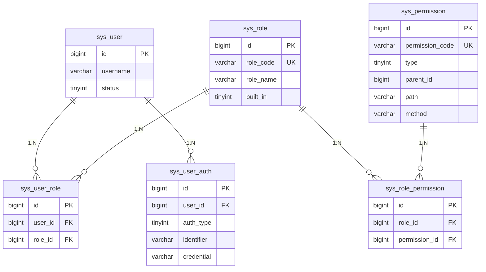
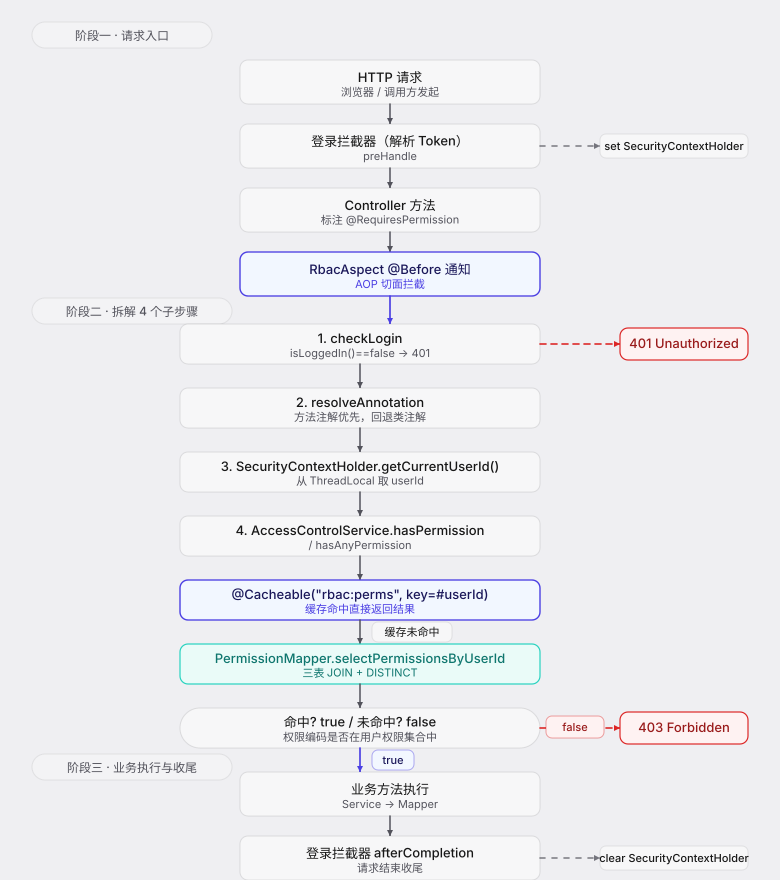

# RBAC 角色权限体系 · 设计文档

> 模块路径：`org.dam.service` + `org.dam.component.security`
> 作者：zhengbing · 版本：1.0 · 日期：2026-08-18

## 1. 设计目标

基于经典 RBAC（Role-Based Access Control）模型，落地一套**用户 ↔ 角色 ↔ 权限**三层解耦的访问控制体系：

- **解耦用户与权限**：用户不直接持有权限，而是通过角色间接获得，避免用户数膨胀后权限维护爆炸。
- **细粒度控制**：权限编码（如 `user:list`、`role:assignPermission`）与 HTTP 接口一一绑定，通过注解声明式校验。
- **声明式拦截**：`@RequiresPermission` / `@RequiresRole` / `@RequiresLogin` 标注在 Controller 方法或类上，由 AOP 切面统一拦截，业务代码零侵入。
- **缓存加速**：用户 → 角色编码集合、用户 → 权限编码集合走 Spring Cache（Redis），TTL 30 分钟；角色/权限/用户关联变更时主动失效。
- **内置角色保护**：`Admin` / `User` 等通过 `built_in=1` 标记，编码不可改、记录不可删，保证系统基线权限不被破坏。
- **全量覆盖分配**：用户分配角色、角色分配权限均采用"传入即最终态"的全量覆盖策略，差集增删，避免状态不一致。

## 2. 权限模型（ER 关系）

经典 RBAC 五张表，`sys_user` 为主用户表（不在本文档范围），其余四张表 + `sys_user_auth` 共同构成认证授权底座。



文本化关联路径：

```
sys_user ──< sys_user_role >── sys_role ──< sys_role_permission >── sys_permission
   (1)            (N)            (1)             (N)                   (1)
```

- `sys_user : sys_role` 为 **多对多**，中间表 `sys_user_role`。
- `sys_role : sys_permission` 为 **多对多**，中间表 `sys_role_permission`。
- 一个用户可拥有多个角色，一个角色可关联多个权限；用户最终权限 = 其所有角色关联权限的**并集**（SQL 中以 `SELECT DISTINCT` 去重）。

## 3. 表结构

表结构定义见 `src/main/resources/sql/rbac_schema.sql`（角色、权限及两张关联表）与 `src/main/resources/sql/auth_schema.sql`（认证表）。

### 3.1 `sys_role` 角色表

| 字段 | 类型 | 默认值 | 说明 |
|------|------|--------|------|
| `id` | BIGINT | AUTO_INCREMENT | 主键 ID |
| `role_code` | VARCHAR(50) | — | 角色编码（程序使用，唯一键 `uk_role_code`） |
| `role_name` | VARCHAR(50) | — | 角色名称（展示用） |
| `description` | VARCHAR(200) | NULL | 角色描述 |
| `status` | TINYINT | 1 | 状态（0-禁用，1-启用） |
| `built_in` | TINYINT | 0 | 是否内置（0-否，1-是，内置角色不可删除） |
| `create_time` | DATETIME | CURRENT_TIMESTAMP | 创建时间 |
| `update_time` | DATETIME | CURRENT_TIMESTAMP ON UPDATE | 更新时间 |
| `create_by` | VARCHAR(64) | NULL | 创建人 |
| `update_by` | VARCHAR(64) | NULL | 更新人 |
| `deleted` | TINYINT | 0 | 逻辑删除标识（0-未删除，1-已删除） |

### 3.2 `sys_permission` 权限表

| 字段 | 类型 | 默认值 | 说明 |
|------|------|--------|------|
| `id` | BIGINT | AUTO_INCREMENT | 主键 ID |
| `permission_code` | VARCHAR(100) | — | 权限编码（程序使用，唯一键 `uk_permission_code`，如 `user:list`） |
| `permission_name` | VARCHAR(50) | — | 权限名称（展示用） |
| `type` | TINYINT | 3 | 类型（1-菜单，2-按钮，3-接口） |
| `parent_id` | BIGINT | 0 | 父级 ID（0-根节点），索引 `idx_parent_id` |
| `path` | VARCHAR(200) | NULL | 访问路径 |
| `method` | VARCHAR(10) | NULL | HTTP 方法（GET/POST/PUT/DELETE） |
| `description` | VARCHAR(200) | NULL | 权限描述 |
| `sort` | INT | 0 | 排序（数字越小越靠前） |
| `status` | TINYINT | 1 | 状态（0-禁用，1-启用） |
| `create_time` / `update_time` / `create_by` / `update_by` / `deleted` | — | — | 同上 |

### 3.3 `sys_user_role` 用户-角色关联表

| 字段 | 类型 | 默认值 | 说明 |
|------|------|--------|------|
| `id` | BIGINT | AUTO_INCREMENT | 主键 ID |
| `user_id` | BIGINT | — | 用户 ID，索引 `idx_user_id` |
| `role_id` | BIGINT | — | 角色 ID，索引 `idx_role_id` |
| `create_time` | DATETIME | CURRENT_TIMESTAMP | 创建时间 |
| `create_by` | VARCHAR(64) | NULL | 创建人 |
| `deleted` | TINYINT | 0 | 逻辑删除标识 |

> 唯一键 `uk_user_role(user_id, role_id)` 防止同一用户重复关联同一角色。关联表无 `update_*` 字段，仅创建 + 逻辑删除。

### 3.4 `sys_role_permission` 角色-权限关联表

| 字段 | 类型 | 默认值 | 说明 |
|------|------|--------|------|
| `id` | BIGINT | AUTO_INCREMENT | 主键 ID |
| `role_id` | BIGINT | — | 角色 ID，索引 `idx_role_id` |
| `permission_id` | BIGINT | — | 权限 ID，索引 `idx_permission_id` |
| `create_time` | DATETIME | CURRENT_TIMESTAMP | 创建时间 |
| `create_by` | VARCHAR(64) | NULL | 创建人 |
| `deleted` | TINYINT | 0 | 逻辑删除标识 |

> 唯一键 `uk_role_permission(role_id, permission_id)` 防止同一角色重复关联同一权限。

### 3.5 `sys_user_auth` 用户认证表（认证侧，权限链路入口）

| 字段 | 类型 | 默认值 | 说明 |
|------|------|--------|------|
| `id` | BIGINT | AUTO_INCREMENT | 主键 ID |
| `user_id` | BIGINT | — | 关联用户 ID，索引 `idx_user_id` |
| `auth_type` | TINYINT | 1 | 认证类型（1-密码，2-手机验证码，3-第三方 OAuth，预留扩展） |
| `identifier` | VARCHAR(100) | — | 登录标识（用户名/手机号/邮箱） |
| `credential` | VARCHAR(200) | — | 凭证（密码认证下为 BCrypt 哈希） |
| `status` | TINYINT | 1 | 状态（0-禁用，1-启用） |
| `create_time` / `update_time` / `create_by` / `update_by` / `deleted` | — | — | 同上 |

> 唯一键 `uk_auth_type_identifier(auth_type, identifier)` 保证同一种认证方式下登录标识唯一；一个用户可有多条不同 `auth_type` 的记录，支持多端登录。

## 4. 核心服务

### 4.1 服务一览

| 服务 | 接口 / 实现 | 职责 |
|------|------------|------|
| 角色服务 | `RoleService` / `RoleServiceImpl` | 角色 CRUD、角色分配权限（全量覆盖）、查询角色已/未分配权限 |
| 权限服务 | `PermissionService` / `PermissionServiceImpl` | 权限 CRUD、级联清理角色权限关联 |
| 用户服务（权限相关） | `UserService` / `UserServiceImpl` | 用户分配角色（全量覆盖）、查询用户角色列表 |
| 访问控制服务 | `AccessControlService` / `AccessControlServiceImpl` | 用户 ↔ 角色 / 权限编码查询，AOP 切面与业务层共用入口 |

### 4.2 `AccessControlService` 关键方法

权限校验的统一门面，所有"用户是否具备某权限/角色"的判断都从这里走，并享受 Spring Cache 加速。

| 方法 | 缓存 | 说明 |
|------|------|------|
| `listRoleCodesByUserId(userId)` | `@Cacheable("rbac:roles", key=#userId)` | 用户角色编码集合，无关联返回空集合 |
| `listPermissionCodesByUserId(userId)` | `@Cacheable("rbac:perms", key=#userId)` | 用户权限编码集合（多角色并集去重），无关联返回空集合 |
| `listRolesByUserId(userId)` | — | 返回角色实体集合，空集合兜底 |
| `listPermissionsByUserId(userId)` | — | 返回权限实体集合，空集合兜底 |
| `hasPermission(userId, code)` | 间接走 `rbac:perms` | 单权限包含判断 |
| `hasRole(userId, code)` | 间接走 `rbac:roles` | 单角色包含判断 |
| `hasAnyRole(userId, ...codes)` | 间接走 `rbac:roles` | 任一角色匹配（OR） |
| `hasAnyPermission(userId, ...codes)` | 间接走 `rbac:perms` | 任一权限匹配（OR） |

实现在 `AccessControlServiceImpl` 中通过 `roleMapper.selectRolesByUserId` / `permissionMapper.selectPermissionsByUserId` 取数，再 `stream().map(...).filter(StrUtil::isNotBlank)` 抽取编码集合。

### 4.3 关联查询 SQL（PermissionMapper.xml）

用户最终权限的 JOIN 链路（三表关联 + 去重 + 按 `sort` 排序）：

```sql
SELECT DISTINCT p.*
FROM sys_permission p
INNER JOIN sys_role_permission rp ON p.id = rp.permission_id
INNER JOIN sys_user_role ur ON rp.role_id = ur.role_id
WHERE ur.user_id = #{userId}
  AND ur.deleted = 0
  AND rp.deleted = 0
  AND p.deleted = 0
  AND p.status = 1
ORDER BY p.sort ASC
```

`selectUnassignedPermissionsByRoleId` 用 `LEFT JOIN ... rp.id IS NULL` 反查"未分配权限"，供前端勾选展示。

### 4.4 角色分配权限（全量覆盖差集算法）

`RoleServiceImpl.assignPermissions` 是权限分配的核心，三步差集计算保证幂等：

```java
// 1. 查询当前角色已关联的权限 ID 集合
List<Long> existPermissionIds = existList.stream()
        .map(RolePermission::getPermissionId)
        .collect(Collectors.toList());

// 2. 计算需要删除的差集（旧关联 - 新列表）
List<Long> toRemoveIds = existPermissionIds.stream()
        .filter(pid -> !permissionIds.contains(pid))
        .collect(Collectors.toList());

// 3. 计算需要新增的差集（新列表 - 旧关联）
List<Long> toAddIds = permissionIds.stream()
        .filter(pid -> !existPermissionIds.contains(pid))
        .distinct()
        .collect(Collectors.toList());
```

`UserServiceImpl.assignRoles` 走完全相同的差集算法，只是把 `permissionIds` 换成 `roleIds`。两个方法均带 `@Transactional(rollbackFor = Exception.class)` + `@CacheEvict(value = {"rbac:roles", "rbac:perms"}, ...)`，事务保证一致性、缓存清除保证下次查询拿到最新数据。

### 4.5 内置角色与级联约束

| 约束 | 实现位置 | 行为 |
|------|---------|------|
| 内置角色不可删除 | `RoleServiceImpl.removeRole` | `built_in=1` 时抛 `BizException("内置角色不允许删除")` |
| 内置角色编码不可改 | `RoleServiceImpl.updateRole` | `built_in=1` 且 `roleCode` 变更时抛 `BizException("内置角色编码不允许修改")` |
| 删角色级联清关联 | `RoleServiceImpl.removeRole` | 删除角色后同步逻辑删除 `sys_role_permission` 中该角色的关联 |
| 删权限级联清关联 | `PermissionServiceImpl.removePermission` | 删除权限后同步逻辑删除 `sys_role_permission` 中该权限的关联 |

### 4.6 缓存失效策略

| 触发动作 | 失效缓存 | 注解 |
|---------|---------|------|
| 新增/修改/删除角色 | `rbac:roles` + `rbac:perms` | `@CacheEvict(value = {"rbac:roles", "rbac:perms"}, allEntries = true)` |
| 角色分配权限 | `rbac:roles` + `rbac:perms` | 同上 `allEntries = true` |
| 新增/修改/删除权限 | `rbac:perms` | `@CacheEvict(value = "rbac:perms", allEntries = true)` |
| 用户分配角色 | `rbac:roles` + `rbac:perms` | `@CacheEvict(value = {"rbac:roles", "rbac:perms"}, key = "#assignDTO.userId")` |
| 删除用户 | `rbac:roles` + `rbac:perms` | `@CacheEvict(value = {"rbac:roles", "rbac:perms"}, key = "#id")` |

> 角色和权限是"全局资源"，任一变更都可能影响多个用户的权限集合，因此采用 `allEntries = true` 整体失效；用户级别的变更（分配角色、删除用户）则精确按 `userId` 失效。

## 5. 权限拦截链路（@RequiresPermission AOP）

### 5.1 三类权限注解

均位于 `org.dam.component.security.annotation` 包，`@Target({METHOD, TYPE})` + `@Retention(RUNTIME)`，可标在方法或类上。

| 注解 | 必填属性 | 默认逻辑 | 失败码 |
|------|---------|---------|--------|
| `@RequiresLogin` | — | — | 401 Unauthorized |
| `@RequiresRole` | `String[] value()` | `logical = Logical.OR`（任一满足） | 403 Forbidden |
| `@RequiresPermission` | `String[] value()` | `logical = Logical.OR`（任一满足） | 403 Forbidden |

`Logical` 枚举取值 `OR` / `AND`，`AND` 表示必须全部满足。用法示例（摘自 `RequiresPermission` Javadoc）：

```java
// 要求 user:add 权限
@RequiresPermission("user:add")

// 要求 user:add 或 user:update 权限（满足其一即可）
@RequiresPermission({"user:add", "user:update"})

// 逻辑与：要求同时具备 user:add 和 user:update 权限
@RequiresPermission(value = {"user:add", "user:update"}, logical = Logical.AND)
```

### 5.2 `RbacAspect` 切面拦截流程

切面位于 `org.dam.component.security.aspect.RbacAspect`，用三个 `@Pointcut` 分别匹配方法级与类级注解（`@annotation` + `@within`）。`@Before` 通知统一拦截，**方法注解优先于类注解**。

`checkPermission` 核心逻辑：

```java
@Before("requiresPermissionPointcut()")
public void checkPermission(JoinPoint joinPoint) {
    // 先校验登录
    checkLogin(joinPoint);

    RequiresPermission anno = resolveAnnotation(joinPoint, RequiresPermission.class);
    if (anno == null) {
        return;
    }
    Long userId = SecurityContextHolder.getCurrentUserId();
    String[] perms = anno.value();
    Logical logical = anno.logical();

    if (logical == Logical.AND) {
        for (String perm : perms) {
            if (!accessControlService.hasPermission(userId, perm)) {
                throw new BizException(ResultCode.FORBIDDEN, "无权限访问，缺少权限：" + perm);
            }
        }
    } else {
        if (!accessControlService.hasAnyPermission(userId, perms)) {
            throw new BizException(ResultCode.FORBIDDEN, "无权限访问，缺少所需权限");
        }
    }
}
```

注解解析方法 `resolveAnnotation` 优先从 `Method` 取，取不到再回退到目标 `Class`：

```java
private <A extends Annotation> A resolveAnnotation(JoinPoint joinPoint, Class<A> annotationType) {
    MethodSignature signature = (MethodSignature) joinPoint.getSignature();
    Method method = signature.getMethod();
    A methodAnno = method.getAnnotation(annotationType);
    if (methodAnno != null) {
        return methodAnno;
    }
    Class<?> targetClass = joinPoint.getTarget().getClass();
    return targetClass.getAnnotation(annotationType);
}
```

### 5.3 `SecurityContextHolder` 与 ThreadLocal

权限校验所需的"当前用户"从 `SecurityContextHolder` 取，底层是 `ThreadLocal<SecurityContext>`：

| 静态方法 | 返回 | 说明 |
|---------|------|------|
| `set(context)` | void | 请求进入时由登录拦截器填充 |
| `get()` | `SecurityContext` | 未设置返回 null |
| `getCurrentUserId()` | `Long` | 未登录返回 null |
| `getCurrentUsername()` | `String` | 未登录返回 `"anonymous"` |
| `isLoggedIn()` | `Boolean` | 未登录返回 false |
| `clear()` | void | **请求结束必须调用**，避免线程池复用串数据 |

`SecurityContext` 为不可变 DTO（`@Builder`），字段：`userId / username / loggedIn`。真实项目由 JWT 解析拦截器填充，本项目示例由 `TestSecurityInterceptor` 注入。

### 5.4 完整拦截链路



## 6. 典型接口示例

### 6.1 角色管理接口（`RoleController`）

每个接口都通过 `@RequiresPermission` 声明所需权限编码，与 `sys_permission` 初始化数据一一对应。

| HTTP | 路径 | 权限编码 | 方法 |
|------|------|---------|------|
| POST | `/role/page` | `role:list` | 分页查询角色 |
| GET | `/role/{id}` | `role:get` | 查询角色详情 |
| POST | `/role` | `role:add` | 新增角色 |
| PUT | `/role` | `role:update` | 修改角色 |
| DELETE | `/role/{id}` | `role:delete` | 删除角色（内置不可删） |
| PUT | `/role/permissions` | `role:assignPermission` | 给角色分配权限（全量覆盖） |
| GET | `/role/{id}/permissions` | `role:get` | 查询角色已/未分配权限 |

真实代码片段（`RoleController.assignPermissions`）：

```java
@PutMapping("/permissions")
@Operation(summary = "给角色分配权限", description = "全量覆盖：传入的 permissionIds 即为该角色的最终权限集合")
@RequiresPermission("role:assignPermission")
public Result<Boolean> assignPermissions(@Valid @RequestBody RolePermissionAssignDTO assignDTO) {
    Boolean success = roleService.assignPermissions(assignDTO);
    return Result.success(success);
}
```

### 6.2 用户分配角色接口（`UserController`）

```java
@PutMapping("/roles")
@Operation(summary = "给用户分配角色", description = "全量覆盖：传入的 roleIds 即为该用户的最终角色集合")
@RequiresPermission("user:assignRole")
public Result<Boolean> assignRoles(@Valid @RequestBody UserRoleAssignDTO assignDTO) {
    Boolean success = userService.assignRoles(assignDTO);
    return Result.success(success);
}
```

### 6.3 初始化数据（来自 `rbac_schema.sql`）

| 角色 | role_code | built_in | 关联权限 |
|------|-----------|----------|---------|
| 超级管理员 | `Admin` | 1 | 全部权限（`SELECT id FROM sys_permission`） |
| 普通用户 | `User` | 1 | `user:list` + `user:get` |

| 用户 | 关联角色 |
|------|---------|
| admin（user_id=1） | `Admin` |
| zhangsan（user_id=2） | `User` |

权限编码命名规范：`{模块}:{动作}`，如 `user:list`、`role:assignPermission`、`permission:delete`，与 DTO 校验正则 `^[A-Za-z][A-Za-z0-9_:]*$` 一致。

## 7. 扩展约定

### 7.1 新增一个受控接口

1. 在 `sys_permission` 插入权限记录（`permission_code` 遵循 `{模块}:{动作}` 规范）。
2. 通过 `PUT /role/{id}/permissions` 把新权限分配给目标角色（自动失效 `rbac:perms` 缓存）。
3. 在目标 Controller 方法上标注 `@RequiresPermission("新权限编码")`，无需修改切面或服务。

### 7.2 新增一个角色

直接 `POST /role` 创建（`built_in` 由服务端强制置 0，无法创建内置角色），再通过 `PUT /role/permissions` 分配权限即可。

### 7.3 新增认证方式（如手机验证码）

`sys_user_auth.auth_type` 已预留 `2-手机验证码 / 3-第三方 OAuth`，新增时只需扩展 `AuthService` 的登录分支，不影响 RBAC 链路——权限校验只认 `userId`，与认证方式无关。

### 7.4 缓存边界与注意事项

- **TTL 30 分钟**：`rbac:roles` / `rbac:perms` 缓存由 Redis 管理，业务侧主动 `@CacheEvict` 失效；若绕过 Service 直接改库（如 SQL 修数据），需手动清缓存或等待 TTL 过期。
- **逻辑删除而非物理删除**：所有表均带 `deleted` 字段，关联查询 SQL 都带 `deleted = 0` 条件；如需物理清理需另行处理。
- **ThreadLocal 必须清理**：`SecurityContextHolder` 的 `clear()` 由登录拦截器在 `afterCompletion` 调用，新增拦截器链时注意顺序，避免内存泄漏。
- **方法注解优先**：类 + 方法同时标注时，方法注解生效、类注解被忽略，便于对单个方法做更细或更宽的授权。

## 8. 相关文件

| 类别 | 文件 |
|------|------|
| 表结构 | `src/main/resources/sql/rbac_schema.sql`、`src/main/resources/sql/auth_schema.sql` |
| 实体 | `src/main/java/org/dam/entity/Role.java`、`Permission.java`、`RolePermission.java`、`UserRole.java`、`UserAuth.java` |
| Mapper | `src/main/java/org/dam/mapper/RoleMapper.java`、`PermissionMapper.java`、`RolePermissionMapper.java`、`UserRoleMapper.java` |
| Mapper XML | `src/main/resources/mapper/RoleMapper.xml`、`PermissionMapper.xml` |
| 角色服务 | `src/main/java/org/dam/service/RoleService.java` + `impl/RoleServiceImpl.java` |
| 权限服务 | `src/main/java/org/dam/service/PermissionService.java` + `impl/PermissionServiceImpl.java` |
| 用户服务（权限相关） | `src/main/java/org/dam/service/UserService.java` + `impl/UserServiceImpl.java`（`assignRoles` / `listUserRoles`） |
| 访问控制服务 | `src/main/java/org/dam/service/AccessControlService.java` + `impl/AccessControlServiceImpl.java` |
| 权限注解 | `src/main/java/org/dam/component/security/annotation/RequiresLogin.java`、`RequiresRole.java`、`RequiresPermission.java`、`Logical.java` |
| AOP 切面 | `src/main/java/org/dam/component/security/aspect/RbacAspect.java` |
| 安全上下文 | `src/main/java/org/dam/component/security/SecurityContext.java`、`SecurityContextHolder.java` |
| DTO | `src/main/java/org/dam/dto/RoleSaveDTO.java`、`RolePageDTO.java`、`PermissionSaveDTO.java`、`PermissionPageDTO.java`、`RolePermissionAssignDTO.java`、`UserRoleAssignDTO.java` |
| VO | `src/main/java/org/dam/vo/RoleVO.java`、`PermissionVO.java`、`UserRoleVO.java`、`RolePermissionVO.java` |
| HTTP 入口 | `src/main/java/org/dam/controller/RoleController.java`、`PermissionController.java`、`UserController.java` |
