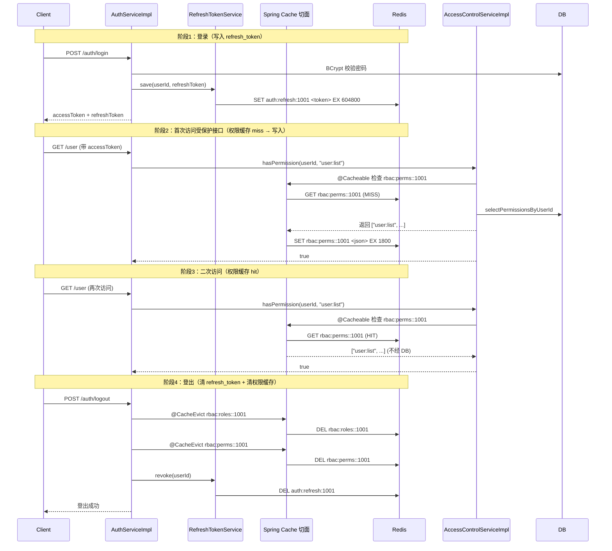

# Redis 缓存 · 设计文档

> 模块路径：`org.dam.config` + `org.dam.service.impl`
> 作者：zhengbing · 版本：1.0 · 日期：2026-08-18

## 1. 设计目标

本项目将 Redis 同时用于两条互不干扰的链路，但**对外只暴露一个核心约束**：

> **权限/角色编码缓存走 Spring Cache 注解（声明式），业务代码不写一行手动缓存代码。**

具体目标：

- **声明式缓存**：`@Cacheable` / `@CacheEvict` 注解驱动，业务方法只关心业务逻辑，缓存读写由 Spring AOP 切面完成。
- **手动操作只限 refresh_token**：`refresh_token` 需要原子 CAS 轮转，Spring Cache 抽象表达不了，单独走 `StringRedisTemplate` + Lua 脚本。
- **两条链路物理隔离**：缓存命名空间（`rbac:roles` / `rbac:perms`）与 token 命名空间（`auth:refresh:`）前缀完全不同，互不串扰。
- **序列化策略统一**：两条链路都采用 String key，但 value 序列化器按各自场景选择（权限缓存用 JSON 带 类型信息，refresh_token 用纯 String）。
- **TTL 与业务语义对齐**：权限缓存 30 分钟自然过期（容许短暂不一致），refresh_token 与 JWT 自身过期时间一致（7 天）。
- **变更即可见**：角色/权限/用户角色关联发生变更时，Service 层主动 `@CacheEvict` 清除脏数据，避免读到旧权限。

## 2. 两条独立链路

| 维度 | 链路 A：权限/角色编码缓存 | 链路 B：refresh_token 存储 |
|------|--------------------------|---------------------------|
| 抽象层 | Spring Cache（`@EnableCaching`） | `StringRedisTemplate` 手动 API |
| 注解 | `@Cacheable` / `@CacheEvict` | 无注解，显式调用 |
| Bean | `RedisCacheManager`（由 `RedisConfig` 提供） | `StringRedisTemplate`（Spring Boot 默认装配） |
| Key 前缀 | `rbac:roles::` / `rbac:perms::`（`{cacheName}::{key}`） | `auth:refresh:{userId}` |
| Value 序列化 | `GenericJackson2JsonRedisSerializer`（带 `@class` 类型信息） | `StringRedisSerializer`（纯字符串） |
| TTL | 30 分钟（`RedisCacheConfiguration.entryTtl`） | 7 天（`refreshTokenExpireDays * 24 * 60 * 60` 秒） |
| 原子性保证 | 单 key 读写，由 Spring Cache 切面保证 | Lua 脚本 CAS 比对 + `setex` |
| 触发位置 | `AccessControlServiceImpl`（读） + 4 个 Service（清） | `AuthServiceImpl` 登录/刷新/登出 |
| 防御目标 | 降低 DB 压力，权限校验毫秒级返回 | 防 replay attack，单用户单 token |

```mermaid
graph LR
    subgraph 链路A:Spring Cache 抽象
        A1[AccessControlServiceImpl] -->|@Cacheable| A2[(rbac:roles::userId)]
        A1 -->|@Cacheable| A3[(rbac:perms::userId)]
        A4[RoleServiceImpl] -->|@CacheEvict allEntries| A2
        A4 -->|@CacheEvict allEntries| A3
        A5[PermissionServiceImpl] -->|@CacheEvict allEntries| A3
        A6[UserServiceImpl] -->|@CacheEvict key=userId| A2
        A6 -->|@CacheEvict key=userId| A3
        A7[AuthServiceImpl.logout] -->|@CacheEvict key=userId| A2
        A7 -->|@CacheEvict key=userId| A3
    end
    subgraph 链路B:StringRedisTemplate 手动
        B1[AuthServiceImpl.login] -->|save| B2[(auth:refresh:userId)]
        B3[AuthServiceImpl.refresh] -->|rotate Lua CAS| B2
        B4[AuthServiceImpl.logout] -->|revoke delete| B2
    end
```

## 3. 依赖与连接

### 3.1 Maven 依赖（`pom.xml`）

```xml
<!-- Spring Boot Data Redis（refresh_token 存储 + 权限缓存） -->
<dependency>
    <groupId>org.springframework.boot</groupId>
    <artifactId>spring-boot-starter-data-redis</artifactId>
</dependency>

<!-- Spring Boot Cache（@Cacheable/@CacheEvict 抽象层） -->
<dependency>
    <groupId>org.springframework.boot</groupId>
    <artifactId>spring-boot-starter-cache</artifactId>
</dependency>

<!-- Apache Commons Pool2（Redis 连接池 lettuce-pool） -->
<dependency>
    <groupId>org.apache.commons</groupId>
    <artifactId>commons-pool2</artifactId>
</dependency>
```

- `spring-boot-starter-data-redis` 同时引入 `lettuce-core`（默认客户端）与 `redis-client`。
- `spring-boot-starter-cache` 提供 Spring Cache 抽象（`@Cacheable` / `@CacheEvict` / `@EnableCaching`），不绑定具体实现。
- `commons-pool2` 是启用 `lettuce.pool` 的前置依赖，缺失则连接池配置静默不生效（退化为单连接）。
- 项目基于 Spring Boot `2.7.18` + JDK 8，使用 `javax.annotation.Resource` 注入。

### 3.2 连接与连接池（`application.yml`）

```yaml
spring:
  redis:
    host: ${REDIS_HOST:127.0.0.1}
    port: ${REDIS_PORT:6379}
    password: ${REDIS_PASSWORD:}
    database: ${REDIS_DB:0}
    timeout: 3000ms
    lettuce:
      pool:
        max-active: 16
        max-idle: 8
        min-idle: 2
        max-wait: 2000ms
```

| 参数 | 值 | 说明 |
|------|----|----|
| `host` / `port` / `database` | `127.0.0.1` / `6379` / `0` | 全部支持环境变量覆盖 |
| `timeout` | `3000ms` | 命令超时，避免 Redis 抖动时请求堆积 |
| `lettuce.pool.max-active` | `16` | 单实例最多 16 条连接 |
| `max-idle` / `min-idle` | `8` / `2` | 空闲保持，减少建连开销 |
| `max-wait` | `2000ms` | 连接耗尽时最多等 2 秒，超时抛异常 |

`spring.cache.type` 未显式配置：项目存在 `RedisCacheManager` Bean，Spring Boot 自动探测后以 Redis 作为 Cache 实现。

### 3.3 refresh_token 相关配置

```yaml
jwt:
  access-token-expire-minutes: 120
  refresh-token-expire-days: 7
```

`RefreshTokenServiceImpl` 通过 `jwtProperties.getRefreshTokenExpireDays()` 读取，计算 TTL 秒数：

```java
long ttlSeconds = jwtProperties.getRefreshTokenExpireDays() * 24L * 60L * 60L;  // 7 * 86400 = 604800
```

## 4. RedisConfig 序列化策略

`org.dam.config.RedisConfig` 是整个缓存体系的核心装配类，承担三个职责：

1. `@EnableCaching` 开启 Spring Cache 注解支持。
2. 装配 `RedisTemplate<String, Object>` —— 给 refresh_token 链路留作扩展（实际 `RefreshTokenServiceImpl` 注入的是 `StringRedisTemplate`，见 §6）。
3. 装配 `RedisCacheManager` —— 给 `@Cacheable` / `@CacheEvict` 注解使用。

### 4.1 关键常量与 Bean

```java
@Configuration
@EnableCaching
public class RedisConfig {

    /**
     * 权限缓存默认过期时间（30 分钟）
     */
    private static final long DEFAULT_CACHE_TTL_MINUTES = 30L;

    @Bean
    public RedisTemplate<String, Object> redisTemplate(RedisConnectionFactory connectionFactory) {
        RedisTemplate<String, Object> template = new RedisTemplate<>();
        template.setConnectionFactory(connectionFactory);

        StringRedisSerializer stringSerializer = new StringRedisSerializer();
        GenericJackson2JsonRedisSerializer jsonSerializer = new GenericJackson2JsonRedisSerializer();

        // key 用 String 序列化，value 用 JSON 序列化（带类型信息）
        template.setKeySerializer(stringSerializer);
        template.setHashKeySerializer(stringSerializer);
        template.setValueSerializer(jsonSerializer);
        template.setHashValueSerializer(jsonSerializer);

        template.afterPropertiesSet();
        return template;
    }

    @Bean
    public RedisCacheManager cacheManager(RedisConnectionFactory connectionFactory) {
        RedisCacheConfiguration config = RedisCacheConfiguration.defaultCacheConfig()
                .entryTtl(Duration.ofMinutes(DEFAULT_CACHE_TTL_MINUTES))
                .serializeKeysWith(RedisSerializationContext.SerializationPair
                        .fromSerializer(new StringRedisSerializer()))
                .serializeValuesWith(RedisSerializationContext.SerializationPair
                        .fromSerializer(new GenericJackson2JsonRedisSerializer()))
                .disableCachingNullValues();

        return RedisCacheManager.builder(connectionFactory)
                .cacheDefaults(config)
                .build();
    }
}
```

### 4.2 序列化器选型说明

| 元素 | 序列化器 | 原因 |
|------|---------|------|
| Cache key | `StringRedisSerializer` | key 是人类可读的 `rbac:roles::1`，便于运维 `redis-cli` 直接查 |
| Cache value | `GenericJackson2JsonRedisSerializer` | value 是 `List<String>`，需要带 `@class` 类型信息以便反序列化为具体类型 |
| `disableCachingNullValues()` | — | 不缓存 null 结果，防止**缓存穿透**写满 null 占位 |

`GenericJackson2JsonRedisSerializer` 写入 Redis 的实际内容形如：

```json
["java.util.ArrayList", ["ROLE_ADMIN", "ROLE_USER"]]
```

带 `@class` 类型信息，`RedisCacheManager` 读回时可直接还原为 `List<String>`，业务层无感知。

## 5. 权限缓存 @Cacheable / @CacheEvict 矩阵

### 5.1 读取侧（`@Cacheable`）

| 类 | 方法 | value | key | 说明 |
|----|------|-------|-----|------|
| `AccessControlServiceImpl` | `listRoleCodesByUserId(Long userId)` | `rbac:roles` | `#userId` | 按 userId 缓存角色编码集合 |
| `AccessControlServiceImpl` | `listPermissionCodesByUserId(Long userId)` | `rbac:perms` | `#userId` | 按 userId 缓存权限编码集合 |

**读取侧实际代码**：

```java
@Override
@Cacheable(value = "rbac:roles", key = "#userId")
public List<String> listRoleCodesByUserId(Long userId) {
    if (Objects.isNull(userId)) {
        return new ArrayList<>();
    }
    List<Role> roles = roleMapper.selectRolesByUserId(userId);
    if (CollUtil.isEmpty(roles)) {
        return new ArrayList<>();
    }
    return roles.stream()
            .map(Role::getRoleCode)
            .filter(StrUtil::isNotBlank)
            .collect(Collectors.toList());
}

@Override
@Cacheable(value = "rbac:perms", key = "#userId")
public List<String> listPermissionCodesByUserId(Long userId) {
    if (Objects.isNull(userId)) {
        return new ArrayList<>();
    }
    List<Permission> permissions = permissionMapper.selectPermissionsByUserId(userId);
    if (CollUtil.isEmpty(permissions)) {
        return new ArrayList<>();
    }
    return permissions.stream()
            .map(Permission::getPermissionCode)
            .filter(StrUtil::isNotBlank)
            .collect(Collectors.toList());
}
```

`hasPermission` / `hasRole` / `hasAnyRole` / `hasAnyPermission` 全部委托给这两个方法，因此**所有权限校验都自动命中缓存**，无需重复加注解。

### 5.2 清除侧（`@CacheEvict`）

| 类 | 方法 | value | key | allEntries | 清除范围 |
|----|------|-------|-----|-----------|---------|
| `RoleServiceImpl` | `saveRole` | `{rbac:roles, rbac:perms}` | — | `true` | 全部角色/权限缓存 |
| `RoleServiceImpl` | `updateRole` | `{rbac:roles, rbac:perms}` | — | `true` | 全部角色/权限缓存 |
| `RoleServiceImpl` | `removeRole` | `{rbac:roles, rbac:perms}` | — | `true` | 全部角色/权限缓存 |
| `RoleServiceImpl` | `assignPermissions` | `{rbac:roles, rbac:perms}` | — | `true` | 全部角色/权限缓存 |
| `PermissionServiceImpl` | `savePermission` | `rbac:perms` | — | `true` | 全部权限缓存 |
| `PermissionServiceImpl` | `updatePermission` | `rbac:perms` | — | `true` | 全部权限缓存 |
| `PermissionServiceImpl` | `removePermission` | `rbac:perms` | — | `true` | 全部权限缓存 |
| `UserServiceImpl` | `removeUser` | `{rbac:roles, rbac:perms}` | `#id` | 默认 false | 单用户角色/权限缓存 |
| `UserServiceImpl` | `assignRoles` | `{rbac:roles, rbac:perms}` | `#assignDTO.userId` | 默认 false | 单用户角色/权限缓存 |
| `AuthServiceImpl` | `logout` | `{rbac:roles, rbac:perms}` | `#userId` | 默认 false | 单用户角色/权限缓存 |

### 5.3 清除策略对比

**全量清除（`allEntries = true`）**：角色/权限元数据变更影响所有用户，无法定位受影响用户集合，宁可**全清重建**。代码示例：

```java
@Override
@Transactional(rollbackFor = Exception.class)
@CacheEvict(value = {"rbac:roles", "rbac:perms"}, allEntries = true)
public Long saveRole(RoleSaveDTO saveDTO) {
    log.info("新增角色，roleCode={}，roleName={}", saveDTO.getRoleCode(), saveDTO.getRoleName());
    checkRoleCodeUnique(saveDTO.getRoleCode(), null);
    Role role = BeanUtil.copyProperties(saveDTO, Role.class);
    if (Objects.isNull(role.getStatus())) {
        role.setStatus(1);
    }
    role.setBuiltIn(0);
    roleMapper.insert(role);
    return role.getId();
}
```

**精准清除（指定 `key`）**：变更只影响单个用户（删除用户、给用户分配角色、用户登出），按 `userId` 精准清除该用户的两个 key，避免误伤其他用户。代码示例：

```java
@Override
@Transactional(rollbackFor = Exception.class)
@CacheEvict(value = {"rbac:roles", "rbac:perms"}, key = "#assignDTO.userId")
public Boolean assignRoles(UserRoleAssignDTO assignDTO) {
    // ... 全量覆盖用户角色关联
    return Boolean.TRUE;
}
```

```java
@Override
@CacheEvict(value = {"rbac:roles", "rbac:perms"}, key = "#userId")
public void logout(Long userId) {
    if (Objects.isNull(userId)) {
        return;
    }
    refreshTokenService.revoke(userId);
    log.info("用户登出成功，userId={}", userId);
}
```

### 5.4 未加 @CacheEvict 的方法（重要约定）

| 类 | 方法 | 未加 `@CacheEvict` 的原因 |
|----|------|--------------------------|
| `UserServiceImpl` | `saveUser` | 新用户无角色/权限关联，无脏数据 |
| `UserServiceImpl` | `updateUser` | 仅改 username/phone 等基础字段，缓存 key 是 `userId` 不变，无影响 |
| `UserServiceImpl` | `changeUserStatus` | 状态变更通过观察者模式另行处理，不直接清缓存（见 `user-status-change-observer-design.md`） |

> **约定**：`@CacheEvict` 与 `@Transactional` 同方法时，Spring 在事务**提交后**执行缓存清除（默认 `beforeInvocation = false`），保证不会清完缓存又被事务回滚重新写脏。

## 6. refresh_token 存储 + Lua 原子轮转

### 6.1 接口契约（`RefreshTokenService`）

```java
public interface RefreshTokenService {

    void save(Long userId, String refreshToken);

    boolean validate(Long userId, String refreshToken);

    boolean rotate(Long userId, String oldRefreshToken, String newRefreshToken);

    void revoke(Long userId);
}
```

**单用户单 token 模型**：Redis 中每个 userId 只保留一份 refresh_token，新登录覆盖旧 token（等同踢人下线）。

### 6.2 Key 规则与 TTL

```java
private static final String KEY_PREFIX = "auth:refresh:";

private String buildKey(Long userId) {
    return KEY_PREFIX + userId;   // 例如 auth:refresh:1001
}
```

TTL 计算：

```java
long ttlSeconds = jwtProperties.getRefreshTokenExpireDays() * 24L * 60L * 60L;  // 7 天 = 604800 秒
```

### 6.3 写入与吊销（非原子，无需 Lua）

```java
@Override
public void save(Long userId, String refreshToken) {
    if (Objects.isNull(userId) || Objects.isNull(refreshToken)) {
        return;
    }
    String key = buildKey(userId);
    long ttlSeconds = jwtProperties.getRefreshTokenExpireDays() * 24L * 60L * 60L;
    stringRedisTemplate.opsForValue().set(key, refreshToken, ttlSeconds, TimeUnit.SECONDS);
    log.info("保存 refresh_token，userId={}，ttl={}秒", userId, ttlSeconds);
}

@Override
public void revoke(Long userId) {
    if (Objects.isNull(userId)) {
        return;
    }
    Boolean deleted = stringRedisTemplate.delete(buildKey(userId));
    if (Boolean.TRUE.equals(deleted)) {
        log.info("吊销 refresh_token，userId={}", userId);
    }
}
```

### 6.4 校验（非原子）

```java
@Override
public boolean validate(Long userId, String refreshToken) {
    if (Objects.isNull(userId) || Objects.isNull(refreshToken)) {
        return false;
    }
    String stored = stringRedisTemplate.opsForValue().get(buildKey(userId));
    return refreshToken.equals(stored);
}
```

> `validate` 仅在不需要轮转的场景使用。`AuthServiceImpl.refresh` 走 `rotate` 而非先 `validate` 再 `save`，是为了避免**校验与写入之间的窗口期**被并发重放。

### 6.5 Lua 原子轮转（核心防 replay attack）

**为什么需要 Lua**：如果用「先 `get` 比对旧 token，再 `setex` 新 token」两步操作，存在 TOCTOU（Time-of-Check to Time-of-Use）窗口：

```
T1: 攻击者拿到泄露的旧 token A
T2: 合法用户用 A 调 rotate → get 比对通过 → 准备 setex 新 token B
T3: 攻击者用 A 并发调 rotate → get 比对通过（A 还没被覆盖）
T4: 合法用户 setex B 完成
T5: 攻击者 setex C 完成，覆盖了 B
```

合法用户的 B 被覆盖，攻击者拿到了 C。Lua 脚本把「比对 + 写入」收敛为单条 Redis 单线程原子命令，杜绝窗口。

**Lua 脚本完整内容**：

```java
private static final String ROTATE_LUA =
        "if redis.call('get', KEYS[1]) == ARGV[1] then " +
        "    redis.call('setex', KEYS[1], ARGV[3], ARGV[2]) " +
        "    return 1 " +
        "else " +
        "    return 0 " +
        "end";

private static final RedisScript<Long> ROTATE_SCRIPT = new DefaultRedisScript<>(ROTATE_LUA, Long.class);
```

**参数含义**：

| 参数 | 变量 | 实际值 | 含义 |
|------|------|--------|------|
| `KEYS[1]` | `buildKey(userId)` | `auth:refresh:1001` | 用户 refresh_token 的 Redis Key |
| `ARGV[1]` | `oldRefreshToken` | 客户端传来的旧 token | CAS 比对值，必须与 Redis 当前值一致才允许轮转 |
| `ARGV[2]` | `newRefreshToken` | 服务端新生成的 token | 比对通过后写入的新值 |
| `ARGV[3]` | `String.valueOf(ttlSeconds)` | `"604800"` | 新 token 的 TTL 秒数，供 `setex` 使用 |

**返回值**：`1` 表示轮转成功；`0` 表示旧 token 已失效（被吊销、被新登录覆盖、或已被并发请求抢先轮转）。

**Java 调用**：

```java
@Override
public boolean rotate(Long userId, String oldRefreshToken, String newRefreshToken) {
    if (Objects.isNull(userId) || Objects.isNull(oldRefreshToken) || Objects.isNull(newRefreshToken)) {
        return false;
    }
    long ttlSeconds = jwtProperties.getRefreshTokenExpireDays() * 24L * 60L * 60L;
    Long result = stringRedisTemplate.execute(
            ROTATE_SCRIPT,
            Collections.singletonList(buildKey(userId)),
            oldRefreshToken,
            newRefreshToken,
            String.valueOf(ttlSeconds)
    );
    boolean success = result != null && result == 1L;
    if (success) {
        log.info("轮转 refresh_token 成功，userId={}", userId);
    } else {
        log.warn("轮转 refresh_token 失败，旧 token 已失效，userId={}", userId);
    }
    return success;
}
```

> **注意 ARGV[3] 是字符串**：`setex` 的第二参数虽是数字，但 Lua 与 Redis 之间传递的所有 ARGV 都是字符串，`String.valueOf(ttlSeconds)` 是必需的转换。

## 7. Key 命名规范

### 7.1 全量 Key 一览

| 用途 | Key 模板 | 示例 | TTL | 所属链路 |
|------|---------|------|-----|---------|
| 角色编码缓存 | `rbac:roles::{userId}` | `rbac:roles::1001` | 30 分钟 | Spring Cache |
| 权限编码缓存 | `rbac:perms::{userId}` | `rbac:perms::1001` | 30 分钟 | Spring Cache |
| refresh_token | `auth:refresh:{userId}` | `auth:refresh:1001` | 7 天 | StringRedisTemplate |

### 7.2 命名约定

- **Spring Cache 自动加 `::`**：`RedisCacheManager` 默认把 `cacheName` 与 `key` 用 `::` 拼接，业务侧只声明 `value = "rbac:roles"` 与 `key = "#userId"`，最终 Key 是 `rbac:roles::1001`。
- **refresh_token 手动拼接**：`KEY_PREFIX = "auth:refresh:"` + `userId`，使用冒号 `:` 分层，与 Redis Key 命名惯例一致。
- **前缀语义化**：`rbac:` 表示权限相关，`auth:` 表示认证相关，便于运维按业务域 `SCAN`。
- **禁用魔法值**：`KEY_PREFIX` 与 `DEFAULT_CACHE_TTL_MINUTES` 均为 `private static final` 常量。

## 8. 踩坑与最佳实践

### 8.1 踩坑：JSON 序列化导致 Lua ARGV 类型异常

**现象**：最初 `RefreshTokenServiceImpl` 注入的是 `RedisTemplate<String, Object>`（即 `RedisConfig` 装配的 Bean），其 value 用 `GenericJackson2JsonRedisSerializer`。`save` 写入 Redis 的内容不是裸字符串，而是带 `@class` 类型信息的 JSON：

```
"java.lang.String"
```

实际存储值会被包成 `"\"abc...\""` 这种带引号的形式。`rotate` 的 Lua 脚本执行 `redis.call('get', KEYS[1]) == ARGV[1]` 时：

- `redis.call('get')` 取出的值是 JSON 包裹后的字符串
- `ARGV[1]`（旧 token）由 `RedisTemplate` 序列化时也被 JSON 包裹
- 两边序列化形式偶有差异（尤其 `String.valueOf(ttlSeconds)` 这种数字 token），CAS 比对**永远返回 0**，refresh_token 无法轮转

**根因**：`GenericJackson2JsonRedisSerializer` 设计目标是序列化 Java 对象图，不适合给 Lua 脚本提供裸字符串 ARGV。

**解决方案**：`RefreshTokenServiceImpl` 改为注入 `StringRedisTemplate`（Spring Boot 默认装配，key/value 均为 `StringRedisSerializer`，无类型包裹）：

```java
@Resource
private StringRedisTemplate stringRedisTemplate;
```

`StringRedisTemplate` 写入 Redis 的就是裸字符串，Lua 脚本中的 `get` 与 `ARGV[1]` 都是裸字符串比对，CAS 正常工作。

**类注释中也记录了这一决策**：

```java
/**
 * Refresh Token 服务实现类
 * 基于 Redis 存储 refresh_token，使用 Lua 脚本保证轮转原子性，防止 replay attack
 * 单用户单 token 模型：新登录覆盖旧 token，等同踢人下线
 * 使用 StringRedisTemplate 避免 JSON 序列化包裹导致 Lua 脚本 ARGV 类型异常
 **/
```

### 8.2 最佳实践：缓存雪崩的考量

**现状**：所有权限缓存 TTL 都是固定 30 分钟，理论上同一时刻大批用户同时缓存命中过期，会瞬间打爆 DB。

**实际风险较低**：

1. 缓存按 `userId` 分散 Key，每个用户的缓存独立过期，过期时刻由「首次访问时间」决定，天然分散。
2. 系统目前为后台管理类应用，并发用户有限，DB 能扛住突发。

**若未来扩展为高并发 C 端**，建议：

- 给 TTL 加随机抖动：`entryTtl(Duration.ofMinutes(30 + ThreadLocalRandom.current().nextInt(10)))`，但 `RedisCacheConfiguration` 是全局配置，需改为按 `cacheName` 定制 `withInitialCacheNames`。
- 或在 `@Cacheable` 的方法内对未命中场景加分布式锁（如 Redisson `RLock`），单 key 重建。

### 8.3 最佳实践：缓存穿透的考量

**现有防护**：

- `RedisCacheConfiguration.disableCachingNullValues()` 不缓存 null 值。
- `AccessControlServiceImpl` 在 userId 为 null 或查询为空时返回 `new ArrayList<>()`（空集合而非 null），空集合**会被缓存**，等价于缓存 null 占位。

**残留风险**：恶意攻击者用大量不存在的 userId 调接口，每个 userId 都会查一次 DB 并写入空集合缓存。当前未对 userId 存在性做前置校验（如布隆过滤器）。

**当前可接受原因**：

- userId 来自 JWT 解析，必须先通过签名校验，攻击者无法随意构造请求。
- 空集合缓存占用极小，30 分钟自然过期。

### 8.4 最佳实践：缓存击穿的考量

**现状**：热点用户的缓存过期瞬间，并发请求同时 miss → 同时查 DB → 同时回写。

**当前未加锁**：权限缓存是「按用户分散」的，单用户成为热点的概率低；且 DB 查询走 MyBatis Plus + 索引，单次耗时可控。

**后续可选加固**：在 `AccessControlServiceImpl.listRoleCodesByUserId` 内部对未命中场景加 `synchronized` 或分布式锁，但会破坏 `@Cacheable` 的纯声明式风格，暂不引入。

### 8.5 最佳实践：缓存与事务的协作

所有 `@CacheEvict` 都与 `@Transactional(rollbackFor = Exception.class)` 同方法。Spring 默认 `beforeInvocation = false`，即：

1. 方法正常返回 → 事务提交 → 缓存清除
2. 方法抛异常 → 事务回滚 → **缓存不清除**（保留旧缓存）

这是正确行为：异常回滚后数据未变更，缓存不应被清。

### 8.6 最佳实践：refresh_token 单用户单 token 模型

**优势**：

- 新登录自动覆盖旧 token，等同**踢人下线**，无需额外维护黑名单。
- `revoke` 只需 `DEL` 一个 key，O(1)。
- rotate 的 CAS 语义清晰：旧 token 失效 = 用户已在新设备登录或已登出。

**代价**：

- 多设备同时登录同一账号时，旧设备 refresh_token 失效，需重新登录。这是**安全优先**的有意取舍。

### 8.7 access_token 不入 Redis 的取舍

`AuthServiceImpl.logout` 只清 refresh_token + 权限缓存，**不清 access_token**。原因：

- access_token 是无状态 JWT，短期有效（`access-token-expire-minutes: 120`，2 小时）。
- 若引入黑名单，每次接口请求都要查 Redis，违背无状态优势。
- 登出后 access_token 最多存活 2 小时自然过期，风险可接受。

如未来要求「登出立即失效」，可引入 Redis 黑名单（key=`jwt:blacklist:{jti}`，TTL=剩余有效期），但会牺牲 access_token 的无状态特性。

## 9. 完整链路：登录 → 缓存写入 → 二次访问命中 → 登出



**关键链路文字版**：

1. **登录**：`AuthServiceImpl.login` 校验密码通过 → 生成双 Token → `refreshTokenService.save` 写 `auth:refresh:{userId}`，TTL 7 天。权限缓存此时**不预写**，等首次访问按需填充。
2. **首次访问受保护接口**：`AccessControlServiceImpl.listPermissionCodesByUserId(userId)` 被 `hasPermission` 调用 → `@Cacheable` 切面 miss → 查 DB → 回写 `rbac:perms::{userId}`，TTL 30 分钟 → 返回结果。
3. **二次访问**：同方法再次调用 → `@Cacheable` 切面 hit → 直接从 Redis 取 `List<String>` → 不查 DB。
4. **登出**：`AuthServiceImpl.logout` 触发：
   - `@CacheEvict(value = {"rbac:roles", "rbac:perms"}, key = "#userId")` 清除该用户的角色与权限缓存
   - `refreshTokenService.revoke(userId)` 删除 `auth:refresh:{userId}`
   - access_token（无状态 JWT）不处理，2 小时后自然过期。

## 10. 相关文件

| 类别 | 文件 |
|------|------|
| 配置 | `src/main/resources/application.yml`（Redis 连接 + lettuce 连接池 + jwt 配置） |
| 配置 | `src/main/java/org/dam/config/RedisConfig.java`（`RedisTemplate` + `RedisCacheManager` + `@EnableCaching`） |
| 缓存读取 | `src/main/java/org/dam/service/impl/AccessControlServiceImpl.java`（`@Cacheable`） |
| 缓存清除 | `src/main/java/org/dam/service/impl/RoleServiceImpl.java`（`@CacheEvict allEntries=true`） |
| 缓存清除 | `src/main/java/org/dam/service/impl/PermissionServiceImpl.java`（`@CacheEvict allEntries=true`） |
| 缓存清除 | `src/main/java/org/dam/service/impl/UserServiceImpl.java`（`@CacheEvict key=#id/#assignDTO.userId`） |
| Token 接口 | `src/main/java/org/dam/service/RefreshTokenService.java`（`save/validate/rotate/revoke`） |
| Token 实现 | `src/main/java/org/dam/service/impl/RefreshTokenServiceImpl.java`（`StringRedisTemplate` + Lua CAS） |
| 业务接入 | `src/main/java/org/dam/service/impl/AuthServiceImpl.java`（`login`/`refresh`/`logout`） |
| 依赖 | `pom.xml`（`spring-boot-starter-data-redis` + `spring-boot-starter-cache` + `commons-pool2`） |
