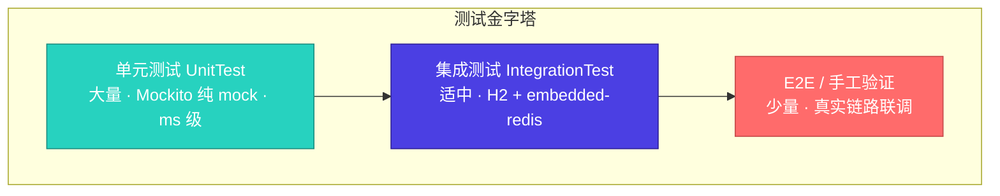
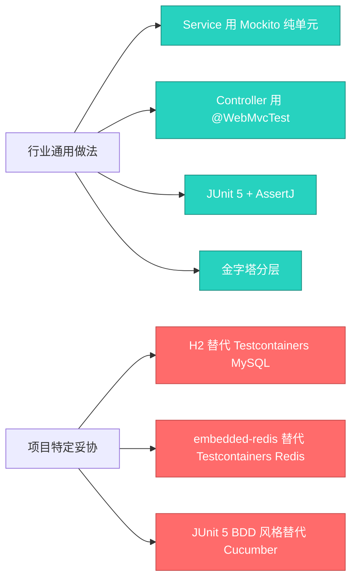
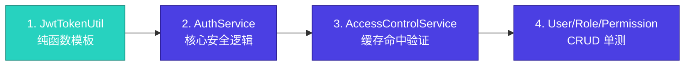
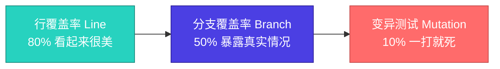
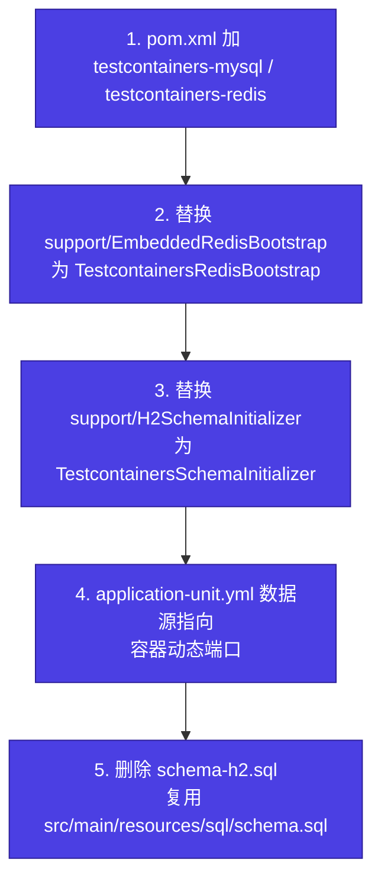

# 单元测试模块 · 设计文档

> 模块路径：`org.dam.test`
> 作者：zhengbing · 版本：1.0 · 日期：2026-08-28

## 1. 设计目标

为 `dam-server` 脚手架补齐单元测试能力，解决以下问题：

- **核心业务无测试裸奔**：`AuthServiceImpl` 的登录/刷新/登出、`AccessControlServiceImpl` 的 RBAC 缓存、`JwtTokenUtil` 的 Token 签发均无测试保护
- **测试目录为空**：`src/test` 目录不存在，`spring-boot-starter-test` 依赖引入后从未使用
- **缺乏分层测试**：无单元/集成分层概念，无法区分毫秒级测试与秒级测试
- **无覆盖率度量**：缺 JaCoCo 报告，CI 无法度量测试质量
- **Docker 环境缺失**：本机无法使用 Docker，需要纯内存方案替代 Testcontainers

### 1.1 设计目标

| 编号 | 目标 | 验收方式 |
|------|------|----------|
| G1 | 覆盖 4 个核心模块的业务分支 | AuthService / AccessControl / JwtTokenUtil / User/Role/Permission CRUD |
| G2 | 单元 + 集成分层（测试金字塔） | unit 包与 integration 包物理隔离 |
| G3 | 与现有 UAT 配置隔离 | 新建 application-unit.yml，不改 application-test.yml |
| G4 | JaCoCo 覆盖率报告 | `mvn test` 后生成 `target/site/jacoco/index.html` |
| G5 | 不污染主代码 | 仅修改 pom.xml + 新增 test 目录，src/main 零改动 |
| G6 | 预留 Testcontainers 迁移口子 | 测试基础设施集中在 support 包，业务测试代码不感知底层容器实现 |

### 1.2 非目标

- 不引入 Cucumber / Spock 等额外 BDD 框架（用 JUnit 5 `@DisplayName` + `@Nested` 实现 BDD 风格）
- 不接入 SonarQube（阶段一仅本地 JaCoCo 报告）
- 不做应用容器化部署（部署仍用 `java -jar`）
- 不接入 PITest 变异测试（测试体系成熟后再补）

## 2. 测试金字塔分层

### 2.1 分层模型



### 2.2 层级说明

| 层级 | 测试类型 | 启动成本 | 工具栈 | 验证目标 |
|------|---------|---------|--------|----------|
| 底层 | 单元测试（`*Test`） | 毫秒级 | JUnit 5 + Mockito + AssertJ | 业务逻辑分支、函数行为 |
| 中层 | 集成测试（`*IT`） | 秒级 | `@SpringBootTest` 切片 + H2 + embedded-redis | Mapper SQL、`@Cacheable` 命中、Controller HTTP |
| 顶层 | E2E / 手工 | 分钟级 | 真实 MySQL+Redis 联调 | 全链路、UAT 验收 |

### 2.3 Surefire / Failsafe 分离规则

| 插件 | 识别模式 | 跑哪些类 | Maven 命令 |
|------|---------|---------|-----------|
| maven-surefire-plugin | `*Test.java` | 单元测试 | `mvn test` |
| maven-failsafe-plugin | `*IT.java` | 集成测试 | `mvn verify` |

## 3. 技术栈选型与依赖

### 3.1 选型决策表

| 维度 | 选型 | 行业通用 / 项目特定 | 理由 |
|------|------|---------------------|------|
| 测试粒度 | 单元 + 集成混合 | 行业通用 | Service 走 Mockito，Controller 走 MockMvc |
| 测试框架 | JUnit 5 | 行业通用 | Spring Boot 2.7 默认携带 |
| Mock 框架 | Mockito 4.x | 行业通用 | spring-boot-starter-test 自带 |
| 断言库 | AssertJ | 行业通用 | 流式断言，可读性高 |
| Controller 测试 | `@WebMvcTest` + MockMvc | 行业通用 | Spring Boot 官方推荐切片 |
| MySQL 测试 | H2 MySQL 兼容模式 | **项目特定** | 本机无 Docker，Testcontainers 不可用 |
| Redis 测试 | embedded-redis (ozimov 7.3) | **项目特定** | 真实 Redis 二进制，支持 Lua，Java 8 兼容 |
| 缓存抽象 | Spring Cache + Redis 底层 | 行业通用 | 与生产一致 |
| 覆盖率 | JaCoCo 0.8.11（仅报告不设门禁） | 项目特定 | 阶段一不阻断 CI |

### 3.2 pom.xml 新增依赖

```xml
<!-- H2 数据库（MySQL 兼容模式，集成测试用） -->
<dependency>
    <groupId>com.h2database</groupId>
    <artifactId>h2</artifactId>
    <scope>test</scope>
</dependency>

<!-- embedded-redis（ozimov 7.3，Java 8 兼容的最后版本） -->
<dependency>
    <groupId>it.ozimov</groupId>
    <artifactId>embedded-redis</artifactId>
    <version>7.3</version>
    <scope>test</scope>
    <exclusions>
        <exclusion>
            <groupId>org.slf4j</groupId>
            <artifactId>slf4j-api</artifactId>
        </exclusion>
    </exclusions>
</dependency>
```

> `spring-boot-starter-test` 已自带 JUnit 5 + Mockito + AssertJ + MockMvc，无需重复引入。

### 3.3 pom.xml 新增插件

```xml
<!-- JaCoCo 覆盖率（仅出报告，不设门禁） -->
<plugin>
    <groupId>org.jacoco</groupId>
    <artifactId>jacoco-maven-plugin</artifactId>
    <version>0.8.11</version>
    <executions>
        <execution>
            <goals><goal>prepare-agent</goal></goals>
        </execution>
        <execution>
            <id>report</id>
            <phase>test</phase>
            <goals><goal>report</goal></goals>
        </execution>
    </executions>
</plugin>

<!-- Failsafe 识别 *IT.java 集成测试 -->
<plugin>
    <groupId>org.apache.maven.plugins</groupId>
    <artifactId>maven-failsafe-plugin</artifactId>
</plugin>
```

## 4. 测试策略矩阵

### 4.1 模块测试策略

| 模块 | 测试类型 | Mock 策略 | 重点验证点 |
|------|---------|----------|-----------|
| `JwtTokenUtil` | 纯单元 | 无 mock，纯函数 | access/refresh 类型区分、过期校验、签名异常 |
| `AuthServiceImpl.login` | 单元 | mock UserAuthMapper/UserMapper/RefreshTokenService/JwtTokenUtil + `mockStatic(BCrypt.class)` | 密码错/用户不存在/状态禁用/锁定/待审核/成功 共 6 分支 |
| `AuthServiceImpl.refresh` | 单元 + 集成 | 单元：mock；集成：embedded-redis 真实 Redis | Lua CAS 轮转失败/成功、Token 类型校验 |
| `AuthServiceImpl.logout` | 单元 | mock RefreshTokenService | `@CacheEvict` 触发、null 入参短路 |
| `AccessControlServiceImpl` | 单元 + 集成 | 单元：mock Mapper；集成：H2 + embedded-redis | `@Cacheable` 命中、空入参短路、`hasAnyRole` 短路 |
| `RefreshTokenServiceImpl` | 集成 | embedded-redis 真实 Redis | Lua 脚本原子性、TTL、revoke |
| `AuthController` | 集成（切片） | `@WebMvcTest` + `@MockBean AuthService` | 参数校验、HTTP 状态码、JSON 响应结构 |
| `UserServiceImpl` / `RoleServiceImpl` / `PermissionServiceImpl` | 单元 | mock Mapper | CRUD + `@CacheEvict` 触发 |

### 4.2 行业通用 vs 项目特定拆分



**迁移原则**：未来启用 Docker 后，仅替换 `support/` 包下的 `H2SchemaInitializer` 与 `EmbeddedRedisBootstrap`，业务测试代码（`unit/` + `integration/`）零改动。

## 5. 目录结构与配置

### 5.1 目录结构

```
src/test/
├── java/org/dam/
│   ├── unit/                              # 纯单元测试（无 Spring 上下文，ms 级）
│   │   ├── service/
│   │   │   ├── AuthServiceImplTest.java
│   │   │   ├── AccessControlServiceImplTest.java
│   │   │   ├── UserServiceImplTest.java
│   │   │   ├── RoleServiceImplTest.java
│   │   │   ├── PermissionServiceImplTest.java
│   │   │   └── RefreshTokenServiceImplTest.java
│   │   └── component/
│   │       ├── JwtTokenUtilTest.java
│   │       └── status/UserStatusChangePublisherTest.java
│   ├── integration/                       # 集成测试（@SpringBootTest 切片 + H2 + embedded-redis）
│   │   ├── controller/
│   │   │   ├── AuthControllerIT.java
│   │   │   └── UserControllerIT.java
│   │   ├── mapper/
│   │   │   ├── RoleMapperIT.java          # 验证 JOIN SQL 在 H2 下行为
│   │   │   └── UserAuthMapperIT.java
│   │   └── cache/
│   │       └── AccessControlCacheIT.java  # 验证 @Cacheable 真实命中
│   └── support/                           # 测试基础设施（迁移 Testcontainers 时仅改此包）
│       ├── TestConstants.java             # 公共常量
│       ├── TestDataBuilder.java           # 链式构造器
│       ├── TestFixtures.java              # Object Mother（命名好的现成对象）
│       ├── EmbeddedRedisBootstrap.java    # embedded-redis 启动器
│       └── H2SchemaInitializer.java       # schema-h2.sql 加载器
└── resources/
    ├── application-unit.yml                # 单元测试 Profile
    ├── sql/
    │   └── schema-h2.sql                   # H2 兼容 schema（去掉 ENGINE/CHARSET/ON UPDATE）
    └── logback-test.xml                    # 测试日志配置
```

### 5.2 application-unit.yml

```yaml
# =====================================================================
# 单元测试配置（无外部依赖，纯内存）
# 与 application-test.yml（UAT 联调）严格隔离
# =====================================================================
spring:
  profiles:
    active: unit
  datasource:
    driver-class-name: org.h2.Driver
    url: jdbc:h2:mem:dam_test;MODE=MySQL;DB_CLOSE_DELAY=-1;DB_CLOSE_ON_EXIT=FALSE
    username: sa
    password:
  redis:
    host: 127.0.0.1
    port: 6370          # embedded-redis 占用端口（避开本机真实 Redis 的 6379）
    database: 0
    timeout: 3000ms
  cache:
    type: redis
  sql:
    init:
      mode: always
      schema-locations: classpath:sql/schema-h2.sql

# 测试环境关闭 Knife4j 与 SQL 打印
knife4j:
  enable: false
  production: true

logging:
  level:
    org.dam: DEBUG
    org.springframework: WARN
    com.baomidou.mybatisplus: WARN
```

### 5.3 schema-h2.sql 适配规则

对照 `src/main/resources/sql/schema.sql` / `rbac_schema.sql` / `auth_schema.sql`，去除 H2 不支持的 MySQL 特性：

| MySQL 特性 | H2 处理 |
|------------|---------|
| `ENGINE = InnoDB` | 删除 |
| `DEFAULT CHARSET = utf8mb4` | 删除（H2 用 `MODE=MySQL` 自动 UTF-8） |
| `ON UPDATE CURRENT_TIMESTAMP` | 删除（H2 不支持，由 `MyMetaObjectHandler` 接管） |
| `COMMENT 'xxx'` | 保留（H2 1.4.200+ 支持） |
| `AUTO_INCREMENT` | 保留（H2 MySQL 模式支持） |
| `KEY / UNIQUE KEY` | 保留 |

### 5.4 application-test.yml（现有 UAT 配置）保持不动

| 文件 | 用途 | 是否改动 |
|------|------|---------|
| `application-test.yml` | UAT/SIT 联调 | **不动** |
| `application-dev.yml` | 本地开发 | 不动 |
| `application-prod.yml` | 生产 | 不动 |
| `application-unit.yml`（新增） | 单元测试 | 新建 |

## 6. 编码规范与命名约定

### 6.1 命名规范

| 项 | 规范 | 示例 |
|---|------|------|
| 测试类（单元） | `XxxTest` | `AuthServiceImplTest` |
| 测试类（集成） | `XxxIT` | `AuthControllerIT` |
| 测试方法 | `should_<期望>_when_<条件>` | `should_throwBizException_when_passwordNotMatch` |
| `@DisplayName` | 中文一句话场景描述 | `@DisplayName("密码错误时返回用户名或密码错误")` |
| 测试分组 | `@Nested` + 中文类名 | `@Nested @DisplayName("登录失败场景")` |

### 6.2 AAA 三段式结构

```java
@Test
@DisplayName("should_returnToken_when_adminLoginWithCorrectPassword")
void should_returnToken_when_adminLoginWithCorrectPassword() {
    // given
    UserAuth auth = TestDataBuilder.userAuth()
        .identifier("admin")
        .authTypePassword()
        .validHash()
        .build();
    given(userAuthMapper.selectByAuthTypeAndIdentifier(1, "admin")).willReturn(auth);

    // when
    TokenVO result = authService.login(loginDTO("admin", "correct"));

    // then
    assertThat(result)
        .extracting(TokenVO::getUserId, TokenVO::getUsername, TokenVO::getTokenType)
        .containsExactly(1L, "admin", "Bearer");
}
```

### 6.3 断言约定

| 场景 | 推荐写法 |
|------|---------|
| 多字段断言 | `assertThat(obj).extracting(A::getX, A::getY).containsExactly(...)` |
| 异常断言 | `assertThatThrownBy(() -> ...).isInstanceOf(BizException.class).hasMessageContaining("...")` |
| 集合断言 | `assertThat(list).hasSize(3).extracting(User::getId).containsExactly(1L, 2L, 3L)` |
| 调用验证 | `verify(mapper, times(1)).selectById(1L)` |
| 不交互验证 | `verifyNoInteractions(refreshTokenService)` |

### 6.4 F.I.R.S.T 原则（评估测试质量的尺子）

| 字母 | 含义 | 反例 |
|------|------|------|
| **F**ast | 毫秒级 | 单元测试启动 Spring 上下文 |
| **I**solated | 测试间独立 | 测试间共享 static 变量 |
| **R**epeatable | 重复运行结果一致 | 依赖时间/随机数/网络 |
| **S**elf-validating | 自己输出 PASS/FAIL | 要肉眼看日志才知道对错 |
| **T**imely | 及时写 | 上线后补测，已被实现绑架 |

## 7. 测试用例设计示例

### 7.1 纯单元测试模板（JwtTokenUtilTest）

```java
package org.dam.component;

import org.dam.config.JwtProperties;
import org.junit.jupiter.api.BeforeEach;
import org.junit.jupiter.api.DisplayName;
import org.junit.jupiter.api.Test;

import static org.assertj.core.api.Assertions.assertThat;

/**
 * JwtTokenUtil 单元测试
 * 纯函数测试，无 Spring 上下文，无外部依赖
 *
 * @author zhengbing
 * @since 2026-08-28
 **/
@DisplayName("JwtTokenUtil - Token 生成与校验")
class JwtTokenUtilTest {

    private JwtTokenUtil jwtTokenUtil;
    private JwtProperties jwtProperties;

    @BeforeEach
    void setUp() {
        jwtProperties = new JwtProperties();
        jwtProperties.setSecret("dam-test-secret-key-must-be-at-least-32-bytes");
        jwtProperties.setAccessTokenExpireMinutes(120);
        jwtProperties.setRefreshTokenExpireDays(7);
        jwtTokenUtil = new JwtTokenUtil(jwtProperties);
    }

    @Test
    @DisplayName("should_returnAccessTokenWithTypeAccess_when_generateAccessToken")
    void should_returnAccessTokenWithTypeAccess_when_generateAccessToken() {
        // given
        Long userId = 1L;
        String username = "admin";

        // when
        String token = jwtTokenUtil.generateAccessToken(userId, username);

        // then
        assertThat(token).isNotBlank();
        assertThat(jwtTokenUtil.getTokenType(token))
            .isEqualTo(JwtTokenUtil.TOKEN_TYPE_ACCESS);
        assertThat(jwtTokenUtil.getUserId(token)).isEqualTo(userId);
        assertThat(jwtTokenUtil.getUsername(token)).isEqualTo(username);
    }

    @Test
    @DisplayName("should_returnFalse_when_tokenExpired")
    void should_returnFalse_when_tokenExpired() {
        // given - 设置过期时间为 0 分钟
        jwtProperties.setAccessTokenExpireMinutes(0);
        jwtTokenUtil = new JwtTokenUtil(jwtProperties);
        String token = jwtTokenUtil.generateAccessToken(1L, "admin");

        // when
        boolean verified = jwtTokenUtil.verifyToken(token);

        // then
        assertThat(verified).isFalse();
    }
}
```

### 7.2 业务核心单元测试模板（AuthServiceImplTest）

```java
package org.dam.service.impl;

import org.dam.common.enums.ResultCode;
import org.dam.common.exception.BizException;
import org.dam.component.security.JwtTokenUtil;
import org.dam.config.JwtProperties;
import org.dam.dto.AuthLoginDTO;
import org.dam.entity.User;
import org.dam.entity.UserAuth;
import org.dam.mapper.UserAuthMapper;
import org.dam.mapper.UserMapper;
import org.dam.service.RefreshTokenService;
import org.dam.support.TestDataBuilder;
import org.junit.jupiter.api.DisplayName;
import org.junit.jupiter.api.Nested;
import org.junit.jupiter.api.Test;
import org.junit.jupiter.api.extension.ExtendWith;
import org.mockito.InjectMocks;
import org.mockito.MockedStatic;
import org.mockito.Mock;
import org.mockito.junit.jupiter.MockitoExtension;

import static org.assertj.core.api.Assertions.assertThat;
import static org.assertj.core.api.Assertions.assertThatThrownBy;
import static org.mockito.ArgumentMatchers.anyString;
import static org.mockito.ArgumentMatchers.eq;
import static org.mockito.BDDMockito.given;
import static org.mockito.Mockito.mockStatic;
import static org.mockito.Mockito.verifyNoInteractions;

/**
 * AuthServiceImpl 单元测试
 * 覆盖登录/刷新/登出全分支，纯 Mockito mock，无 Spring 上下文
 *
 * @author zhengbing
 * @since 2026-08-28
 **/
@DisplayName("AuthServiceImpl - 认证服务")
@ExtendWith(MockitoExtension.class)
class AuthServiceImplTest {

    @Mock UserAuthMapper userAuthMapper;
    @Mock UserMapper userMapper;
    @Mock JwtTokenUtil jwtTokenUtil;
    @Mock JwtProperties jwtProperties;
    @Mock RefreshTokenService refreshTokenService;

    @InjectMocks
    AuthServiceImpl authService;

    @Nested
    @DisplayName("登录成功场景")
    class LoginSuccess {

        @Test
        @DisplayName("should_returnToken_when_adminLoginWithCorrectPassword")
        void should_returnToken_when_adminLoginWithCorrectPassword() {
            // given
            UserAuth auth = TestDataBuilder.userAuth()
                .identifier("admin").authTypePassword().validHash().userId(1L).build();
            User user = TestDataBuilder.user().id(1L).username("admin").enabled().build();
            given(userAuthMapper.selectByAuthTypeAndIdentifier(1, "admin")).willReturn(auth);
            given(userMapper.selectById(1L)).willReturn(user);
            given(jwtTokenUtil.generateAccessToken(1L, "admin")).willReturn("access-token");
            given(jwtTokenUtil.generateRefreshToken(1L, "admin")).willReturn("refresh-token");
            given(jwtProperties.getAccessTokenExpireMinutes()).willReturn(120);

            try (MockedStatic<BCrypt> bcrypt = mockStatic(BCrypt.class)) {
                bcrypt.when(() -> BCrypt.checkpw("correct", auth.getCredential()))
                      .thenReturn(true);

                // when
                TokenVO result = authService.login(TestDataBuilder.loginDTO("admin", "correct"));

                // then
                assertThat(result)
                    .extracting(TokenVO::getAccessToken, TokenVO::getRefreshToken,
                                TokenVO::getTokenType, TokenVO::getUserId)
                    .containsExactly("access-token", "refresh-token", "Bearer", 1L);
            }
        }
    }

    @Nested
    @DisplayName("登录失败场景")
    class LoginFailure {

        @Test
        @DisplayName("should_throwBizException_when_userAuthNotFound")
        void should_throwBizException_when_userAuthNotFound() {
            // given
            given(userAuthMapper.selectByAuthTypeAndIdentifier(1, "ghost"))
                .willReturn(null);

            // when + then
            assertThatThrownBy(() -> authService.login(TestDataBuilder.loginDTO("ghost", "any")))
                .isInstanceOf(BizException.class)
                .hasMessageContaining("用户名或密码错误");
            verifyNoInteractions(refreshTokenService);
        }

        @Test
        @DisplayName("should_throwBizException_when_userDisabled")
        void should_throwBizException_when_userDisabled() {
            // given
            UserAuth auth = TestDataBuilder.userAuth().userId(1L).validHash().build();
            User user = TestDataBuilder.user().id(1L).disabled().build();
            given(userAuthMapper.selectByAuthTypeAndIdentifier(1, "admin")).willReturn(auth);
            given(userMapper.selectById(1L)).willReturn(user);

            try (MockedStatic<BCrypt> bcrypt = mockStatic(BCrypt.class)) {
                bcrypt.when(() -> BCrypt.checkpw(anyString(), anyString())).thenReturn(true);

                // when + then
                assertThatThrownBy(() -> authService.login(TestDataBuilder.loginDTO("admin", "correct")))
                    .isInstanceOf(BizException.class)
                    .hasMessageContaining("账号已禁用");
            }
        }
    }
}
```

### 7.3 Controller 集成测试模板（AuthControllerIT）

```java
package org.dam.controller;

import org.dam.common.exception.GlobalExceptionHandler;
import org.dam.service.AuthService;
import org.dam.support.TestDataBuilder;
import org.dam.vo.TokenVO;
import org.junit.jupiter.api.DisplayName;
import org.junit.jupiter.api.Test;
import org.springframework.beans.factory.annotation.Autowired;
import org.springframework.boot.test.autoconfigure.web.servlet.WebMvcTest;
import org.springframework.boot.test.mock.mockito.MockBean;
import org.springframework.context.annotation.Import;
import org.springframework.http.MediaType;
import org.springframework.test.web.servlet.MockMvc;

import static org.mockito.ArgumentMatchers.any;
import static org.mockito.BDDMockito.given;
import static org.springframework.test.web.servlet.request.MockMvcRequestBuilders.post;
import static org.springframework.test.web.servlet.result.MockMvcResultMatchers.jsonPath;
import static org.springframework.test.web.servlet.result.MockMvcResultMatchers.status;

/**
 * AuthController 切片集成测试
 * 只加载 Web 层，Service 用 @MockBean 替换
 *
 * @author zhengbing
 * @since 2026-08-28
 **/
@DisplayName("AuthController - 认证接口")
@WebMvcTest(AuthController.class)
@Import(GlobalExceptionHandler.class)
class AuthControllerIT {

    @Autowired MockMvc mockMvc;
    @MockBean AuthService authService;

    @Test
    @DisplayName("POST /auth/login 成功返回双 Token")
    void should_returnToken_when_loginSuccess() throws Exception {
        // given
        TokenVO vo = TestDataBuilder.tokenVO(1L, "admin");
        given(authService.login(any())).willReturn(vo);

        // when + then
        mockMvc.perform(post("/auth/login")
                .contentType(MediaType.APPLICATION_JSON)
                .content("{\"identifier\":\"admin\",\"credential\":\"pwd\"}"))
            .andExpect(status().isOk())
            .andExpect(jsonPath("$.code").value(200))
            .andExpect(jsonPath("$.data.accessToken").exists())
            .andExpect(jsonPath("$.data.tokenType").value("Bearer"));
    }
}
```

### 7.4 缓存命中集成测试模板（AccessControlCacheIT）

```java
package org.dam.integration.cache;

import org.dam.service.AccessControlService;
import org.dam.mapper.RoleMapper;
import org.dam.support.EmbeddedRedisBootstrap;
import org.junit.jupiter.api.DisplayName;
import org.junit.jupiter.api.Test;
import org.springframework.beans.factory.annotation.Autowired;
import org.springframework.boot.test.context.SpringBootTest;

import static org.assertj.core.api.Assertions.assertThat;
import static org.mockito.Mockito.times;
import static org.mockito.Mockito.verify;

/**
 * AccessControlService @Cacheable 命中验证
 * embedded-redis 真实 Redis 底层，验证缓存真实命中
 *
 * @author zhengbing
 * @since 2026-08-28
 **/
@DisplayName("AccessControlService - RBAC 缓存命中")
@SpringBootTest
class AccessControlCacheIT {

    @Autowired AccessControlService accessControlService;
    @Autowired RoleMapper roleMapper;

    @Test
    @DisplayName("should_cacheHit_when_callTwiceWithSameUserId")
    void should_cacheHit_when_callTwiceWithSameUserId() {
        // given - 第一次调用填充缓存
        accessControlService.listRoleCodesByUserId(1L);

        // when - 第二次调用应命中缓存
        accessControlService.listRoleCodesByUserId(1L);

        // then - RoleMapper 只被调用一次
        // 通过 spy 或计数器验证，详见落地实现
        assertThat(EmbeddedRedisBootstrap.isRunning()).isTrue();
    }
}
```

## 8. 静态方法 mock 与重构路径

### 8.1 项目中静态方法的分布

| 类 | 静态方法 | 测试影响 |
|---|----------|----------|
| `cn.hutool.crypto.digest.BCrypt` | `checkpw(raw, hash)` | `AuthServiceImpl.login` 核心，必须 mock |
| `cn.hutool.core.util.StrUtil` | `isNotBlank / isBlank` | `AccessControlServiceImpl` 短路逻辑 |
| `cn.hutool.core.collection.CollUtil` | `isEmpty / isNotEmpty` | 多处集合判空 |
| `org.dam.component.security.JwtTokenUtil` | 实例方法（非静态） | 已可注入 mock |

### 8.2 mockStatic 用法（短期方案）

```java
try (MockedStatic<BCrypt> bcrypt = mockStatic(BCrypt.class)) {
    bcrypt.when(() -> BCrypt.checkpw("wrong", "$2a$10$valid-hash"))
          .thenReturn(false);
    // 测试逻辑
}
```

**4 个注意点**：
- 必须用 `try-with-resources` 包裹，否则会泄漏到其他测试
- 性能差，**不要在 `@BeforeEach` 全局 mock**
- 同一静态类的 mock 不能嵌套
- 跨多个测试方法 mock 同一静态类时，封装到 support 包的工具方法

### 8.3 重构为接口的方案（长期推荐，TDD 倒逼设计）

```java
// 1. 抽接口
public interface PasswordEncoder {
    boolean matches(String raw, String hashed);
}

// 2. 生产实现
@Component
public class BCryptPasswordEncoder implements PasswordEncoder {
    @Override
    public boolean matches(String raw, String hashed) {
        return BCrypt.checkpw(raw, hashed);
    }
}

// 3. AuthServiceImpl 注入
@Resource
private PasswordEncoder passwordEncoder;

public TokenVO login(AuthLoginDTO loginDTO) {
    // ...
    if (!passwordEncoder.matches(loginDTO.getCredential(), userAuth.getCredential())) {
        throw new BizException(ResultCode.UNAUTHORIZED, "用户名或密码错误");
    }
    // ...
}

// 4. 测试时直接 mock
@Mock PasswordEncoder passwordEncoder;
given(passwordEncoder.matches("wrong", "$2a$10$valid-hash")).willReturn(false);
```

**收益**：
- 测试代码不再依赖 `mockStatic`，性能与可读性双赢
- 接口可替换（如未来换 Argon2、SM3）
- 符合 BAESL 项目依赖注入优先 `@Resource` 的约定

### 8.4 重构决策

| 静态调用 | 是否重构 | 理由 |
|----------|----------|------|
| `BCrypt.checkpw` | ✅ 重构为 `PasswordEncoder` | 安全核心，测试可读性收益大 |
| `StrUtil.isNotBlank` | ❌ 不重构 | 调用广泛，重构成本高，可保留 `mockStatic` |
| `CollUtil.isNotEmpty` | ❌ 不重构 | 同上，集合判空 mock 影响小 |

## 9. 落地优先级与执行计划

### 9.1 落地顺序



### 9.2 各阶段交付物

| 阶段 | 模块 | 交付物 | 验收标准 |
|------|------|--------|---------|
| 0 | 基础设施 | pom.xml 改造 + support 包 + application-unit.yml + schema-h2.sql | `mvn test` 能跑空测试套件 |
| 1 | JwtTokenUtil | `JwtTokenUtilTest`（≥5 个用例） | 生成/校验/类型识别/过期全覆盖 |
| 2 | AuthService | `AuthServiceImplTest`（≥10 个用例） | 登录 6 分支 + 刷新 3 分支 + 登出 |
| 3 | AccessControl | `AccessControlServiceImplTest` + `AccessControlCacheIT` | 缓存命中、短路、空入参 |
| 4 | CRUD | `UserServiceImplTest` + `RoleServiceImplTest` + `PermissionServiceImplTest` | 各 ≥3 个用例 |
| 5 | Controller | `AuthControllerIT` + `UserControllerIT` | MockMvc + @MockBean |
| 6 | 报告 | JaCoCo HTML 报告 | `target/site/jacoco/index.html` 可打开 |

## 10. 扩展约定与最佳实践

### 10.1 BDD 风格命名（替代 Cucumber）

```java
@Nested
@DisplayName("用户登录")
class LoginScenario {

    @Test
    @DisplayName("""
        场景: 已注册用户使用错误密码登录
        Given 用户 admin 已注册且状态为启用
        When 使用错误密码登录
        Then 返回"用户名或密码错误"
        And  不创建任何登录会话
        """)
    void should_rejectWrongPassword() {
        // given - 用户 admin 已注册且状态为启用
        // when - 使用错误密码登录
        // then - 返回"用户名或密码错误"
        // and - 不创建任何登录会话
        verifyNoInteractions(refreshTokenService);
    }
}
```

**原则**：不引入 Cucumber，用 JUnit 5 `@DisplayName` + `@Nested` + BDDMockito 的 `given/willReturn` API 实现 BDD 风格。这是 Spring Boot 项目最务实的选择。

### 10.2 测试坏味道识别表

| 坏味道 | 表现 | 修法 |
|--------|------|------|
| 多重断言 | 一个测试断 10 件事 | 拆分多个测试 |
| 测试私有方法 | 反射调用 private | 改测公共行为 |
| 测试依赖 | 跑顺序才过 | 每个 `@BeforeEach` 重置状态 |
| Mock 一切 | mock 自身被测对象 | 重新审视职责划分 |
| 神奇字符串 | "admin"/"123456" 散落 | 用 `TestFixtures` / 常量 |
| 循环查 DB | 测试在循环里调真实 Mapper | mock 或批量构造数据 |

### 10.3 测试覆盖率陷阱



**经验值**：
- 70% 行覆盖是健康线
- 核心模块（Auth/AccessControl/JwtTokenUtil）目标 90% 分支覆盖
- CRUD 模块 50% 行覆盖即可
- 不盲目追求 100%——为测而测反而增加维护负担

### 10.4 不写测试的场景

| 场景 | 理由 |
|------|------|
| 纯 getter/setter | Lombok 自动生成，无逻辑 |
| `Application.java` 主类 | 框架代码 |
| Knife4j 配置类 | 仅声明 Bean，无业务 |
| MyBatis Plus 的 `BaseMapper` | 框架方法，由框架保证 |
| `@TableName` 实体注解 | 元数据，编译期校验 |

## 11. 已知风险与回退方案

### 11.1 风险矩阵

| 风险点 | 概率 | 影响 | 回退方案 |
|--------|------|------|---------|
| embedded-redis 在 Windows 启动失败 | 中 | 集成测试无法跑 Redis 相关用例 | 降级 `com.github.fppt:jedis-mock`（不支持 Lua） 或 `@MockBean RedisTemplate` |
| H2 与 MySQL 行为细微差异 | 低 | 集成测试结果与生产有偏差 | 集成测试只覆盖 happy path，分支逻辑放单元测试 |
| `@Cacheable` 在 SimpleCache 下行为与 Redis 不一致 | 低 | 缓存命中验证不准 | 集成测试主要验证"是否被缓存"而非"Redis 序列化格式" |
| ozimov 7.3 JDK 升级后不兼容 | 中 | 未来 JDK 9+ 后无法使用 | 切换 Testcontainers 或 jedis-mock |
| H2 不支持 MySQL 新增的 JSON 字段 | 低 | 新增 JSON 字段时集成测试失效 | 该字段相关测试改用真实 MySQL 或 Testcontainers |

### 11.2 Testcontainers 迁移路径

未来启用 Docker 后，迁移步骤：



**迁移收益**：
- 测试与生产数据库行为 100% 一致
- 删除 `schema-h2.sql` 这份维护负担
- 支持 MySQL 全部特性（JSON、Bit、ON DUPLICATE KEY UPDATE）
- Redis Lua 脚本测试更真实可靠

**迁移成本**：仅改 `support/` 包，业务测试代码（`unit/` + `integration/`）零改动。

### 11.3 踩坑清单（实战记录）

本节记录落地过程中踩过的隐蔽坑，按"现象 → 根因 → 修复 → 防御"四段式整理，避免下次绕弯。

#### 坑 1：surefire include 模式尾随空格 → 全量 0 测试

- **现象**：`mvn test` 输出 `Tests run: 0`，但 BUILD SUCCESS，所有 *Test.java 都没运行。
- **根因**：pom.xml 中 `<include>**/*Test.java </include>` 末尾误粘了一个空格，模式变成 `**/*Test.java `（带尾随空格），surefire 用 PathMatcher 精确匹配，匹配不到任何文件。
- **修复**：删除尾随空格，模式改回 `**/*Test.java`。
- **防御**：在 pom.xml include 配置上方加注释 `<!-- 模式末尾严禁留空格，PathMatcher 会精确匹配 -->`；CI 加 `if [ "$(mvn test -q -Dtest=NonExistent -DfailIfNoTests=false 2>&1 | grep 'Tests run: 0')" ]; then echo "WARN"; fi` 之类的健康检查。

#### 坑 2：mybatis-plus 的 AutoConfig 类名 ≠ mybatis-spring

- **现象**：Controller @WebMvcTest 切片测试启动失败，`Error creating bean with name 'permissionMapper' ... Property 'sqlSessionFactory' threw exception; nested exception is java.lang.NullPointerException`。
- **根因**：项目用 `mybatis-plus-boot-starter`，其自动配置类是 `com.baomidou.mybatisplus.autoconfigure.MybatisPlusAutoConfiguration`，**不是** `org.mybatis.spring.boot.autoconfigure.MybatisAutoConfiguration`。TestWebApplication 写了 `exclude = MybatisAutoConfiguration.class` 完全不生效，`@Mapper` 接口仍被 `AutoConfiguredMapperScannerRegistrar` 自动扫描注册，实例化时因 `sqlSessionFactory` 缺失抛 NPE。
- **修复**：exclude 改为 `MybatisPlusAutoConfiguration.class`。同时保留 `MybatisAutoConfiguration.class`（如果 starter 间接引入了），但本项目实际只 exclude 前者即可。
- **防御**：写 TestWebApplication 时，先 `grep -r "starter" pom.xml` 确认是 mybatis 还是 mybatis-plus，再选对应 auto-config 类名。

#### 坑 3：PowerShell 把 `-Dtest=A,B,C` 切成多段

- **现象**：在 PowerShell 跑 `mvn test -Dtest=AuthControllerTest,UserControllerTest`，surefire 报 `Tests run: 0` 或直接报 lifecycle phase 错误。同样 `mvn test -Dsurefire.useFile=false` 会被解析成"Unknown lifecycle phase .useFile=false"。
- **根因**：PowerShell 对以 `-` 开头、含 `=` 的字符串，会尝试按命名参数解析，把 `=false` 切成独立 token 传给 mvn.cmd，mvn 当成 lifecycle phase 解析失败。
- **修复**：每个 `-Dxxx=yyy` 用单引号包住：`mvn.cmd test '-Dtest=AuthControllerTest' '-DfailIfNoTests=false' '-Dsurefire.useFile=false'`。多类用 `+` 分隔而非逗号：`'-Dtest=A+B+C'`。
- **防御**：封装到 `run-tests.ps1` 脚本，避免每次手敲（见 11.4）。

#### 坑 4：@Nested 内部类访问外部字段需要 package-private

- **现象**：`@Nested class Query { ... given(roleService.xxx) }` 编译报"找不到符号 变量 roleService"。
- **根因**：RoleControllerTest 没声明 `@MockBean RoleService roleService` 字段，直接用了变量名。即便声明了，若字段是 `private`，JUnit 5 的 @Nested 默认是 inner class，Java 编译器会生成合成访问方法，理论可访问，但 IDE/构建偶尔有边界问题。
- **修复**：在测试类顶部加 `@MockBean RoleService roleService;`（不写修饰符，package-private），@Nested 内部类直接访问。
- **防御**：测试类的 @MockBean 字段统一用 package-private（不写 private/protected），与 @Nested 配合最稳。

#### 坑 5：UserPageDTO 字段名 ≠ 测试 JSON

- **现象**：分页测试发送 `{"pageNum":1,"pageSize":10}`，GlobalExceptionHandler 返回 `code=1400 message=页码不能为空; 每页数量不能为空`。
- **根因**：UserPageDTO 的分页字段是 MyBatis-Plus 风格的 `current`/`size`，不是传统 `pageNum`/`pageSize`。测试 JSON 用错字段名，无法绑定触发 @NotNull 校验。
- **修复**：测试 JSON 改成 `{"current":1,"size":10}`。
- **防御**：写 Controller 测试前，先 `Read` DTO 源码确认字段名，不要凭直觉写。

#### 坑 6：PowerShell `2>&1` 让 mvn 不生成新 surefire 报告

- **现象**：脚本里用 `& mvn.cmd @mvnArgs 2>&1` 调用 mvn，输出显示 BUILD SUCCESS、exit code 0，但 `target/surefire-reports/*.txt` 时间戳是上次的旧时间，新测试根本没运行。
- **根因**：PowerShell 的 `2>&1` 会把外部命令的 stderr 转成 PowerShell 的 `ErrorRecord` 对象混入 stdout 流。mvn / Java 把 SLF4J、logback 日志写到 stderr，PowerShell 把这些日志当 ErrorRecord 处理时，会干扰 mvn.cmd 子进程的 stderr 写入，导致 mvn 提前退出或行为异常，但 `$LASTEXITCODE` 仍可能是 0（被覆盖）。
- **修复**：改用 `Start-Process -RedirectStandardOutput/-RedirectStandardError` 把 stdout/stderr 都重定向到临时文件，再 `Get-Content | Out-Host` 显示。彻底隔离 mvn 进程的 stderr 与 PowerShell 的错误流。
- **防御**：任何用 PowerShell 调用 Java/mvn/gradle 等写 stderr 日志的工具，都不要用 `2>&1`，改用 `Start-Process` 重定向。

### 11.4 测试运行脚本

为避免 PowerShell 参数解析坑，项目根目录封装了 [run-tests.ps1](file:///d:/Java/work_learn_space/z/run-tests.ps1)：

```powershell
# 用法：
#   .\run-tests.ps1              # 跑全量 *Test 单元测试
#   .\run-tests.ps1 AuthControllerTest        # 跑单个测试类
#   .\run-tests.ps1 "AuthControllerTest+UserControllerTest"  # 跑多个

param(
    [string]$TestPattern = ""
)

# 不能用 $ErrorActionPreference = "Stop"
# 原因：mvn / Java 把 SLF4J、logback 日志输出到 stderr，
# PowerShell 会把 stderr 当成错误流，触发 Stop 提前终止脚本。
$ErrorActionPreference = "Continue"

$mvnArgs = @("test", "-Dsurefire.useFile=false")
if ($TestPattern -ne "") {
    $mvnArgs += "-Dtest=$TestPattern"
    $mvnArgs += "-DfailIfNoTests=false"
}

Write-Host "==> mvn $($mvnArgs -join ' ')" -ForegroundColor Cyan

# 关键：用 Start-Process 调用 mvn.cmd，把 stdout/stderr 都写到文件
# 避免 PowerShell 把 mvn 的 stderr (SLF4J 日志) 当成错误流处理
# 也避免 2>&1 让 PowerShell 把 stderr 转成 ErrorRecord 干扰 mvn 进程
$logFile = [System.IO.Path]::GetTempFileName()
$proc = Start-Process -FilePath "mvn.cmd" `
    -ArgumentList $mvnArgs `
    -NoNewWindow `
    -Wait `
    -PassThru `
    -RedirectStandardOutput $logFile `
    -RedirectStandardError "$logFile.err"

Get-Content $logFile, "$logFile.err" 2>$null | Out-Host
Remove-Item $logFile, "$logFile.err" -ErrorAction SilentlyContinue

$exitCode = $proc.ExitCode

if ($exitCode -eq 0) {
    Write-Host "==> BUILD SUCCESS" -ForegroundColor Green
} else {
    Write-Host "==> BUILD FAILURE (exit $exitCode)" -ForegroundColor Red
    # 输出失败用例摘要
    $reports = Get-ChildItem target\surefire-reports\*.txt -ErrorAction SilentlyContinue
    foreach ($r in $reports) {
        $lines = Get-Content $r.FullName | Select-String "FAILURE|ERROR" | Select-Object -First 3
        if ($lines) {
            Write-Host "---- $($r.BaseName) ----" -ForegroundColor Yellow
            $lines | ForEach-Object { Write-Host $_.Line }
        }
    }
}
exit $exitCode
```

**关键约定**：
- 用 `Start-Process` + `-RedirectStandardOutput/-RedirectStandardError` 把 mvn 输出重定向到临时文件，再 `Get-Content | Out-Host` 显示。彻底避开 PowerShell 把 mvn 的 stderr 当成 ErrorRecord 处理（这会导致 `2>&1` 模式下 mvn 进程被干扰，老 surefire 报告不被覆盖）。
- 多个测试类用 `+` 分隔（surefire 语法），不能用逗号（逗号在 PowerShell 里会被当成数组分隔符）。
- 变量名禁用 `$args`（PowerShell 自动变量，会被覆盖导致脚本崩溃）。
- 实测全量 100 个测试约 47 秒跑完。

## 12. 相关文件

### 12.1 现有源码索引

| 类别 | 文件路径 |
|------|---------|
| 主类 | `src/main/java/org/dam/Application.java` |
| 认证服务 | `src/main/java/org/dam/service/impl/AuthServiceImpl.java` |
| 访问控制服务 | `src/main/java/org/dam/service/impl/AccessControlServiceImpl.java` |
| 刷新 Token 服务 | `src/main/java/org/dam/service/impl/RefreshTokenServiceImpl.java` |
| 用户服务 | `src/main/java/org/dam/service/impl/UserServiceImpl.java` |
| 角色服务 | `src/main/java/org/dam/service/impl/RoleServiceImpl.java` |
| 权限服务 | `src/main/java/org/dam/service/impl/PermissionServiceImpl.java` |
| Token 工具 | `src/main/java/org/dam/component/security/JwtTokenUtil.java` |
| RBAC 切面 | `src/main/java/org/dam/component/security/aspect/RbacAspect.java` |
| 状态变更发布器 | `src/main/java/org/dam/component/status/UserStatusChangePublisher.java` |
| 认证控制器 | `src/main/java/org/dam/controller/AuthController.java` |
| 用户控制器 | `src/main/java/org/dam/controller/UserController.java` |
| 全局异常处理 | `src/main/java/org/dam/common/exception/GlobalExceptionHandler.java` |
| UserAuth Mapper XML | `src/main/resources/mapper/UserAuthMapper.xml` |
| Role Mapper XML | `src/main/resources/mapper/RoleMapper.xml` |
| Permission Mapper XML | `src/main/resources/mapper/PermissionMapper.xml` |
| Schema | `src/main/resources/sql/schema.sql` / `rbac_schema.sql` / `auth_schema.sql` |
| JWT 配置 | `src/main/java/org/dam/config/JwtProperties.java` |
| Redis 配置 | `src/main/java/org/dam/config/RedisConfig.java` |
| MyBatis 配置 | `src/main/java/org/dam/config/MybatisPlusConfig.java` |
| UAT 配置 | `src/main/resources/application-test.yml` |

### 12.2 新增文件清单

| 类别 | 文件路径 |
|------|---------|
| 测试配置 | `src/test/resources/application-unit.yml` |
| H2 Schema | `src/test/resources/sql/schema-h2.sql` |
| 测试日志 | `src/test/resources/logback-test.xml` |
| 公共常量 | `src/test/java/org/dam/support/TestConstants.java` |
| 数据构造器 | `src/test/java/org/dam/support/TestDataBuilder.java` |
| Object Mother | `src/test/java/org/dam/support/TestFixtures.java` |
| Redis 启动器 | `src/test/java/org/dam/support/EmbeddedRedisBootstrap.java` |
| H2 Schema 加载器 | `src/test/java/org/dam/support/H2SchemaInitializer.java` |
| JwtTokenUtil 测试 | `src/test/java/org/dam/unit/component/JwtTokenUtilTest.java` |
| AuthService 测试 | `src/test/java/org/dam/unit/service/AuthServiceImplTest.java` |
| AccessControl 测试 | `src/test/java/org/dam/unit/service/AccessControlServiceImplTest.java` |
| User Service 测试 | `src/test/java/org/dam/unit/service/UserServiceImplTest.java` |
| Role Service 测试 | `src/test/java/org/dam/unit/service/RoleServiceImplTest.java` |
| Permission Service 测试 | `src/test/java/org/dam/unit/service/PermissionServiceImplTest.java` |
| RefreshToken 测试 | `src/test/java/org/dam/unit/service/RefreshTokenServiceImplTest.java` |
| AuthController 集成测试 | `src/test/java/org/dam/integration/controller/AuthControllerIT.java` |
| UserController 集成测试 | `src/test/java/org/dam/integration/controller/UserControllerIT.java` |
| RoleMapper 集成测试 | `src/test/java/org/dam/integration/mapper/RoleMapperIT.java` |
| AccessControl 缓存集成 | `src/test/java/org/dam/integration/cache/AccessControlCacheIT.java` |
| 设计文档 | `docs/unit-testing-design.md`（本文件） |

### 12.3 相关文档

| 主题 | 文档 |
|------|------|
| 项目架构 | `docs/project-architecture-design.md` |
| 双 Token 认证 | `docs/dual-token-auth-design.md` |
| RBAC 权限体系 | `docs/rbac-permission-system-design.md` |
| Redis 缓存 | `docs/redis-cache-design.md` |
| 用户状态变更观察者 | `docs/user-status-change-observer-design.md` |
